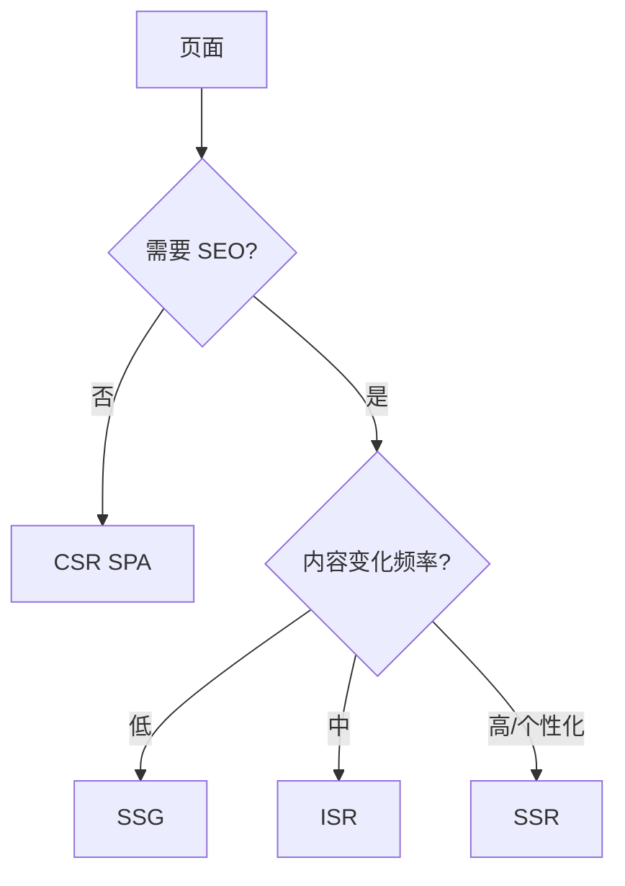

# 渲染策略（CSR / SSR / SSG / ISR）

## 学习目标

- 能为每个页面选对 CSR/SSR/SSG/ISR
- 能在 Next.js 中落地并验证 SEO、TTFB、Hydration
- 能排查 Hydration mismatch、SEO 不收录

## 为什么需要

「全站 SSR」和「全站 CSR」都是错的——**按页面特征选型**才是架构师工作。

> 核心心法：**需要 SEO/首屏？考虑 SSR/SSG。纯后台？CSR。** 混合架构是常态。

---

## 一、页面选型决策树



| 页面类型 | 推荐 | 理由 |
|---------|------|------|
| 营销首页 | SSG/ISR | 快+SEO |
| 商品详情 | ISR/SSR | SEO+库存更新 |
| 用户 Dashboard | CSR | 登录后，SEO 无关 |
| 文档站 | SSG | 纯静态 |

---

## 二、Next.js App Router 落地

### SSG/ISR

```tsx
// app/blog/[slug]/page.tsx
export async function generateStaticParams() {
  return posts.map(p => ({ slug: p.slug }));
}

export default async function Page({ params }) {
  const post = await getPost(params.slug); // 构建时/按需
  return <Article post={post} />;
}

export const revalidate = 3600; // ISR 1h
```

### SSR（动态）

```tsx
export const dynamic = 'force-dynamic';
export default async function Page() {
  const data = await fetch('https://api...', { cache: 'no-store' });
  return <div>{data.title}</div>;
}
```

### CSR 岛屿

```tsx
'use client';
export function InteractiveChart() { /* 仅客户端 */ }
```

---

## 三、Hydration 问题排查

**报错：** Text content does not match server-rendered HTML

**常见原因：**

- `Date.now()` / `Math.random()` 服务端客户端不一致
- 浏览器扩展改 DOM
- 错误嵌套 `<p><div></div></p>`

**修复：** 仅客户端值放 `useEffect`；或 `suppressHydrationWarning`（慎用）

**验证：** 生产 build `pnpm build && pnpm start`，Console 无 hydration error。

---

## 四、SEO 验证

1. View Source 看是否有正文 HTML（非空 div#root）
2. Google Rich Results Test
3. `sitemap.xml` + `robots.txt` + meta/JSON-LD

---

## 排查实战

### 案例 A：详情页 Google 不收录

- **原因：** 纯 CSR，爬虫空 HTML
- **修复：** 改 SSR/SSG，View Source 可见内容
- **验证：** Search Console 抓取成功

### 案例 B：TTFB 2s

- **原因：** SSR 每次打慢 API
- **修复：** ISR + CDN cache `s-maxage`
- **验证：** TTFB <600ms

---

## 项目落地步骤

1. 页面清单 + 选型表（上表）
2. Next 路由划分 Server/Client Component
3. 配 `revalidate` / `cache`
4. CI 跑 build + hydration 冒烟

## 小结

- 混合架构：营销 SSG、详情 ISR、后台 CSR
- Hydration 问题看 SSR/CSR 不一致
- SEO 必须 View Source 有内容

## 延伸阅读

- [Next.js Rendering](https://nextjs.org/docs/app/building-your-application/rendering)
