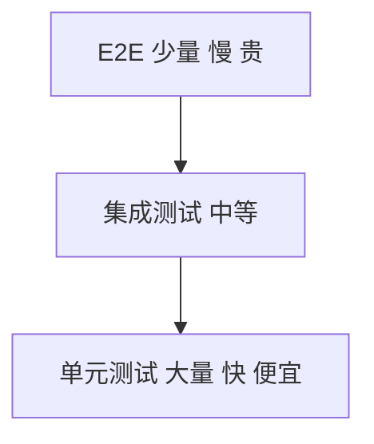

# 测试体系

## 学习目标

- 理解测试金字塔与各层职责
- 掌握单元测试（Vitest/Jest）、组件测试（Testing Library）
- 了解 E2E 测试（Playwright/Cypress）
- 能建立团队测试规范与 CI 集成

## 为什么需要

- **回归**：重构、新功能不破坏已有逻辑
- **文档**：测试即用法示例
- **信心**：有测试覆盖才敢快速迭代
- **架构**：可测试性影响设计（依赖注入、纯函数）

## 核心原理

### 1. 测试金字塔



| 层级 | 范围 | 工具 | 速度 |
|------|------|------|------|
| 单元 | 函数、工具类 | Vitest, Jest | 毫秒 |
| 组件 | React/Vue 组件 | Testing Library | 秒级 |
| 集成 | 多模块协作 | Testing Library + MSW | 秒级 |
| E2E | 完整用户流程 | Playwright, Cypress | 分钟 |

**比例建议：** 70% 单元 + 20% 集成 + 10% E2E

### 2. 单元测试

```javascript
// utils/formatDate.test.ts
import { describe, it, expect } from 'vitest';
import { formatDate } from './formatDate';

describe('formatDate', () => {
  it('formats ISO string to YYYY-MM-DD', () => {
    expect(formatDate('2025-06-09T10:00:00Z')).toBe('2025-06-09');
  });

  it('returns empty for invalid input', () => {
    expect(formatDate('invalid')).toBe('');
  });
});
```

**原则：**

- 测行为，不测实现
- 纯函数优先，易测
- Mock 外部依赖（API、Date）

### 3. 组件测试

```tsx
// Button.test.tsx
import { render, screen, fireEvent } from '@testing-library/react';
import { Button } from './Button';

describe('Button', () => {
  it('renders children', () => {
    render(<Button>Click me</Button>);
    expect(screen.getByRole('button', { name: /click me/i })).toBeInTheDocument();
  });

  it('calls onClick when clicked', () => {
    const handleClick = vi.fn();
    render(<Button onClick={handleClick}>Click</Button>);
    fireEvent.click(screen.getByRole('button'));
    expect(handleClick).toHaveBeenCalledTimes(1);
  });
});
```

**Testing Library 理念：** 像用户一样查询（role、label、text），而非实现细节（class、test-id 次之）

### 4. E2E 测试

```javascript
// login.spec.ts — Playwright
import { test, expect } from '@playwright/test';

test('user can login', async ({ page }) => {
  await page.goto('/login');
  await page.fill('[name=email]', 'user@example.com');
  await page.fill('[name=password]', 'password');
  await page.click('button[type=submit]');
  await expect(page).toHaveURL('/dashboard');
  await expect(page.locator('h1')).toContainText('Dashboard');
});
```

**适用：** 关键路径（登录、支付、核心业务流程）

### 5. Mock 与 MSW

```javascript
// MSW — Mock Service Worker，拦截网络
import { http, HttpResponse } from 'msw';
import { setupServer } from 'msw/node';

const server = setupServer(
  http.get('/api/users', () => {
    return HttpResponse.json([{ id: 1, name: 'Alice' }]);
  })
);

beforeAll(() => server.listen());
afterEach(() => server.resetHandlers());
afterAll(() => server.close());
```

### 6. CI 集成

```yaml
# 与 CI 流水线集成
- run: pnpm test --coverage
- run: pnpm exec playwright test
```

### 7. TDD / BDD 与测试替身

**TDD：** Red（写失败测试）→ Green（最小实现）→ Refactor

**BDD：** `describe`/`it` 描述行为，`given-when-then` 风格

| 类型 | 说明 |
|------|------|
| stub | 固定返回值 |
| spy | 记录调用 |
| mock | 预设行为 + 断言 |
| fake | 轻量实现（内存 DB） |

```javascript
const fetchMock = vi.fn().mockResolvedValue({ data: [] });
```

### 8. 覆盖率、快照与 Testing Trophy

- **覆盖率：** 行、分支、函数、语句 — 关注分支覆盖
- **快照：** `expect(tree).toMatchSnapshot()` — 防 UI 意外变更，勿滥用
- **Testing Trophy：** 集成测试 > 单元测试 > E2E（Kent C. Dodds）

### 9. a11y 测试与可测试性设计

```javascript
import { axe } from 'jest-axe';
it('should have no a11y violations', async () => {
  const { container } = render(<App />);
  expect(await axe(container)).toHaveNoViolations();
});
```

**可测试性：** 依赖注入、纯函数、避免全局状态、组件 props 驱动。

---

## 实战：为核心支付按钮补测试（1 小时）

```tsx
// PayButton.test.tsx
import { render, screen, fireEvent } from '@testing-library/react';
import { PayButton } from './PayButton';

it('disables when loading', () => {
  render(<PayButton loading onPay={vi.fn()} />);
  expect(screen.getByRole('button')).toBeDisabled();
});

it('calls onPay once', () => {
  const onPay = vi.fn();
  render(<PayButton onPay={onPay} />);
  fireEvent.click(screen.getByRole('button', { name: /支付/i }));
  expect(onPay).toHaveBeenCalledTimes(1);
});
```

```typescript
// checkout.spec.ts — Playwright 关键路径
test('checkout flow', async ({ page }) => {
  await page.goto('/cart');
  await page.click('text=去结算');
  await expect(page).toHaveURL('/checkout');
  await page.click('text=确认支付');
  await expect(page.locator('.success')).toBeVisible();
});
```

**验证：** CI 中 unit + e2e 绿；改坏按钮 CI 红。

## 常见误区与最佳实践

| 误区 | 正确理解 |
|------|---------|
| "E2E 覆盖越多越好" | 慢且脆，关键路径即可 |
| "测 implementation details" | 测用户可见行为 |
| "100% 覆盖率" | 质量>数字，关键逻辑优先 |
| "测试是 QA 的事" | 开发写单元/组件，QA 补充 E2E |

**最佳实践：**

- 新功能带测试，PR 必过 CI
- 工具函数、hooks 必测
- 组件测交互和 accessibility
- E2E 测 3-5 条核心用户路径

## 手写简易断言框架

```javascript
function expect(actual) {
  return {
    toBe(expected) {
      if (actual !== expected) throw new Error(`Expected ${expected}, got ${actual}`);
    },
    toEqual(expected) {
      if (JSON.stringify(actual) !== JSON.stringify(expected)) throw new Error('Not equal');
    },
  };
}
function test(name, fn) {
  try { fn(); console.log(`✓ ${name}`); }
  catch (e) { console.error(`✗ ${name}`, e); }
}
```

**契约测试**：前后端约定 API schema（Pact/OpenAPI），防接口变更打破前端。

## 面试高频问答（追问链）

> 大厂对一个考点通常追问到能力边界：**概念 → 机制 → 边界 → ⭐ 原理（触底）→ 实战（落地）**。实战层是区分「背过」和「做过」的关键。

### 链一：测试策略

1. **概念**：测试金字塔？→ 单元多、集成中、E2E 少，性价比递减。
2. **机制**：Testing Library 理念？→ 测用户行为不测实现细节。
3. **边界**：覆盖率目标多少？→ 关键路径优先，不追 100%，门禁可设 80%。
4. ⭐ **原理（触底）**：覆盖率高就代表测试好吗？怎么衡量测试有效性？→ 不一定，覆盖率只测「执行到」不测「断言对」；用变异测试(mutation testing)、关键路径 + 边界覆盖、线上缺陷逃逸率衡量。
5. **实战（落地）**：你在项目里怎么落地测试金字塔？→ 场景：回归靠手测、改一处崩一片；步骤：核心工具函数/hooks 写单测(Vitest)、关键组件用 Testing Library 测行为、下单/支付主流程少量 Playwright E2E，CI 设覆盖率门禁 80% 仅卡关键目录；验证：CI 跑全量 + 变异测试抽查断言有效性、跟踪缺陷逃逸率；结果：发布前自动拦截回归，线上 P0 缺陷显著下降。

### 链二：测试工程化

1. **概念**：MSW 做什么？→ 拦截网络请求 mock API，不 mock fetch 本身。
2. **机制**：为什么比 mock fetch 好？→ 接近真实、前后端解耦、复用同一套 mock。
3. **应用**：E2E 怎么稳定不 flaky？→ 等待真实条件而非固定 sleep、隔离数据、重试与并行。
4. ⭐ **原理（触底）**：契约测试解决什么？前后端怎么协作？→ 用 Pact 等定义消费者期望契约，提供方据此验证，避免接口变更引发集成故障，CI 中双向校验。
5. **实战（落地）**：E2E 老 flaky 你怎么治理的？→ 场景：CI 里 E2E 间歇失败、团队不信任；步骤：MSW 统一 mock API 隔离后端波动、去掉固定 sleep 改 await 真实条件、每用例独立 seed 数据、失败自动重试 + 并行分片；验证：连续跑 50 次通过率 100%、统计 flaky 率；结果：E2E 稳定可信纳入合并门禁，并用契约测试(Pact)在 CI 双向校验防接口变更。

## 小结

- 测试金字塔：单元多、E2E 少
- Vitest/Jest 单元，Testing Library 组件，Playwright E2E
- MSW mock API
- CI 集成，测试是开发责任

## 延伸阅读

- [Testing Library](https://testing-library.com/)
- [Vitest](https://vitest.dev/)
- [Playwright](https://playwright.dev/)
- [MSW](https://mswjs.io/)
