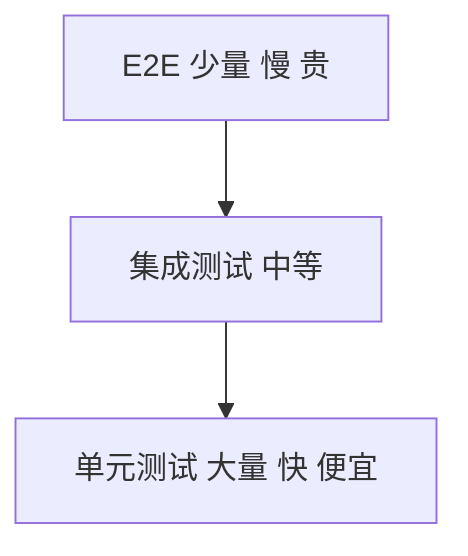

# 测试体系

## 学习目标

- 理解测试金字塔与各层职责
- 掌握单元测试（Vitest/Jest）、组件测试（Testing Library）
- 了解 E2E 测试（Playwright/Cypress）
- 能建立团队测试规范与 CI 集成

## 为什么需要

- **回归**：重构、新功能不破坏已有逻辑
- **文档**：测试即用法示例
- **信心**：有测试覆盖才敢快速迭代
- **架构**：可测试性影响设计（依赖注入、纯函数）

## 核心原理

### 1. 测试金字塔



| 层级 | 范围 | 工具 | 速度 |
|------|------|------|------|
| 单元 | 函数、工具类 | Vitest, Jest | 毫秒 |
| 组件 | React/Vue 组件 | Testing Library | 秒级 |
| 集成 | 多模块协作 | Testing Library + MSW | 秒级 |
| E2E | 完整用户流程 | Playwright, Cypress | 分钟 |

**比例建议：** 70% 单元 + 20% 集成 + 10% E2E

### 2. 单元测试

```javascript
// utils/formatDate.test.ts
import { describe, it, expect } from 'vitest';
import { formatDate } from './formatDate';

describe('formatDate', () => {
  it('formats ISO string to YYYY-MM-DD', () => {
    expect(formatDate('2025-06-09T10:00:00Z')).toBe('2025-06-09');
  });

  it('returns empty for invalid input', () => {
    expect(formatDate('invalid')).toBe('');
  });
});
```

**原则：**

- 测行为，不测实现
- 纯函数优先，易测
- Mock 外部依赖（API、Date）

### 3. 组件测试

```tsx
// Button.test.tsx
import { render, screen, fireEvent } from '@testing-library/react';
import { Button } from './Button';

describe('Button', () => {
  it('renders children', () => {
    render(<Button>Click me</Button>);
    expect(screen.getByRole('button', { name: /click me/i })).toBeInTheDocument();
  });

  it('calls onClick when clicked', () => {
    const handleClick = vi.fn();
    render(<Button onClick={handleClick}>Click</Button>);
    fireEvent.click(screen.getByRole('button'));
    expect(handleClick).toHaveBeenCalledTimes(1);
  });
});
```

**Testing Library 理念：** 像用户一样查询（role、label、text），而非实现细节（class、test-id 次之）

### 4. E2E 测试

```javascript
// login.spec.ts — Playwright
import { test, expect } from '@playwright/test';

test('user can login', async ({ page }) => {
  await page.goto('/login');
  await page.fill('[name=email]', 'user@example.com');
  await page.fill('[name=password]', 'password');
  await page.click('button[type=submit]');
  await expect(page).toHaveURL('/dashboard');
  await expect(page.locator('h1')).toContainText('Dashboard');
});
```

**适用：** 关键路径（登录、支付、核心业务流程）

### 5. Mock 与 MSW

```javascript
// MSW — Mock Service Worker，拦截网络
import { http, HttpResponse } from 'msw';
import { setupServer } from 'msw/node';

const server = setupServer(
  http.get('/api/users', () => {
    return HttpResponse.json([{ id: 1, name: 'Alice' }]);
  })
);

beforeAll(() => server.listen());
afterEach(() => server.resetHandlers());
afterAll(() => server.close());
```

### 6. CI 集成

```yaml
# 与 CI 流水线集成
- run: pnpm test --coverage
- run: pnpm exec playwright test
```

## 常见误区与最佳实践

| 误区 | 正确理解 |
|------|---------|
| "E2E 覆盖越多越好" | 慢且脆，关键路径即可 |
| "测 implementation details" | 测用户可见行为 |
| "100% 覆盖率" | 质量>数字，关键逻辑优先 |
| "测试是 QA 的事" | 开发写单元/组件，QA 补充 E2E |

**最佳实践：**

- 新功能带测试，PR 必过 CI
- 工具函数、hooks 必测
- 组件测交互和 accessibility
- E2E 测 3-5 条核心用户路径

## 小结

- 测试金字塔：单元多、E2E 少
- Vitest/Jest 单元，Testing Library 组件，Playwright E2E
- MSW mock API
- CI 集成，测试是开发责任

## 延伸阅读

- [Testing Library](https://testing-library.com/)
- [Vitest](https://vitest.dev/)
- [Playwright](https://playwright.dev/)
- [MSW](https://mswjs.io/)
