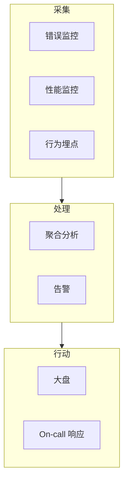

# 监控与告警

## 学习目标

- 理解前端监控体系：错误、性能、行为
- 掌握 Sentry 等错误监控的集成
- 了解 RUM 性能监控与埋点
- 能设计告警规则与 On-call 流程

## 为什么需要

线上问题用户先于开发发现，代价高。监控提供：

- **错误**：JS 异常、Promise rejection、资源加载失败
- **性能**：LCP、API 耗时、长任务
- **行为**：用户路径、转化漏斗

架构师需建立可观测性，支撑快速定位和预防。

## 核心原理

### 1. 监控体系



### 2. 错误监控（Sentry）

**捕获类型：**

- 未捕获的 JS 异常
- 未处理的 Promise rejection
- 资源加载失败（img、script）
- 手动 `Sentry.captureException()`

```javascript
import * as Sentry from '@sentry/react';

Sentry.init({
  dsn: 'https://xxx@sentry.io/xxx',
  environment: import.meta.env.MODE,
  integrations: [
    Sentry.browserTracingIntegration(),
    Sentry.replayIntegration()
  ],
  tracesSampleRate: 0.1,
  replaysSessionSampleRate: 0.1
});

// Error Boundary 集成
<Sentry.ErrorBoundary fallback={<ErrorFallback />}>
  <App />
</Sentry.ErrorBoundary>
```

**Source Map：** 生产代码压缩后需上传 source map，才能还原堆栈

```javascript
// vite.config.ts
import { sentryVitePlugin } from '@sentry/vite-plugin';

export default defineConfig({
  build: { sourcemap: true },
  plugins: [
    sentryVitePlugin({
      org: 'myorg',
      project: 'myapp',
      authToken: process.env.SENTRY_AUTH_TOKEN
    })
  ]
});
```

### 3. 性能监控

```javascript
import { onLCP, onINP, onCLS } from 'web-vitals';

function reportMetric(metric) {
  // 上报到自建或第三方
  fetch('/api/metrics', {
    method: 'POST',
    body: JSON.stringify({
      name: metric.name,
      value: metric.value,
      page: location.pathname,
      userAgent: navigator.userAgent
    }),
    keepalive: true
  });
}

onLCP(reportMetric);
onINP(reportMetric);
onCLS(reportMetric);
```

**API 监控：**

```javascript
// 封装 fetch，记录耗时
async function monitoredFetch(url, options) {
  const start = performance.now();
  try {
    const res = await fetch(url, options);
    reportApi({ url, duration: performance.now() - start, status: res.status });
    return res;
  } catch (err) {
    reportApi({ url, duration: performance.now() - start, error: err.message });
    throw err;
  }
}
```

### 4. 行为埋点

```javascript
// 声明式埋点
track('button_click', {
  button_id: 'submit_order',
  page: 'checkout',
  user_id: getUserId()
});

// 转化漏斗
track('funnel_step', { step: 'add_to_cart', product_id: '123' });
track('funnel_step', { step: 'checkout_start' });
track('funnel_step', { step: 'payment_success' });
```

**原则：**

- 事件命名规范：`object_action`
- 属性不采集 PII（个人身份信息）
- 采样率控制成本

### 5. 告警规则

| 指标 | 阈值示例 | 动作 |
|------|---------|------|
| 错误率 | > 1% 5分钟 | PagerDuty |
| 新错误类型 | 首次出现 | Slack |
| LCP P75 | > 4s | 邮件 |
| API 5xx | > 5% | 立即告警 |

## 常见误区与最佳实践

| 误区 | 正确理解 |
|------|---------|
| "有 Sentry 就够了" | 需性能、行为补充 |
| "生产才需要监控" | staging 也应接入，提前发现 |
| "告警越多越好" | 避免告警疲劳，关键指标 |
| "埋点越多越好" | 围绕业务问题设计 |

**最佳实践：**

- 错误监控 + Source Map 必配
- Core Web Vitals RUM 上报
- 告警分级：P0 立即、P1 工作时间
- 定期 review 错误趋势，优先 fix 高频

## 小结

- 错误（Sentry）、性能（web-vitals）、行为（埋点）
- Source Map 还原生产堆栈
- 告警有阈值、有分级、有 On-call
- 监控服务于快速定位和预防

## 延伸阅读

- [Sentry 文档](https://docs.sentry.io/)
- [web-vitals](https://github.com/GoogleChrome/web-vitals)
- [OpenTelemetry Web](https://opentelemetry.io/docs/instrumentation/js/)
