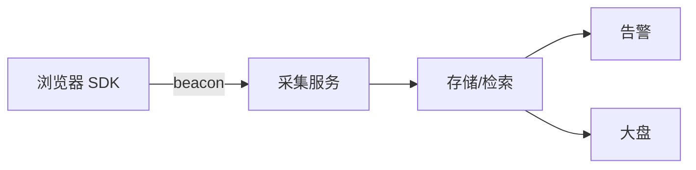

# 监控与告警

## 学习目标

- 从 0 接入前端错误 + 性能 RUM，并配置告警
- 能根据告警在 Sentry/日志里定位到具体用户路径和代码行
- 掌握 Source Map 安全上传与白屏检测

## 为什么需要

「用户说白屏」但没有监控 = 无法复现。监控是线上问题的**眼睛**。

> 核心心法：**采集 → 聚合 → 告警 → 排障 → 验证修复。** 缺一环都是盲人摸象。

---

## 一、架构一览



---

## 二、从 0 接入（半天）

### 步骤 1：Sentry 错误

```typescript
// main.tsx
import * as Sentry from '@sentry/react';

Sentry.init({
  dsn: import.meta.env.VITE_SENTRY_DSN,
  environment: import.meta.env.MODE,
  integrations: [Sentry.browserTracingIntegration()],
  tracesSampleRate: 0.1,
});

<Sentry.ErrorBoundary fallback={<ErrorPage />}>
  <App />
</Sentry.ErrorBoundary>
```

### 步骤 2：web-vitals 性能

```typescript
import { onLCP, onINP, onCLS } from 'web-vitals/attribution';

function report(metric) {
  navigator.sendBeacon('/api/rum', JSON.stringify({
    name: metric.name,
    value: metric.value,
    rating: metric.rating,
    page: location.pathname,
    attribution: metric.attribution, // 直接知道 LCP 元素
  }));
}
onLCP(report); onINP(report); onCLS(report);
```

### 步骤 3：全局兜底

```javascript
window.addEventListener('unhandledrejection', e => report(e.reason));
window.addEventListener('error', e => {
  if (e.target !== window) report({ type: 'resource', src: e.target?.src });
}, true);
```

### 步骤 4：Source Map（仅私有上传）

```typescript
// vite + sentry plugin，upload 后删除 public map
sentryVitePlugin({ org, project, authToken, sourcemaps: { filesToDeleteAfterUpload: ['**/*.map'] } })
```

**验证：** 故意 `throw new Error('test')` → Sentry 收到且堆栈映射到 `.tsx` 行号。

---

## 三、告警规则

| 指标 | 阈值 | 动作 |
|------|------|------|
| JS 错误率 | >1% 5min | PagerDuty |
| 新 issue 首次 | 任意 | Slack |
| LCP P75 | >4s | 邮件 |
| 白屏率 | >0.5% | 立即 |

---

## 四、排障流程

1. **告警** → 打开 Sentry issue，看 breadcrumbs、用户、release
2. **复现** → 同版本 + 同路由 + 同 UA 尝试
3. **修复** → PR 关联 issue
4. **验证** → 部署后看 issue 是否停止增长；regression 测试

### 案例：发布后错误率 spike

- Sentry：100% 来自 `v1.2.3`，`TypeError: x is undefined` at `Checkout.tsx:88`
- 关联 commit：删字段未改前端
- 热修或回滚 → 错误率 10 分钟恢复

### 案例：LCP 劣化

- RUM attribution：LCP 元素变成 1.2MB png
- 设计换图未压缩 → WebP + preload
- P75 LCP 5s → 2.1s

---

## 五、白屏检测

```javascript
window.addEventListener('load', () => {
  setTimeout(() => {
    const root = document.getElementById('root');
    if (!root?.innerHTML) report({ type: 'blank-screen' });
  }, 5000);
});
```

---

## 项目 Checklist

- [ ] Sentry + ErrorBoundary + release 版本 tag
- [ ] web-vitals attribution 上报
- [ ] Source Map 私有上传，公网不可访问
- [ ] 告警值班 runbook 文档

## 小结

- 错误 Sentry，性能 RUM，二者互补
- attribution 缩短定位时间
- 告警必须配 runbook 和 release 关联

## 延伸阅读

- [Sentry React](https://docs.sentry.io/platforms/javascript/guides/react/)
- [web-vitals attribution](https://github.com/GoogleChrome/web-vitals)
