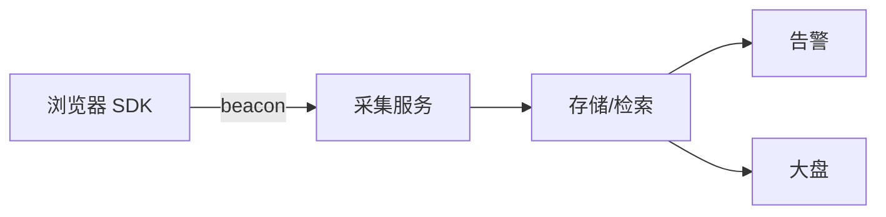
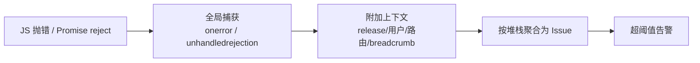

# 监控与告警

## 学习目标

- 从 0 接入前端错误 + 性能 RUM，并配置告警
- 能根据告警在 Sentry/日志里定位到具体用户路径和代码行
- 掌握 Source Map 安全上传与白屏检测

## 为什么需要

「用户说白屏」但没有监控 = 无法复现。监控是线上问题的**眼睛**。

> 核心心法：**采集 → 聚合 → 告警 → 排障 → 验证修复。** 缺一环都是盲人摸象。

---

## 一、架构一览



---

## 二、底层原理：监控在解决什么问题

### 三类可观测性（前端语境）

| 类型 | 回答什么 | 典型数据 | 工具 |
|------|---------|---------|------|
| **Logs（日志）** | 发生了什么 | console、breadcrumb、用户操作路径 | Sentry breadcrumbs |
| **Metrics（指标）** | 趋势如何 | 错误率、LCP P75、白屏率 | web-vitals、自定义 counter |
| **Traces（链路）** | 慢在哪一步 | 页面加载分段、API 耗时 | Sentry Performance、OTel |

> 前端监控的核心矛盾：**线上环境不可调试**。监控是用「聚合后的真实用户数据」替代「本地断点」。

### 错误监控原理



- **聚合（Grouping）：** 同一堆栈的 1000 次报错算 1 个 issue，避免告警风暴。
- **Source Map：** 生产代码被压缩混淆，必须上传 map 到私有服务才能把 `a.js:1:2345` 映射回 `Checkout.tsx:88`。
- **Release 关联：** 每个部署打版本 tag，才能判断「哪个版本引入的」。

### RUM（真实用户监控）原理

Lab 数据（Lighthouse）≠ 真实用户体验。RUM 采集**真实用户**在**真实网络/设备**上的指标：

- **P75 而非平均值：** Google 用第 75 百分位评估 Core Web Vitals，因为平均值会被少数极快用户拉低，掩盖长尾慢体验。
- **attribution（归因）：** `web-vitals/attribution` 直接告诉你 LCP 慢是因为 TTFB 大、还是图片下载慢、还是渲染延迟——省去大量猜测。
- **采样（Sampling）：** 全量上报成本高，通常 `tracesSampleRate: 0.1`（10% 采样）在成本与精度间平衡。

### 告警设计原理

好的告警 = **可操作 + 低噪音**：

| 原则 | 说明 |
|------|------|
| 基于 SLO | 错误率 >1% 持续 5min，而非「有 1 个错误就告警」 |
| 分级 | P0 立即（白屏率）、P1 工作时间（新 issue）、P2 日报（LCP 劣化） |
| 关联 release | 告警必须带版本号，否则无法定位 |
| Runbook | 每条告警有「收到后第一步做什么」文档 |

---

## 三、从 0 接入（半天）

### 步骤 1：Sentry 错误

```typescript
// main.tsx
import * as Sentry from '@sentry/react';

Sentry.init({
  dsn: import.meta.env.VITE_SENTRY_DSN,
  environment: import.meta.env.MODE,
  integrations: [Sentry.browserTracingIntegration()],
  tracesSampleRate: 0.1,
});

<Sentry.ErrorBoundary fallback={<ErrorPage />}>
  <App />
</Sentry.ErrorBoundary>
```

### 步骤 2：web-vitals 性能

```typescript
import { onLCP, onINP, onCLS } from 'web-vitals/attribution';

function report(metric) {
  navigator.sendBeacon('/api/rum', JSON.stringify({
    name: metric.name,
    value: metric.value,
    rating: metric.rating,
    page: location.pathname,
    attribution: metric.attribution, // 直接知道 LCP 元素
  }));
}
onLCP(report); onINP(report); onCLS(report);
```

### 步骤 3：全局兜底

```javascript
window.addEventListener('unhandledrejection', e => report(e.reason));
window.addEventListener('error', e => {
  if (e.target !== window) report({ type: 'resource', src: e.target?.src });
}, true);
```

### 步骤 4：Source Map（仅私有上传）

```typescript
// vite + sentry plugin，upload 后删除 public map
sentryVitePlugin({ org, project, authToken, sourcemaps: { filesToDeleteAfterUpload: ['**/*.map'] } })
```

**验证：** 故意 `throw new Error('test')` → Sentry 收到且堆栈映射到 `.tsx` 行号。

---

## 四、告警规则

| 指标 | 阈值 | 动作 |
|------|------|------|
| JS 错误率 | >1% 5min | PagerDuty |
| 新 issue 首次 | 任意 | Slack |
| LCP P75 | >4s | 邮件 |
| 白屏率 | >0.5% | 立即 |

---

## 五、排障流程

1. **告警** → 打开 Sentry issue，看 breadcrumbs、用户、release
2. **复现** → 同版本 + 同路由 + 同 UA 尝试
3. **修复** → PR 关联 issue
4. **验证** → 部署后看 issue 是否停止增长；regression 测试

### 案例：发布后错误率 spike

- Sentry：100% 来自 `v1.2.3`，`TypeError: x is undefined` at `Checkout.tsx:88`
- 关联 commit：删字段未改前端
- 热修或回滚 → 错误率 10 分钟恢复

### 案例：LCP 劣化

- RUM attribution：LCP 元素变成 1.2MB png
- 设计换图未压缩 → WebP + preload
- P75 LCP 5s → 2.1s

---

## 六、白屏检测

```javascript
window.addEventListener('load', () => {
  setTimeout(() => {
    const root = document.getElementById('root');
    if (!root?.innerHTML) report({ type: 'blank-screen' });
  }, 5000);
});
```

---

## 项目 Checklist

- [ ] Sentry + ErrorBoundary + release 版本 tag
- [ ] web-vitals attribution 上报
- [ ] Source Map 私有上传，公网不可访问
- [ ] 告警值班 runbook 文档

## 七、内存泄漏排查体系（三快照法）

### 流程

1. **基线快照**：页面空闲时 Heap Snapshot → Snapshot A
2. **操作复现**：执行可疑操作（路由切换、打开关闭弹窗）多次
3. **对比快照**：再拍 Snapshot B、C，选 Comparison 视图
4. **定位对象**：看 **Detached DOM tree**、EventListener、Closure 持续增长

| 泄漏类型 | 特征 | 修复 |
|---------|------|------|
| Detached DOM | 节点已从文档移除但仍被 JS 引用 | 卸载时解绑 + 清引用 |
| 闭包泄漏 | Closure 保留大对象 | 缩小闭包范围、WeakMap |
| 定时器/监听 | Interval、addEventListener 未清理 | useEffect cleanup |
| 全局缓存 | Map 只增不减 | LRU 淘汰、WeakMap |

```javascript
// React 常见：useEffect 未 cleanup
useEffect(() => {
  const timer = setInterval(poll, 1000);
  return () => clearInterval(timer); // 必须
}, []);
```

**Performance Monitor**（DevTools → More tools）：实时看 JS heap、DOM 节点数曲线，台阶式上升即泄漏信号。

---

## 八、卡顿 / Long Task 排查

### INP / 卡顿定位流程

1. **RUM**：看 INP P75 劣化页面
2. **Performance 录制**：勾选 Screenshots + Web Vitals
3. **找 Long Task**：Main 线程 >50ms 红色条
4. **归因**：Bottom-Up 看热点函数；Call Tree 看调用链
5. **修复**：拆任务（`scheduler.postTask` / `requestIdleCallback` / `useTransition`）、Web Worker、虚拟列表

```javascript
// 上报 Long Task（PerformanceObserver）
const obs = new PerformanceObserver((list) => {
  for (const entry of list.getEntries()) {
    if (entry.duration > 50) {
      report({ type: 'longtask', duration: entry.duration, startTime: entry.startTime });
    }
  }
});
obs.observe({ type: 'longtask', buffered: true });
```

| 现象 | 常见原因 | 修复 |
|------|---------|------|
| 输入延迟高 | 大列表重渲染 | memo + 虚拟滚动 |
| 滚动掉帧 | scroll 里读 layout | 改 IntersectionObserver |
| 路由切换卡 | 同步大计算 | lazy + transition |

---

## 监控 SDK 系统设计（面试场景题）

详见 [04-前端系统设计专题](../04-架构设计/04-前端系统设计专题.md)。

**核心模块**：采集器（error/unhandledrejection/performance）→ 离线队列 → 批量上报 → 采样/限流 → TraceId 贯穿 → SourceMap 私有关联。

**白屏检测**：轮询关键 DOM 节点或 `document.body.innerHTML` 为空 + 超时判定。

## 面试高频问答（追问链）

> 大厂对一个考点通常追问到能力边界：**概念 → 机制 → 边界 → ⭐ 原理（触底）→ 实战（落地）**。实战层是区分「背过」和「做过」的关键。

### 链一：错误监控

1. **概念**：Sentry 错误聚合原理？→ stack + message fingerprint 合并同类错误。
2. **机制**：Source Map 为什么私有上传？→ 公网暴露源码，仅服务端解析堆栈。
3. **边界**：怎么捕获异步/资源/Promise 错误？→ window.onerror + unhandledrejection + 资源 error 捕获 + 框架 ErrorBoundary。
4. ⭐ **原理（触底）**：白屏怎么检测和定位？→ 采样关键点截图/DOM 节点数 + MutationObserver 判断根容器是否渲染 + 结合错误/接口失败/资源加载交叉归因。
5. **实战（落地）**：线上白屏告警你怎么定位的？→ 场景：用户反馈白屏但无报错；步骤：埋点采集根容器节点数 + MutationObserver 判断根容器是否渲染、Sentry 接 source map 私有上传还原堆栈、交叉错误/接口失败/资源加载归因 → 定位是某 CDN chunk 加载失败，补资源 error 捕获 + 重试 + fallback；验证：复现链路命中、告警可下钻到具体 chunk；结果：白屏 MTTR 从小时级降到分钟级。

### 链二：性能与内存排查

1. **概念**：RUM 为什么看 P75？→ 平均掩盖长尾，P75 代表大多数用户。
2. **机制**：三快照法怎么定位泄漏？→ 空闲拍 A，操作后拍 B/C，Comparison 找 Detached DOM 与 Closure 增长。
3. **应用**：Long Task 阈值与影响？→ >50ms 阻塞主线程影响 INP，用 PerformanceObserver 上报。
4. ⭐ **原理（触底）**：告警怎么设计才不会「狼来了」？→ 基于 SLO 设阈值、分级、聚合去重防风暴、配 runbook 可操作、动态基线/同比环比减少误报。
5. **实战（落地）**：你怎么设计一套不「狼来了」的告警？→ 场景：阈值固定导致夜间低流量误报刷屏；步骤：基于 SLO 定阈值(如错误率>0.5% 持续 5min)、按 P0/P1/P2 分级、同 fingerprint 聚合去重防风暴、用动态基线/同比环比、每条告警挂 runbook；验证：演练注入故障看是否准确触发且无风暴、统计误报率；结果：告警量下降约 70%、每条都可操作，值班不再疲劳。

## 小结

- 原理：Logs/Metrics/Traces 三类可观测性；线上用聚合数据替代本地调试
- 错误靠堆栈聚合 + Source Map + Release 关联定位
- RUM 用 P75 + attribution 反映真实用户体验
- 告警基于 SLO、分级、可操作，配 runbook
- 错误 Sentry，性能 web-vitals，二者互补

## 延伸阅读

- [Sentry React](https://docs.sentry.io/platforms/javascript/guides/react/)
- [web-vitals attribution](https://github.com/GoogleChrome/web-vitals)
