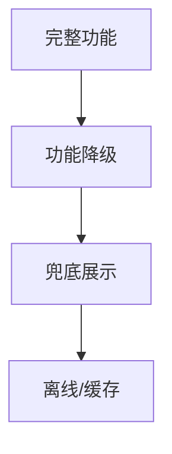

# 降级与容灾

## 学习目标

- 理解前端降级的场景与策略
- 掌握 Error Boundary、兜底 UI
- 了解熔断、超时、重试机制
- 理解灰度发布与快速回滚

## 为什么需要

依赖不可控：API 超时、CDN 故障、第三方脚本挂掉。前端需要：

- **优雅降级**：部分功能不可用，核心流程仍可完成
- **快速恢复**：灰度、回滚减少影响面
- **用户感知**：友好提示而非白屏

## 核心原理

### 1. 降级层次



| 层级 | 策略 | 示例 |
|------|------|------|
| 功能降级 | 关闭非核心功能 | 推荐模块失败，主列表仍展示 |
| 展示降级 | 静态兜底 | 图表失败显示表格 |
| 缓存降级 | 本地/Service Worker | 离线读缓存 |
| 完全降级 | 维护页 | 全站不可用 |

### 2. Error Boundary

```tsx
class ErrorBoundary extends React.Component {
  state = { hasError: false, error: null };

  static getDerivedStateFromError(error) {
    return { hasError: true, error };
  }

  componentDidCatch(error, info) {
    Sentry.captureException(error, { extra: info });
  }

  render() {
    if (this.state.hasError) {
      return (
        <div className="error-fallback">
          <h2>出了点问题</h2>
          <button onClick={() => this.setState({ hasError: false })}>
            重试
          </button>
        </div>
      );
    }
    return this.props.children;
  }
}

// 使用 — 局部降级，不影响整页
<ErrorBoundary>
  <Recommendations />
</ErrorBoundary>
<MainContent /> {/* 不受影响 */}
```

### 3. 请求降级

```javascript
async function fetchWithFallback(url, options = {}) {
  const { timeout = 5000, retries = 2, fallback = null } = options;

  for (let i = 0; i <= retries; i++) {
    try {
      const controller = new AbortController();
      const timer = setTimeout(() => controller.abort(), timeout);

      const res = await fetch(url, { ...options, signal: controller.signal });
      clearTimeout(timer);

      if (!res.ok) throw new Error(`HTTP ${res.status}`);
      return await res.json();
    } catch (err) {
      if (i === retries) {
        if (fallback !== null) return fallback;
        throw err;
      }
      await sleep(1000 * (i + 1)); // 指数退避
    }
  }
}

// 使用
const data = await fetchWithFallback('/api/recommendations', {
  fallback: [] // 失败返回空数组，不阻塞主流程
});
```

### 4. 熔断

```javascript
class CircuitBreaker {
  constructor(threshold = 5, timeout = 60000) {
    this.failures = 0;
    this.threshold = threshold;
    this.timeout = timeout;
    this.state = 'closed'; // closed | open | half-open
    this.nextAttempt = 0;
  }

  async execute(fn) {
    if (this.state === 'open') {
      if (Date.now() < this.nextAttempt) {
        throw new Error('Circuit open');
      }
      this.state = 'half-open';
    }

    try {
      const result = await fn();
      this.failures = 0;
      this.state = 'closed';
      return result;
    } catch (err) {
      this.failures++;
      if (this.failures >= this.threshold) {
        this.state = 'open';
        this.nextAttempt = Date.now() + this.timeout;
      }
      throw err;
    }
  }
}
```

### 5. 灰度与回滚

```javascript
// Feature Flag — 功能开关
if (featureFlags.newCheckout) {
  return <NewCheckout />;
}
return <LegacyCheckout />;

// 灰度 — 按用户分流
if (isInCanary(userId, 0.1)) {
  return <NewFeature />;
}
```

**回滚 checklist：**

1. 监控错误率、核心指标
2. 超阈值 → 关闭 Feature Flag 或切换 CDN 版本
3. 通知相关方，记录 incident
4. 事后复盘，修复后再灰度

### 6. Service Worker 离线

```javascript
// 缓存关键静态资源，离线可访问
self.addEventListener('fetch', (event) => {
  event.respondWith(
    caches.match(event.request).then(cached => {
      return cached || fetch(event.request);
    })
  );
});
```

### 7. 优雅降级 vs 渐进增强

- **渐进增强：** 基础功能优先，增强能力叠加（无 JS 也能看内容）
- **优雅降级：** 高级功能失败时回退到基础能力

### 8. 兜底设计与重试退避

```javascript
// 指数退避 + jitter
async function retry(fn, max = 3) {
  for (let i = 0; i < max; i++) {
    try { return await fn(); }
    catch (e) {
      if (i === max - 1) throw e;
      const delay = Math.min(1000 * 2 ** i + Math.random() * 100, 30000);
      await sleep(delay);
    }
  }
}
```

### 9. 前端限流与弱网优化

```javascript
// 简单令牌桶 — 限制用户操作频率
// 弱网：请求超时缩短、降级图片质量、离线缓存关键数据
if (navigator.connection?.effectiveType === '2g') {
  loadLowResImages();
}
```

**监控驱动降级：** 错误率超阈值自动关闭 Feature Flag 或非核心模块。

---

## 实战：推荐模块失败不影响下单

```tsx
<ErrorBoundary fallback={<RecommendFallback />}>
  <Recommendations />
</ErrorBoundary>
<CheckoutForm /> {/* 核心路径独立 */}
```

```javascript
const rec = await fetchWithFallback('/api/recommend', { fallback: [] });
// 推荐空数组，主流程继续
```

**验证：** Mock 推荐 API 500，结账仍可完成；Sentry 仅记录推荐模块错误。

## 常见误区与最佳实践

| 误区 | 正确理解 |
|------|---------|
| "后端挂了前端没办法" | 缓存、兜底、友好提示 |
| "Error Boundary 捕获所有" | 不捕获事件、异步、SSR |
| "无限重试" | 退避 + 上限，避免雪崩 |
| "降级不需要设计" | 提前设计兜底 UI 和 fallback 数据 |

**最佳实践：**

- 核心路径有 fallback，非核心可失败
- 请求超时 5-10s，重试 2-3 次
- 新功能 Feature Flag，可秒级关闭
- 保留 N 版本构建产物，一键回滚

## 熔断限流手写

```javascript
class CircuitBreaker {
  constructor(threshold = 5, timeout = 30000) {
    this.failures = 0; this.threshold = threshold;
    this.timeout = timeout; this.state = 'CLOSED';
  }
  async call(fn) {
    if (this.state === 'OPEN') {
      if (Date.now() - this.openedAt > this.timeout) this.state = 'HALF_OPEN';
      else throw new Error('Circuit open');
    }
    try {
      const result = await fn();
      this.failures = 0; this.state = 'CLOSED';
      return result;
    } catch (e) {
      if (++this.failures >= this.threshold) {
        this.state = 'OPEN'; this.openedAt = Date.now();
      }
      throw e;
    }
  }
}
```

**SLA/SLO**：SLA 对用户承诺（99.9%）；SLO 内部目标（错误率 <0.1%）。

## 面试高频问答（追问链）

> 大厂对一个考点通常追问到能力边界：**概念 → 机制 → 边界 → ⭐ 原理（触底）→ 实战（落地）**。实战层是区分「背过」和「做过」的关键。

### 链一：容错与降级

1. **概念**：Error Boundary 捕获什么？→ 子树渲染错误，不捕获事件/异步/SSR。
2. **机制**：事件/异步错误怎么兜？→ try/catch + 全局监听 + 上报。
3. **边界**：降级分几层？→ 功能 → 展示 → 缓存 → 维护页，逐级保核心。
4. ⭐ **原理（触底）**：手写一个熔断器三状态怎么转换？为什么需要 HALF_OPEN？→ CLOSED 计失败率超阈转 OPEN 拒绝，冷却后转 HALF_OPEN 放少量试探，成功回 CLOSED、失败回 OPEN；HALF_OPEN 避免服务刚恢复就被流量打垮（见本章手写）。
5. **实战（落地）**：你怎么给核心接口做降级容灾？→ 场景：推荐服务偶发超时拖垮首页；步骤：请求层加超时 + 退避重试(带 jitter) + 熔断器(CLOSED/OPEN/HALF_OPEN)，熔断后走本地缓存/兜底文案，组件用 Error Boundary 包裹防整页崩；验证：故障演练注入超时/500，确认自动降级且首页核心可用；结果：依赖故障时首页仍可浏览，可用性从 99.5% 提到 99.95%。

### 链二：稳定性体系

1. **概念**：Feature Flag 价值？→ 秒级关闭新功能、无需重新部署。
2. **机制**：请求层稳定性手段？→ 超时、重试（退避+jitter）、fallback、熔断、限流。
3. **应用**：故障演练怎么做？→ 混沌工程注入故障，验证降级与告警有效性。
4. ⭐ **原理（触底）**：SLA/SLO/SLI 区别？前端怎么定 SLO？→ SLI 是度量(如成功率)、SLO 是目标(99.9%)、SLA 是对外承诺含赔付；前端按可用性/性能/错误率定 SLO，用错误预算驱动发布节奏。
5. **实战（落地）**：你怎么用 SLO + Feature Flag 控发布风险？→ 场景：新功能上线引发错误率飙升却难快速回滚；步骤：定义 SLI(成功率/INP) 与 SLO(99.9%) 算错误预算、新功能包 Feature Flag 灰度放量、触发阈值即秒级关闭、混沌演练验证降级与告警有效；验证：灰度期间盯大盘 P75 与错误率、预算耗尽即停发；结果：出问题秒级关闭无需回滚发版，错误预算驱动发布节奏。

## 小结

- 降级：功能 → 展示 → 缓存 → 维护页
- Error Boundary 局部隔离
- 请求：超时、重试、fallback、熔断
- 灰度 + Feature Flag + 回滚能力

## 延伸阅读

- [React Error Boundaries](https://react.dev/reference/react/Component#catching-rendering-errors-with-an-error-boundary)
- [Circuit Breaker Pattern](https://martinfowler.com/bliki/CircuitBreaker.html)
- [Feature Flags Best Practices](https://launchdarkly.com/blog/feature-flag-best-practices/)
