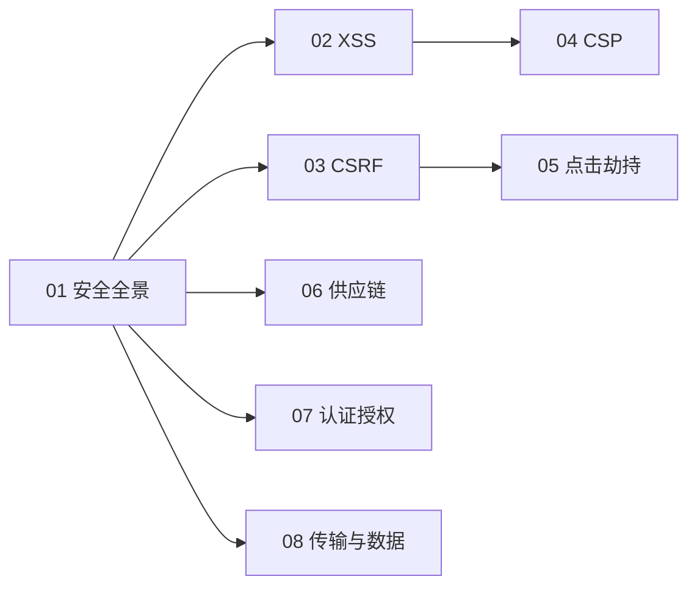

# 07-安全 · 本章导读

## 模块定位

前端是用户数据的第一道防线，也是攻击面最 exposed 的一层。本模块系统覆盖注入类（XSS）、伪造类（CSRF）、UI 类（点击劫持）、策略防御（CSP）、供应链、认证授权、传输与数据安全。

## 学习路径

## 章节列表

| 文件 | 主题 |
|------|------|
| [01-前端安全攻防](./01-前端安全攻防.md) | 安全全景：XSS/CSRF/CSP/供应链/越权 |
| [02-XSS攻防详解](./02-XSS攻防详解.md) | XSS 原理、三类型、分层防御 |
| [03-CSRF攻防详解](./03-CSRF攻防详解.md) | CSRF 原理、SameSite、Token |
| [04-CSP内容安全策略实战](./04-CSP内容安全策略实战.md) | CSP 指令、nonce、渐进上线 |
| [05-点击劫持与UI层攻击](./05-点击劫持与UI层攻击.md) | 点击劫持、Tabnabbing、开放重定向 |
| [06-供应链与依赖安全](./06-供应链与依赖安全.md) | 依赖审计、SRI、锁文件、依赖混淆 |
| [07-认证授权与Token安全](./07-认证授权与Token安全.md) | JWT、OAuth PKCE、越权、Token 存储 |
| [08-传输与数据安全](./08-传输与数据安全.md) | HTTPS、HSTS、安全响应头、隐私合规 |

## 自测清单

- [ ] XSS 有哪几种类型？如何防护？
- [ ] 反射型/存储型/DOM 型 XSS 的触发链路区别？
- [ ] source 与 sink 是什么？如何识别 DOM XSS？
- [ ] 输出编码、DOMPurify、CSP、Trusted Types 各解决什么？
- [ ] CSRF 攻击原理与 Token 防护？
- [ ] CSRF 成立的三个前提？SameSite 三个取值的区别？
- [ ] 为什么 CSRF Token 不能只放 Cookie？XSS 与 CSRF 如何叠加？
- [ ] CSP 如何配置？nonce/hash/strict-dynamic 各解决什么？为何要 Report-Only 渐进上线？
- [ ] 点击劫持如何防御？frame-ancestors 与 X-Frame-Options 的关系？
- [ ] 供应链攻击有哪些入口？审计/锁文件/SRI 各防什么？
- [ ] JWT payload 能存敏感信息吗？token 该存哪里？SPA 为何用 PKCE？
- [ ] 水平越权与垂直越权的区别？前端路由守卫为什么不是安全边界？
- [ ] HTTPS 解决哪三个问题？HSTS、nosniff 各防什么？
- [ ] 各专题文档的「面试高频问答」能否口述标准答法？
