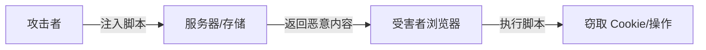
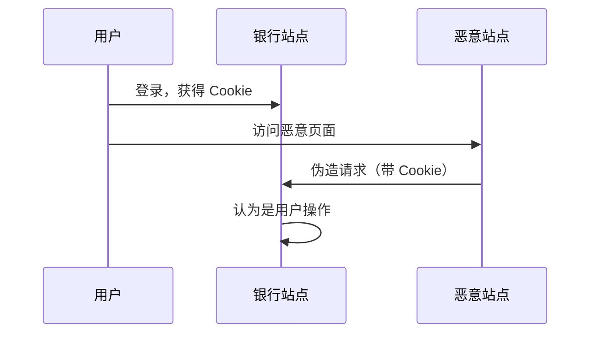

# 前端安全攻防

## 学习目标

- 理解 XSS 的类型与防护手段
- 掌握 CSRF 攻击原理与防御
- 了解 CSP、点击劫持、敏感信息保护
- 理解 npm 供应链安全风险与防护

## 为什么需要

前端代码运行在用户浏览器，处理用户输入、token、支付信息。安全漏洞导致：

- 用户数据泄露
- 账户被盗
- 恶意脚本注入
- 供应链攻击（恶意依赖）

架构师需在设计和代码审查中建立安全基线。

## 核心原理

### 1. XSS（Cross-Site Scripting）

**原理：** 攻击者注入恶意脚本，在其他用户浏览器执行。



**三种类型：**

| 类型 | 存储位置 | 示例 |
|------|---------|------|
| 存储型 | 服务器 DB | 评论区插入 `<script>` |
| 反射型 | URL 参数 | `?q=<script>alert(1)</script>` |
| DOM 型 | 客户端 JS | `innerHTML = location.hash` |

**防护：**

```javascript
// 1. 输出编码 — 永远不信任用户输入
function escapeHtml(str) {
  return str
    .replace(/&/g, '&amp;')
    .replace(/</g, '&lt;')
    .replace(/>/g, '&gt;')
    .replace(/"/g, '&quot;')
    .replace(/'/g, '&#039;');
}

// 2. 避免 dangerouslySetInnerHTML
// React 默认转义
<div>{userInput}</div> // 安全

// 若必须用 HTML，用 DOMPurify
import DOMPurify from 'dompurify';
<div dangerouslySetInnerHTML={{ __html: DOMPurify.sanitize(html) }} />

// 3. HttpOnly Cookie — JS 无法读取
Set-Cookie: token=xxx; HttpOnly; Secure; SameSite=Strict

// 4. CSP — 限制脚本来源
Content-Security-Policy: default-src 'self'; script-src 'self'
```

### 2. CSRF（Cross-Site Request Forgery）

**原理：** 利用用户已登录身份，诱导访问恶意页面发起请求。



**防护：**

```javascript
// 1. CSRF Token — 服务端生成，表单/Header 携带
<form>
  <input type="hidden" name="_csrf" value="{{csrfToken}}" />
</form>

fetch('/api/transfer', {
  method: 'POST',
  headers: {
    'X-CSRF-Token': getCsrfToken(),
    'Content-Type': 'application/json'
  },
  body: JSON.stringify(data)
});

// 2. SameSite Cookie
Set-Cookie: session=xxx; SameSite=Strict

// 3. 验证 Origin/Referer
// 服务端检查请求来源

// 4. 敏感操作二次验证（密码、短信）
```

### 3. CSP（Content Security Policy）

```http
Content-Security-Policy:
  default-src 'self';
  script-src 'self' https://cdn.example.com;
  style-src 'self' 'unsafe-inline';
  img-src 'self' data: https:;
  connect-src 'self' https://api.example.com;
  frame-ancestors 'none';
  report-uri /csp-report;
```

| 指令 | 作用 |
|------|------|
| default-src | 默认策略 |
| script-src | 脚本来源，避免 inline 脚本 |
| frame-ancestors | 防止点击劫持（替代 X-Frame-Options） |
| report-uri | 违规上报 |

**Report-Only 模式：** 先监控再 enforce

```http
Content-Security-Policy-Report-Only: script-src 'self'; report-uri /csp-report
```

### 4. 其他安全点

**点击劫持：**

```http
X-Frame-Options: DENY
# 或 CSP frame-ancestors 'none'
```

**敏感信息：**

```javascript
// 错误 — token 放 localStorage，XSS 可窃取
localStorage.setItem('token', token);

// 正确 — HttpOnly Cookie，JS 不可读
// 或使用内存 + 短过期 refresh token

// 错误 — API Key 硬编码
const API_KEY = 'sk-xxx';

// 正确 — 环境变量，服务端代理
```

**依赖安全：**

```bash
# 定期审计
pnpm audit
npm audit fix

# lockfile 锁定版本
# CI 集成 Snyk、Dependabot
```

**Subresource Integrity（SRI）：**

```html
<script
  src="https://cdn.example.com/lib.js"
  integrity="sha384-xxx"
  crossorigin="anonymous"
></script>
```

### 5. 安全 Checklist

- [ ] 用户输入输出编码，HTML 用 DOMPurify
- [ ] 敏感 token 用 HttpOnly Cookie
- [ ] 表单/API 有 CSRF 防护
- [ ] 配置 CSP，逐步收紧
- [ ] 依赖定期 audit，lockfile 提交
- [ ] 不在前端存密钥、密码
- [ ] HTTPS 全站，Secure Cookie

## 常见误区与最佳实践

| 误区 | 正确理解 |
|------|---------|
| "React 自动防 XSS" | dangerouslySetInnerHTML 仍危险 |
| "HTTPS 就安全" | HTTPS 防窃听，不防 XSS/CSRF |
| "CORS 防 CSRF" | CORS 不阻止请求发送，CSRF 需 Token |
| "小项目不用管安全" | 漏洞与规模无关 |

**最佳实践：**

- 安全左移：设计、CR 阶段考虑
- 最小权限：CSP、CORS 收紧
- 定期渗透测试、依赖扫描
- 安全 incident 响应流程

## 小结

- XSS：编码输出、CSP、HttpOnly、DOMPurify
- CSRF：Token、SameSite、Origin 验证
- CSP 限制资源来源，report-uri 监控
- 供应链：audit、lockfile、SRI

## 延伸阅读

- [OWASP Top 10](https://owasp.org/www-project-top-ten/)
- [MDN: CSP](https://developer.mozilla.org/en-US/docs/Web/HTTP/CSP)
- [DOMPurify](https://github.com/cure53/DOMPurify)
- [npm audit](https://docs.npmjs.com/cli/v8/commands/npm-audit)
