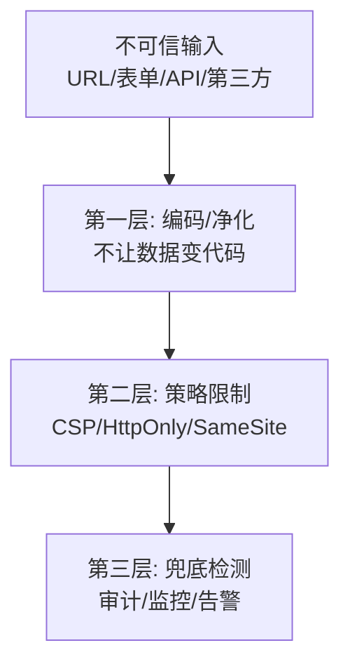

# 前端安全攻防

## 学习目标

- 能复现 XSS/CSRF 攻击并验证防御有效
- 能在项目中落地 CSP、HttpOnly Cookie、依赖审计
- 掌握 JWT/OAuth 常见误用与修复

## 为什么需要

安全漏洞不是「后端的事」——XSS 可窃取 token、CSRF 可冒充用户操作。

> 核心心法：**攻击复现 → 加防御 → 再攻击验证失败。** 没验证过的防御不可信。

---

## 一、心智模型

| 攻击 | 本质 | 前端第一道防线 |
|------|------|---------------|
| XSS | 注入脚本执行 | 输出编码、CSP、不用 innerHTML |
| CSRF | 借用 Cookie 发请求 | Token、SameSite |
| 点击劫持 | iframe 嵌套诱骗 | X-Frame-Options、CSP |
| 供应链 | 恶意依赖 | audit、lockfile、SRI |

---

## 二、底层原理：纵深防御与信任边界

### 前端安全的本质

浏览器里运行的代码**天然不可信**——攻击者可以：注入脚本、伪造请求、嵌套页面、篡改依赖。前端安全的工作是**缩小攻击面 + 多层兜底**。



这就是**纵深防御（Defense in Depth）**：任何单层都可能被绕过（如 CSP 配错、DOMPurify 被绕过），多层叠加才能兜底。

### 信任边界

| 边界 | 内侧（可信） | 外侧（不可信） | 前端职责 |
|------|------------|--------------|---------|
| 数据 | 经校验的业务数据 | 用户输入、URL、第三方 API | 输出编码、运行时校验 |
| 执行 | 自己的 JS | 注入的脚本、第三方 CDN | CSP 白名单、SRI |
| 身份 | 服务端校验的权限 | 客户端隐藏按钮 | UI 体验优化，后端裁决 |
| 传输 | HTTPS 加密通道 | 明文 HTTP、中间人 | 全站 HTTPS + HSTS |

### 本模块文档导航

本篇是安全**全景速览**，各专题有深度文档：

| 专题 | 文档 |
|------|------|
| XSS | [02-XSS攻防详解](./02-XSS攻防详解.md) |
| CSRF | [03-CSRF攻防详解](./03-CSRF攻防详解.md) |
| CSP | [04-CSP内容安全策略实战](./04-CSP内容安全策略实战.md) |
| 点击劫持 | [05-点击劫持与UI层攻击](./05-点击劫持与UI层攻击.md) |
| 供应链 | [06-供应链与依赖安全](./06-供应链与依赖安全.md) |
| 认证授权 | [07-认证授权与Token安全](./07-认证授权与Token安全.md) |
| 传输与数据 | [08-传输与数据安全](./08-传输与数据安全.md) |

---

## 三、XSS：复现 → 防御 → 验证

### 复现（本地 lab）

```javascript
// 危险：评论直接 innerHTML
commentEl.innerHTML = userInput;
// 输入：
```

### 防御

```tsx
// React 默认转义文本
<div>{userInput}</div>

// 必须渲染 HTML 时
import DOMPurify from 'dompurify';
<div dangerouslySetInnerHTML={{ __html: DOMPurify.sanitize(html) }} />
```

```http
Content-Security-Policy: default-src 'self'; script-src 'self'; object-src 'none'
```

### 验证

1. 再注入 payload → 不执行或 CSP 控制台报 violated
2. token 放 HttpOnly Cookie → `document.cookie` 读不到

---

## 四、CSRF：复现 → 防御 → 验证

### 复现

恶意站点 `<form action="https://bank.com/transfer" method="POST">` 自动提交——浏览器带 Cookie。

### 防御

```javascript
fetch('/api/transfer', {
  method: 'POST',
  headers: { 'X-CSRF-Token': getCsrfToken() },
  credentials: 'include',
});
```

```http
Set-Cookie: session=xxx; HttpOnly; Secure; SameSite=Strict
```

### 验证

无 Token 的 POST → 403；跨站 form 提交无效。

---

## 五、JWT / OAuth 误用

| 误用 | 风险 | 正确 |
|------|------|------|
| JWT 存 localStorage | XSS 窃取 | HttpOnly Cookie 或内存+短过期 |
| payload 存密码 | 可解码 | 只存 sub/exp |
| SPA 无 PKCE | 授权码拦截 | OAuth PKCE |

---

## 六、依赖审计（CI 必跑）

```bash
pnpm audit --audit-level=high
# CI 失败阻断合并；Dependabot 自动 PR
```

```html
<script src="https://cdn.example.com/lib.js"
  integrity="sha384-..." crossorigin="anonymous"></script>
```

---

## 七、越权（前端配合）

- UI 按权限隐藏按钮（**不能替代后端校验**）
- API 403 统一处理；禁止仅靠前端 route guard

---

## 排查实战

### 案例：活动页 XSS

- 用户输入昵称带 script，存储型 XSS
- 修复：DOMPurify + CSP
- 验证：pentest 复测通过

### 案例：npm 供应链

- audit 发现 transitive 高危
- 升级/替换依赖，lockfile 更新
- CI audit 0 high

---

## 项目 Checklist

- [ ] CSP Report-Only → enforce 渐进
- [ ] 敏感 token HttpOnly + Secure + SameSite
- [ ] CSRF Token 所有变更类 API
- [ ] pnpm audit in CI
- [ ] 第三方 script SRI 或 self-host

## 面试高频问答（追问链）

> 大厂对一个考点通常追问到能力边界：**概念 → 机制 → 边界 → ⭐ 原理（触底）→ 实战（落地）**。实战层是区分「背过」和「做过」的关键。

### 链一：安全体系观

1. **概念**：前端安全核心威胁有哪些？→ XSS、CSRF、点击劫持、供应链、越权。
2. **机制**：XSS 和 CSRF 区别？→ XSS 执行恶意脚本（信任用户输入），CSRF 借用 Cookie 发请求（信任已登录身份）。
3. **边界**：纵深防御是什么？→ 编码 → 策略(CSP) → 检测多层，单层失效仍有兜底。
4. **应用**：安全谁负责？→ 前后端协同，前端不能替代后端校验。
5. ⭐ **原理（触底）**：给你一个新业务，你怎么系统性做安全设计？→ 按信任边界(数据/执行/身份/传输)梳理威胁(STRIDE)→ 分层防御 + 安全响应头基线 + 依赖审计 + CI 安全扫描 + 上线攻防验证闭环。
6. **实战（落地）**：接手新业务你怎么跑通一轮 attack-defense-verify 闭环？→ 攻击面：按信任边界(数据/执行/身份/传输)用 STRIDE 列威胁，自测构造 XSS/CSRF/越权 payload 复现；防御：分层落地（输出编码 + DOMPurify、CSP/HSTS 等响应头基线、CSRF Token + SameSite、后端逐接口鉴权、依赖审计）；验证：CI 接 ZAP/Snyk 扫描 + 上线前渗透复测 payload 全部被拦、安全头用 securityheaders 评级；结果：沉淀可复用的安全基线模板，新项目开箱即合规。

## 小结

- 原理：纵深防御（编码→策略→检测）+ 信任边界（数据/执行/身份/传输）
- 安全要 attack-defense-verify 闭环
- 各专题详见 02-08 深度文档
- XSS 防注入+ CSP；CSRF 防 Token+ SameSite
- 前端不存敏感 JWT；后端才是权限最终裁判

## 延伸阅读

- [OWASP Top 10](https://owasp.org/www-project-top-ten/)
- [MDN CSP](https://developer.mozilla.org/en-US/docs/Web/HTTP/CSP)
