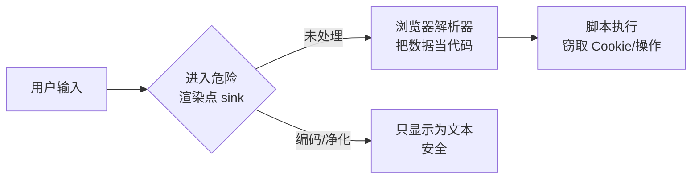
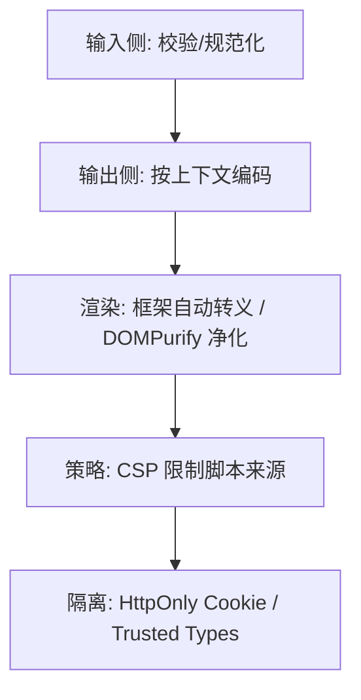

# XSS 跨站脚本攻防详解

## 学习目标

- 理解 XSS 的本质：数据被当作代码执行
- 区分反射型、存储型、DOM 型三类 XSS 的触发链路
- 掌握分层防御：输出编码、框架转义、DOMPurify、CSP、Trusted Types
- 能识别 DOM XSS 的 source/sink，并在 React/Vue 中避开高危 API
- 能复现攻击并验证防御有效

## 为什么需要

XSS 是 OWASP 常年 Top 榜单的漏洞。一旦得手，攻击者能：窃取 Cookie/Token、冒充用户操作、篡改页面、做键盘记录、发起蠕虫传播。它几乎全部发生在**前端渲染层**，是前端工程师责无旁贷的防线。

> 核心心法：**XSS 的本质是「数据」越界变成了「代码」。** 一切防御都围绕一句话——**让用户输入永远只能是数据，不能被解析为可执行的脚本/HTML**。

---

## 一、原理：数据如何变成代码

浏览器解析页面时，HTML、JS、CSS、URL 都有各自的「解析器」。当用户输入未经处理就拼接进这些上下文，输入里的特殊字符会被解析器当作语法结构：

```javascript
// 服务端/前端拼接
const html = '<div>' + userInput + '</div>';
// 正常输入: "你好"        → <div>你好</div>
// 恶意输入: ""
//   → <div></div>
//   浏览器把它当成真的  标签，onerror 触发，脚本执行
```



关键概念：

- **Source（污染源）**：用户可控的输入——URL、表单、`location`、`postMessage`、Cookie、接口返回。
- **Sink（危险汇聚点）**：能把字符串解析为代码的 API——`innerHTML`、`eval`、`document.write`、`href="javascript:"` 等。
- **XSS = Source 的数据未净化流入 Sink。**

---

## 二、三种类型

| 类型 | 数据存哪 | 触发链路 | 影响面 |
|------|---------|---------|--------|
| 反射型（Reflected） | URL/请求参数 | 诱导点击恶意链接 → 服务器原样返回 → 执行 | 单个受害者 |
| 存储型（Stored） | 服务器数据库 | 攻击者提交 → 存库 → 其他用户访问即中招 | 所有访问者（最危险） |
| DOM 型（DOM-based） | 不经服务器 | 前端 JS 直接把 source 写入 sink | 取决于页面 |

### 2.1 反射型

```
https://site.com/search?q=<script>steal()</script>
```

服务器把 `q` 直接拼进 HTML 返回，脚本执行。常见于搜索结果页、错误提示页。

### 2.2 存储型（危害最大）

```javascript
// 攻击者在评论/昵称/富文本里提交
""
// 存进数据库 → 每个看到这条评论的用户都会执行
```

### 2.3 DOM 型（纯前端，后端无法拦截）

```javascript
// 危险：直接把 URL hash 写入页面
document.getElementById('app').innerHTML = location.hash.slice(1);
// 访问 page# 即触发
// 注意：服务器日志里甚至看不到 payload（# 后不发往服务器）
```

---

## 三、防御体系（分层，纵深防御）

单一手段都可能被绕过，必须分层叠加：



### 3.1 输出编码（按上下文，最根本）

同一数据在不同上下文要用不同编码：

| 上下文 | 危险字符 | 编码方式 |
|--------|---------|---------|
| HTML 文本 | `< > & " '` | HTML 实体（`&lt;` 等） |
| HTML 属性 | `" '` | 属性编码 + 加引号 |
| JavaScript | `' " \ 换行` | JS 字符串转义 / `JSON.stringify` |
| URL | 特殊字符 | `encodeURIComponent` |
| CSS | `< > '` | CSS 转义 |

```javascript
// HTML 文本编码
function escapeHtml(s) {
  return s.replace(/[&<>"']/g, c => ({
    '&': '&amp;', '<': '&lt;', '>': '&gt;', '"': '&quot;', "'": '&#39;'
  }[c]));
}
```

### 3.2 框架自动转义（首选）

React/Vue 默认对插值做 HTML 转义——**优先依赖框架，别手动拼 HTML**：

```jsx
// React：{} 插值自动转义，安全
<div>{userInput}</div>

// 危险 API，绕过转义
<div dangerouslySetInnerHTML={{ __html: userInput }} />
```

```vue
<!-- Vue：插值安全 -->
<div>{{ userInput }}</div>

<!-- 危险：v-html 不转义 -->
<div v-html="userInput"></div>
```

### 3.3 富文本场景：DOMPurify 净化

确实需要渲染用户提供的 HTML（富文本编辑器、Markdown）时，用白名单净化库：

```tsx
import DOMPurify from 'dompurify';

const clean = DOMPurify.sanitize(dirtyHtml, {
  ALLOWED_TAGS: ['b', 'i', 'em', 'strong', 'a', 'p', 'ul', 'li'],
  ALLOWED_ATTR: ['href'],
});
<div dangerouslySetInnerHTML={{ __html: clean }} />
```

> 不要自己写正则过滤标签——绕过手法极多（大小写、编码、嵌套、畸形标签）。永远用成熟库。

### 3.4 CSP（内容安全策略，强力兜底）

即使有注入，CSP 也能阻止脚本执行/外联：

```http
Content-Security-Policy:
  default-src 'self';
  script-src 'self' 'nonce-r4nd0m';
  object-src 'none';
  base-uri 'self';
  report-uri /csp-report
```

| 指令 | 作用 |
|------|------|
| `script-src 'self'` | 只允许同源脚本，**禁内联脚本/eval** |
| `'nonce-xxx'` | 给可信内联脚本签发一次性随机数 |
| `object-src 'none'` | 禁 Flash/object 等 |
| `base-uri 'self'` | 防 `<base>` 劫持 |
| `report-uri` | 上报违规，便于监控 |

落地建议：先用 `Content-Security-Policy-Report-Only` 观察上报，无误伤再切正式。

### 3.5 Trusted Types（现代浏览器，根治 DOM XSS）

强制所有 DOM sink 只接受可信类型，从源头堵死字符串注入：

```http
Content-Security-Policy: require-trusted-types-for 'script'
```

```javascript
const policy = trustedTypes.createPolicy('default', {
  createHTML: (s) => DOMPurify.sanitize(s),
});
el.innerHTML = policy.createHTML(userInput); // 直接赋字符串会被拒绝
```

### 3.6 Cookie 隔离

```http
Set-Cookie: session=xxx; HttpOnly; Secure; SameSite=Strict
```

`HttpOnly` 让 `document.cookie` 读不到 token——即使 XSS 得手也偷不走会话。

---

## 四、DOM XSS：source/sink 速查

### 常见 Source（污染源）

```javascript
location.href / location.search / location.hash
document.referrer
window.name
postMessage 的 event.data
localStorage / URL 参数
```

### 常见 Sink（危险点）

| Sink | 风险 | 安全替代 |
|------|------|---------|
| `el.innerHTML` / `outerHTML` | 解析 HTML | `textContent` |
| `document.write()` | 解析 HTML | 避免使用 |
| `eval()` / `new Function()` | 执行代码 | `JSON.parse` |
| `setTimeout('代码')` | 字符串当代码 | 传函数 |
| `a.href = 'javascript:...'` | 伪协议执行 | 校验协议白名单 |
| `el.setAttribute('on...', )` | 事件处理 | 禁止动态绑 on* |

### `javascript:` 伪协议防御

```javascript
function safeHref(url) {
  try {
    const u = new URL(url, location.origin);
    return ['http:', 'https:', 'mailto:'].includes(u.protocol) ? url : '#';
  } catch { return '#'; }
}
```

---

## 五、框架中的高危点清单

| 框架 | 高危 API | 安全做法 |
|------|---------|---------|
| React | `dangerouslySetInnerHTML` | DOMPurify 净化后再用 |
| React | `<a href={userUrl}>` | 校验协议，禁 `javascript:` |
| React | `ref` 直接 `innerHTML` | 用 textContent |
| Vue | `v-html` | DOMPurify 净化 |
| Vue | `:href`/`:src` 动态绑 | 协议白名单 |
| 通用 | SSR 注入 `window.__DATA__` | 用 `JSON.stringify` 并转义 `<` |

SSR 数据注入的安全写法：

```javascript
// 危险：直接序列化，</script> 会截断脚本
`<script>window.__D__=${JSON.stringify(data)}</script>`

// 安全：转义危险字符
const json = JSON.stringify(data).replace(/</g, '\\u003c');
`<script>window.__D__=${json}</script>`
```

---

## 六、复现 → 防御 → 验证（实操闭环）

### 复现（本地 lab）

```javascript
// 搭一个最小漏洞页
app.get('/search', (req, res) => {
  res.send(`<h1>结果：${req.query.q}</h1>`); // 未编码
});
// 访问 /search?q=<script>alert(document.cookie)</script>
```

### 防御

```javascript
res.send(`<h1>结果：${escapeHtml(req.query.q)}</h1>`); // 输出编码
// + 响应头加 CSP
// + 会话 Cookie 加 HttpOnly
```

### 验证

1. 再次注入 payload → 页面显示为纯文本，不执行
2. 控制台若有 CSP 拦截 → 看到 `Refused to execute inline script`
3. `document.cookie` 读不到 session（HttpOnly 生效）
4. 用 OWASP ZAP / Burp 自动化扫描复测

---

## 排查实战

### 案例 A：评论区存储型 XSS

- **现象：** 某用户昵称含 ``，所有人打开列表页弹窗
- **定位：** 后端原样存储，前端用 `innerHTML` 渲染昵称
- **修复：** 渲染改框架插值/`textContent`；富文本走 DOMPurify；加 CSP
- **验证：** 重新注入 payload 不执行，ZAP 扫描 0 高危

### 案例 B：DOM 型 XSS（后端日志查不到）

- **现象：** 分享链接 `page#` 触发
- **定位：** 前端把 `location.hash` 写入 `innerHTML`
- **修复：** 改 `textContent`；或 DOMPurify 净化
- **验证：** 同链接不再执行

### 案例 C：富文本编辑器绕过

- **现象：** 自研正则过滤被 `<svg/onload>` 绕过
- **修复：** 弃用自写正则，统一 DOMPurify 白名单
- **验证：** 用 XSS payload 字典批量复测全部拦截

---

## 常见误区与最佳实践

| 误区 | 正确理解 |
|------|---------|
| "前端校验了就安全" | 前端校验可绕过，输出编码才是关键 |
| "自己写正则过滤标签" | 绕过手法极多，必须用 DOMPurify |
| "有 CSP 就够了" | CSP 是兜底，编码/净化是根本 |
| "只有输入框才有 XSS" | URL、hash、postMessage 都是 source |
| "React 完全免疫" | dangerouslySetInnerHTML / href 仍有风险 |
| "转义一次走天下" | 要按 HTML/属性/JS/URL 上下文分别编码 |

**可执行清单：**

- [ ] 默认用框架插值，杜绝手动拼 HTML
- [ ] 富文本一律 DOMPurify 白名单净化
- [ ] 按上下文输出编码（HTML/属性/JS/URL）
- [ ] 部署 CSP（先 Report-Only 再 enforce）
- [ ] 会话 token 用 HttpOnly + Secure + SameSite
- [ ] 校验 `href/src` 协议，禁 `javascript:`
- [ ] SSR 注入数据转义 `<`
- [ ] 评估开启 Trusted Types

## 面试高频问答（追问链）

> 大厂对一个考点通常追问到能力边界：**概念 → 机制 → 边界 → ⭐ 原理（触底）→ 实战（落地）**。实战层是区分「背过」和「做过」的关键。

### 链一：XSS 原理与防御

1. **概念**：三种 XSS 区别？→ 反射型(URL 参数)、存储型(持久化最危险)、DOM 型(纯前端)。
2. **机制**：XSS 本质是什么？→ 用户数据越界被当成代码执行。
3. **边界**：innerHTML / dangerouslySetInnerHTML 安全吗？→ 不安全，需 DOMPurify 净化。
4. **应用**：框架默认安全吗？→ JSX/模板自动转义，但 SSR 注入、href javascript:、富文本仍危险。
5. ⭐ **原理（触底）**：怎么定位和根治一个 DOM XSS？Trusted Types 怎么帮忙？→ 抓 source(location/输入)→sink(innerHTML/eval) 链路，优先 textContent + DOMPurify；Trusted Types 强制 sink 只接受可信类型，从机制上消除 DOM XSS。
6. **实战（落地）**：你怎么定位并根治一个线上 XSS（attack-defense-verify）？→ 攻击：在评论/富文本注入 `` 复现弹窗，抓 source(输入/location)→sink(innerHTML) 链路；防御：sink 改 textContent、富文本走 DOMPurify 白名单净化、上 CSP(nonce+strict-dynamic) 兜底、评估 Trusted Types 强制可信类型；验证：重放原 payload + 自动化扫描确认不再执行、看 CSP report 无违规；结果：消除该类 sink XSS，Trusted Types 从机制上根治 DOM XSS。

## 小结

- XSS 本质：用户**数据**越界被当成**代码**执行
- 三类：反射型（URL）、存储型（库，最危险）、DOM 型（纯前端）
- 防御要分层：输出编码 + 框架转义 + DOMPurify + CSP + HttpOnly + Trusted Types
- DOM XSS 抓 source→sink 链路，优先 `textContent`
- 闭环：复现 → 加防御 → 再攻击验证失败

## 延伸阅读

- [OWASP XSS](https://owasp.org/www-community/attacks/xss/)
- [OWASP XSS Prevention Cheat Sheet](https://cheatsheetseries.owasp.org/cheatsheets/Cross_Site_Scripting_Prevention_Cheat_Sheet.html)
- [DOMPurify](https://github.com/cure53/DOMPurify)
- [MDN: CSP](https://developer.mozilla.org/zh-CN/docs/Web/HTTP/CSP)
- [Trusted Types](https://web.dev/articles/trusted-types)
