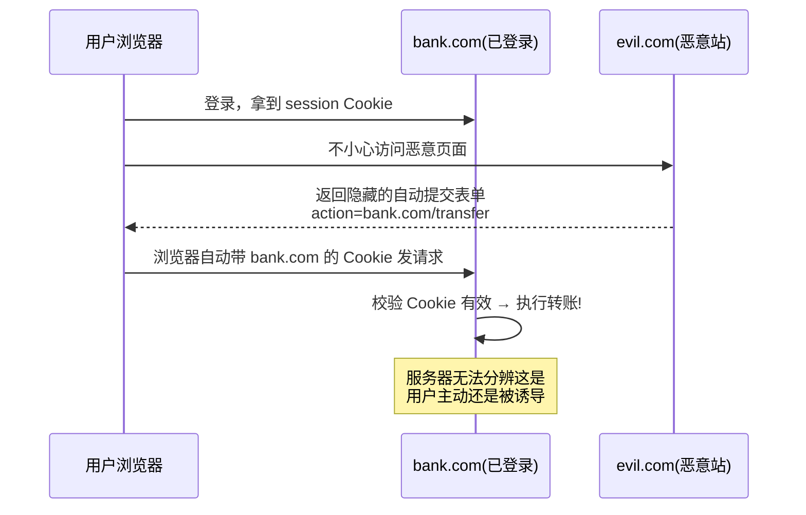
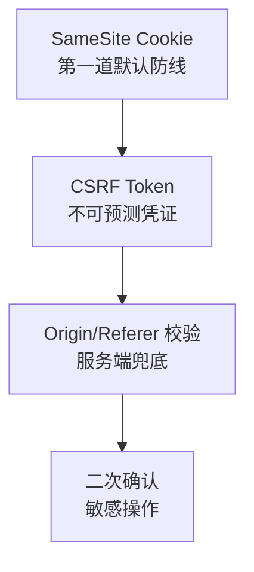

# CSRF 跨站请求伪造攻防详解

## 学习目标

- 理解 CSRF 的本质：浏览器自动携带 Cookie 被恶意利用
- 区分 CSRF 与 XSS 的差异，理解二者如何叠加
- 掌握主流防御：SameSite Cookie、CSRF Token、双重提交、Origin 校验
- 能复现 GET/POST/JSON 等不同形态的 CSRF 并验证防御

## 为什么需要

CSRF（Cross-Site Request Forgery）让攻击者在**用户不知情**的情况下，以用户身份发起请求——转账、改密码、删数据。它不需要窃取任何凭证，只是「借用」浏览器自动携带的登录态。只要你的接口靠 Cookie 鉴权，就可能中招。

> 核心心法：**CSRF 利用的是「浏览器会自动带上 Cookie」这一默认行为。** 防御的关键是：让服务器能区分「请求到底是用户在本站主动发起的，还是被第三方站点诱导发起的」。

---

## 一、原理：被借用的登录态



成立的三个前提（缺一不可）：

1. 用户**已登录**目标站点，且会话存于 Cookie。
2. 目标接口**仅靠 Cookie** 鉴权，无额外校验。
3. 攻击者能构造请求（参数可预测），并诱导用户访问恶意页。

> 与 XSS 的区别：**XSS 是在受害站点内执行脚本（信任被滥用的是站点对用户输入的信任）；CSRF 是从外部站点伪造请求（被滥用的是站点对浏览器 Cookie 的信任）。** XSS 能直接读响应，CSRF 通常是「盲发」（看不到响应）。

---

## 二、攻击形态

### 2.1 GET 型（最易，危险接口绝不能用 GET 做变更）

```html
<!-- 恶意页面里一张图，加载即发请求 -->

```

### 2.2 POST 型（自动提交表单）

```html
<form action="https://bank.com/transfer" method="POST" id="f">
  <input type="hidden" name="to" value="attacker" />
  <input type="hidden" name="amount" value="10000" />
</form>
<script>document.getElementById('f').submit();</script>
```

### 2.3 JSON / 复杂请求

`Content-Type: application/json` 的 fetch 会触发 **CORS 预检（OPTIONS）**，跨站默认被拦——这本身是一道天然屏障。但若服务器对 `text/plain` 等简单请求也接受 JSON 体，仍可能被绕过：

```html
<form action="https://api.com/transfer" method="POST"
      enctype="text/plain">
  <input name='{"to":"attacker","amount":10000,"x":"' value='"}' />
</form>
```

> 结论：**不要仅靠 Content-Type 防 CSRF**，要用下面的正规手段。

---

## 三、防御体系（分层）



### 3.1 SameSite Cookie（现代浏览器默认，最省事）

让 Cookie 在跨站请求时不被携带：

```http
Set-Cookie: session=xxx; HttpOnly; Secure; SameSite=Lax
```

| 取值 | 行为 | 适用 |
|------|------|------|
| `Strict` | 任何跨站请求都不带 Cookie | 安全性最高，但外链跳转会丢登录态 |
| `Lax`（现代浏览器默认） | 仅顶级导航的 GET 带 Cookie | 平衡，推荐默认 |
| `None` | 跨站也带（必须配 `Secure`） | 需要第三方携带的场景 |

`Lax` 下：``/表单 POST 等跨站请求不带 Cookie → 大部分 CSRF 自动失效。

> 注意：SameSite 不是 100% 银弹——老旧浏览器不支持、`SameSite=None` 场景、同站子域攻击等仍需 Token 兜底。

### 3.2 CSRF Token（同步令牌，经典强防御）

服务器下发一个**不可预测**的随机 Token，要求每次变更请求都带上。攻击者跨站拿不到这个 Token。

```javascript
// 1. 服务端渲染时注入（或单独接口下发）
// <meta name="csrf-token" content="r4nd0m-token">

// 2. 前端每次变更请求带上
const token = document.querySelector('meta[name="csrf-token"]').content;
fetch('/api/transfer', {
  method: 'POST',
  headers: {
    'Content-Type': 'application/json',
    'X-CSRF-Token': token,        // 关键：放自定义头，跨站表单无法设置
  },
  credentials: 'include',
  body: JSON.stringify({ to, amount }),
});
```

服务端校验请求头/参数里的 Token 与会话中存储的是否一致，不一致返回 403。

> 放在**自定义请求头**（如 `X-CSRF-Token`）尤其有效：跨站 HTML 表单无法设置自定义头，且会触发 CORS 预检。

### 3.3 双重提交 Cookie（Double Submit，无状态）

服务器不存 Token，而是同时放进 Cookie 和请求头，校验两者相等：

```javascript
// 服务端下发: Set-Cookie: csrf=abc (非 HttpOnly，供 JS 读取)
// 前端读取 Cookie 写入请求头
const csrf = document.cookie.match(/csrf=([^;]+)/)?.[1];
fetch('/api/x', { headers: { 'X-CSRF-Token': csrf }, credentials: 'include' });
// 服务端校验: Cookie 里的 csrf === 头里的 X-CSRF-Token
```

攻击者能让浏览器带上 Cookie，但读不到值、也无法设置自定义头 → 校验失败。适合无状态/分布式后端。

### 3.4 Origin / Referer 校验（服务端兜底）

```javascript
// 服务端中间件
const origin = req.headers.origin || req.headers.referer;
if (!origin || !isAllowed(new URL(origin).host)) {
  return res.status(403).end();
}
```

简单有效，但 Referer 可能被代理/隐私策略剥离，作为**辅助**而非唯一手段。

### 3.5 敏感操作二次验证

转账、改密码等高危操作，额外要求输入密码 / 短信验证码 / 二次确认——即使前面都被绕过也能兜底。

---

## 四、前端落地清单

```javascript
// 统一 axios 拦截器自动带 Token
axios.interceptors.request.use((config) => {
  if (['post', 'put', 'delete', 'patch'].includes(config.method)) {
    config.headers['X-CSRF-Token'] = getCsrfToken();
  }
  return config;
});
```

- 所有**变更类**接口（POST/PUT/DELETE/PATCH）都带 Token
- 严格遵守 RESTful：GET 只读，绝不用 GET 做副作用操作
- 会话 Cookie 统一 `HttpOnly; Secure; SameSite=Lax`
- 跨域接口配合后端做 CORS 白名单 + 预检

---

## 五、复现 → 防御 → 验证

### 复现

```html
<!-- 攻击者页面 attack.html，本地起服务打开 -->
<form action="http://localhost:3000/api/transfer" method="POST">
  <input name="to" value="hacker"><input name="amount" value="9999">
</form>
<script>document.forms[0].submit()</script>
<!-- 此时若你在另一个 Tab 登录了目标站，转账会成功 -->
```

### 防御

```http
Set-Cookie: session=...; HttpOnly; Secure; SameSite=Lax
```

```javascript
// 后端要求 X-CSRF-Token 且校验 Origin
```

### 验证

1. 重新打开攻击页提交 → 返回 **403**（无 Token / Origin 不符）
2. DevTools Network 看该跨站 POST **未携带 session Cookie**（SameSite 生效）
3. 正常站内操作仍成功（Token 正确）

---

## 排查实战

### 案例 A：改密码接口被 CSRF

- **现象：** 用户访问外链后密码被改
- **定位：** 改密码接口仅校验 session Cookie，无 Token；Cookie 未设 SameSite
- **修复：** Cookie 加 `SameSite=Lax`；接口加 `X-CSRF-Token` 校验；改密码额外验原密码
- **验证：** 伪造请求返回 403，原密码错误也拦截

### 案例 B：GET 接口副作用

- **现象：** `` 让用户被强制登出
- **定位：** 登出用了 GET
- **修复：** 改为 POST + Token
- **验证：** GET 不再产生副作用

### 案例 C：SameSite=None 漏配

- **现象：** 为支持第三方嵌入把 Cookie 设了 `SameSite=None`，CSRF 风险回归
- **修复：** 该场景必须叠加 CSRF Token + Origin 校验
- **验证：** 跨站请求无 Token → 403

---

## 常见误区与最佳实践

| 误区 | 正确理解 |
|------|---------|
| "有 HTTPS 就防 CSRF" | HTTPS 防窃听，不防伪造 |
| "校验 Referer 就够" | Referer 可被剥离，仅作辅助 |
| "Token 放 Cookie 自动带就行" | 必须放头/参数，Cookie 自动带等于没防 |
| "SameSite 万能" | 老浏览器/None 场景仍需 Token |
| "JSON 接口天然安全" | 简单请求/text-plain 仍可绕过 |
| "CSRF 和 XSS 一回事" | XSS 站内注入脚本，CSRF 站外伪造请求；XSS 可击穿所有 CSRF 防御 |

**可执行清单：**

- [ ] 会话 Cookie 设 `HttpOnly; Secure; SameSite=Lax`
- [ ] 所有变更类接口校验 CSRF Token（放自定义头）
- [ ] 严格 GET 只读，副作用用 POST/PUT/DELETE
- [ ] 服务端校验 Origin/Referer 作兜底
- [ ] 敏感操作二次验证（密码/验证码）
- [ ] 同时防住 XSS（否则 CSRF 防御可被绕过）

## 面试高频问答（追问链）

> 大厂对一个考点通常追问到能力边界：**概念 → 机制 → 边界 → ⭐ 原理（触底）→ 实战（落地）**。实战层是区分「背过」和「做过」的关键。

### 链一：CSRF 原理与防御

1. **概念**：CSRF 三要素？→ 用户已登录、Cookie 自动携带、攻击者构造请求。
2. **机制**：SameSite 三种值？→ Strict 完全禁止、Lax 导航允许、None 需 Secure。
3. **边界**：JSON 请求需要 CSRF 防护吗？→ 需要，text/plain 可绕过预检。
4. **应用**：CSRF Token 放哪、为什么有效？→ 放自定义 Header/参数，攻击者跨域读不到。
5. ⭐ **原理（触底）**：有了 SameSite=Lax 还需要 CSRF Token 吗？XSS 在场时 Token 还有用吗？→ 仍需 Token 兜底（旧浏览器/GET 导航/子域风险）；XSS 在场可读取 Token 使其失效，所以必须先堵 XSS，防御要分层。
6. **实战（落地）**：你怎么给一个写接口做完整 CSRF 防护并验证（attack-defense-verify）？→ 攻击：构造跨站自动提交表单/img 发起转账请求复现；防御：Cookie 设 SameSite=Lax/Strict + 关键接口加 CSRF Token(放自定义 Header，攻击者跨域读不到) + 校验 Origin/Referer + 先堵 XSS 防 Token 被读；验证：用攻击页重放确认被 403、清空 Token 确认拦截生效；结果：跨站请求全部失败，分层防御即使单点失效仍有兜底。

## 小结

- CSRF 本质：浏览器自动携带 Cookie 被第三方站点借用
- 三前提：已登录 + 仅 Cookie 鉴权 + 请求可伪造
- 防御分层：SameSite（默认）+ CSRF Token（核心）+ Origin 校验（兜底）+ 二次确认
- Token 必须放在跨站无法设置的位置（自定义头/参数）
- CSRF 与 XSS 互补：先堵 XSS，否则 Token 也会被读走

## 延伸阅读

- [OWASP CSRF](https://owasp.org/www-community/attacks/csrf)
- [OWASP CSRF Prevention Cheat Sheet](https://cheatsheetseries.owasp.org/cheatsheets/Cross-Site_Request_Forgery_Prevention_Cheat_Sheet.html)
- [MDN: SameSite cookies](https://developer.mozilla.org/zh-CN/docs/Web/HTTP/Headers/Set-Cookie/SameSite)
