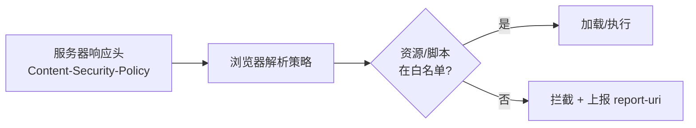
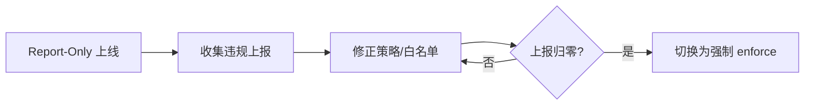

# CSP 内容安全策略实战

## 学习目标

- 理解 CSP 作为「纵深防御」如何兜底 XSS
- 掌握核心指令、nonce/hash、Report-Only 渐进上线
- 能为真实项目（含第三方脚本/CDN）写出可用的 CSP
- 能用违规上报与 DevTools 排查 CSP 误伤

## 为什么需要

输出编码、DOMPurify 是 XSS 的「主防线」，但人会犯错、第三方库会引入漏洞。CSP（Content Security Policy）是浏览器级的**白名单机制**：即使页面被注入脚本，只要不在白名单内就拒绝执行。它是 XSS 的最后一道保险。

> 核心心法：**CSP 不是用来「修复」XSS 的，而是「即使有 XSS 也无法得手」的兜底。** 默认拒绝、按需放行。

---

## 一、工作原理

服务器通过响应头（或 `<meta>`）下发策略，浏览器据此拦截不符合的资源加载与脚本执行：



两种下发方式：

```http
# 推荐：响应头
Content-Security-Policy: default-src 'self'
```

```html
<!-- 备选：meta（无法用 report-uri、frame-ancestors） -->
<meta http-equiv="Content-Security-Policy" content="default-src 'self'">
```

---

## 二、核心指令速查

| 指令 | 控制对象 | 常用值 |
|------|---------|--------|
| `default-src` | 兜底，未指定的都用它 | `'self'` |
| `script-src` | JS 来源 | `'self' 'nonce-xxx'` |
| `style-src` | CSS 来源 | `'self' 'unsafe-inline'`（尽量避免） |
| `img-src` | 图片 | `'self' data: https:` |
| `connect-src` | fetch/XHR/WebSocket | `'self' https://api.com` |
| `font-src` | 字体 | `'self' data:` |
| `frame-src` | iframe 内容 | 按需 |
| `frame-ancestors` | 谁能 iframe 嵌入本页 | `'none'`（防点击劫持） |
| `object-src` | `<object>/<embed>` | `'none'` |
| `base-uri` | `<base>` 标签 | `'self'` |
| `form-action` | 表单提交目标 | `'self'` |
| `upgrade-insecure-requests` | 自动升级 http→https | 无值 |
| `report-uri` / `report-to` | 违规上报地址 | `/csp-report` |

**关键字含义：**

- `'self'`：同源
- `'none'`：全部禁止
- `'unsafe-inline'`：允许内联脚本/样式（**削弱安全，慎用**）
- `'unsafe-eval'`：允许 eval（尽量禁）
- `'nonce-xxx'`：放行带匹配 nonce 的内联脚本
- `'strict-dynamic'`：信任由已信任脚本动态创建的脚本

---

## 三、内联脚本怎么办：nonce 与 hash

最安全的 CSP 是禁掉所有内联脚本，但现实常需要内联。两种放行方式：

### 3.1 nonce（一次性随机数，推荐）

```http
Content-Security-Policy: script-src 'self' 'nonce-r4nd0mB64=='
```

```html
<!-- 每次请求服务端生成新 nonce，注入到标签 -->
<script nonce="r4nd0mB64==">/* 可信内联代码 */</script>
```

> nonce 必须**每次响应随机生成**，不可固定，否则形同虚设。SSR 框架（Next.js 等）有内置支持。

### 3.2 hash（静态内联脚本）

```http
Content-Security-Policy: script-src 'self' 'sha256-abc123...'
```

适合内容固定的内联脚本，把脚本内容的 sha256 加入白名单。

### 3.3 strict-dynamic（现代推荐）

```http
script-src 'nonce-xxx' 'strict-dynamic'
```

只信任带 nonce 的根脚本，及其动态加载的子脚本，**忽略白名单 host**——更易维护，能防住第三方域被攻破。

---

## 四、渐进上线（关键流程，避免误伤）

直接上线 CSP 极易把正常资源拦掉导致白屏。正确姿势是**先观察后强制**：



```http
# 第一步：只上报不拦截，业务不受影响
Content-Security-Policy-Report-Only: default-src 'self'; report-uri /csp-report

# 第二步：观察 1-2 周，补全白名单，确认无误伤后切正式
Content-Security-Policy: default-src 'self'; ...
```

违规上报接收（示例）：

```javascript
app.post('/csp-report', express.json({ type: '*/*' }), (req, res) => {
  logger.warn('CSP violation', req.body['csp-report']);
  res.status(204).end();
});
```

---

## 五、真实项目示例

```http
Content-Security-Policy:
  default-src 'self';
  script-src 'self' 'nonce-{随机}' 'strict-dynamic' https://www.googletagmanager.com;
  style-src 'self' 'unsafe-inline' https://fonts.googleapis.com;
  font-src 'self' https://fonts.gstatic.com;
  img-src 'self' data: https://cdn.example.com;
  connect-src 'self' https://api.example.com https://sentry.io;
  frame-ancestors 'none';
  object-src 'none';
  base-uri 'self';
  form-action 'self';
  upgrade-insecure-requests;
  report-to csp-endpoint
```

> `style-src 'unsafe-inline'` 常因 CSS-in-JS / 第三方组件难以去除；可接受但要清楚它削弱了对样式注入的防护。

---

## 六、排查实战

### 案例 A：上线 CSP 后部分功能白屏

- **现象：** 控制台报 `Refused to load ... because it violates CSP`
- **定位：** 某 CDN/埋点域名未加入白名单
- **修复：** 把该域加入对应 `*-src`；或先用 Report-Only 收集
- **验证：** 控制台无 violation，功能恢复

### 案例 B：内联脚本全部失效

- **原因：** `script-src 'self'` 未放行内联
- **修复：** 加 nonce 或迁移为外链脚本
- **验证：** 脚本正常执行，注入的脚本仍被拦

### 案例 C：CSP 形同虚设

- **原因：** 用了 `'unsafe-inline'` 又没配 nonce → 注入脚本照样执行
- **修复：** 去掉 `'unsafe-inline'`，改 nonce + strict-dynamic
- **验证：** 注入内联脚本被拒

---

## 常见误区与最佳实践

| 误区 | 正确理解 |
|------|---------|
| "CSP 能修复 XSS" | CSP 是兜底，编码/净化才是主防线 |
| "加了 CSP 就安全" | `'unsafe-inline'` 会让 CSP 失效 |
| "nonce 可以固定" | 必须每次请求随机 |
| "meta 标签等价响应头" | meta 不支持 report-uri/frame-ancestors |
| "一次性上强制策略" | 必须 Report-Only 渐进，否则白屏 |

**可执行清单：**

- [ ] 先用 `Content-Security-Policy-Report-Only` 上线
- [ ] 配置 `report-to`/`report-uri` 收集违规
- [ ] `script-src` 用 nonce + `strict-dynamic`，禁 `unsafe-inline`
- [ ] `frame-ancestors 'none'` 防点击劫持
- [ ] `object-src 'none'`、`base-uri 'self'`
- [ ] 观察无误伤后切强制策略

## 面试高频问答（追问链）

> 大厂对一个考点通常追问到能力边界：**概念 → 机制 → 边界 → ⭐ 原理（触底）→ 实战（落地）**。实战层是区分「背过」和「做过」的关键。

### 链一：CSP 落地

1. **概念**：CSP 是什么、防什么？→ 浏览器级资源白名单，XSS 纵深防御兜底。
2. **机制**：nonce 和 hash 区别？→ nonce 每次随机、hash 固定脚本内容哈希。
3. **边界**：怎么渐进上线不误伤？→ Report-Only 观察 1-2 周 → 修误伤 → 切强制。
4. **应用**：strict-dynamic 作用？→ 信任 nonce 脚本动态加载的子脚本，省维护白名单。
5. ⭐ **原理（触底）**：为什么白名单式 CSP 容易被绕过？现代推荐怎么配？→ 白名单含 CDN/JSONP 端点易被利用；推荐 nonce + strict-dynamic + `'unsafe-inline'` 仅作旧浏览器降级，配 report-to 持续收敛。
6. **实战（落地）**：你怎么在不误伤业务的前提下上线一套现代 CSP？→ 攻击面：先盘点内联脚本/第三方域/eval 用法，构造注入脚本验证是否可执行；防御：用 nonce + strict-dynamic 替代白名单，先发 `Content-Security-Policy-Report-Only` 配 report-to 观察 1-2 周；验证：收集 violation 报告逐条修复(挪走内联、给脚本打 nonce)，确认无误伤后切强制策略、重放注入确认被拦；结果：CSP 强制生效拦截注入脚本，且持续收敛不被 CDN/JSONP 端点绕过。

## 小结

- CSP 是浏览器级白名单，XSS 的纵深防御兜底
- 核心是 `script-src`：用 nonce/hash/strict-dynamic 放行内联
- `'unsafe-inline'` 会让 CSP 大打折扣，尽量避免
- 上线必走 Report-Only → 收集 → 强制 的渐进流程
- 配合 `frame-ancestors` 还能防点击劫持

## 延伸阅读

- [MDN: CSP](https://developer.mozilla.org/zh-CN/docs/Web/HTTP/CSP)
- [CSP Evaluator](https://csp-evaluator.withgoogle.com/)
- [web.dev: strict CSP](https://web.dev/articles/strict-csp)
