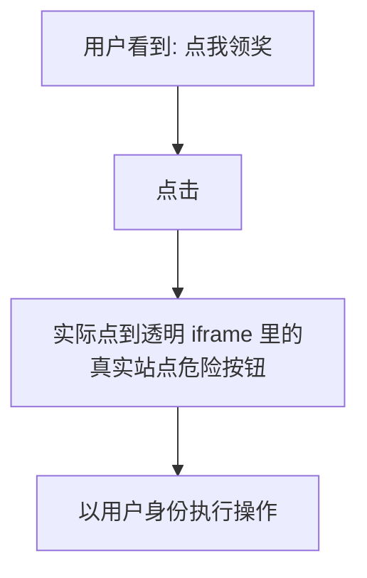

# 点击劫持与 UI 层攻击

## 学习目标

- 理解点击劫持（Clickjacking）如何用透明 iframe 诱骗用户
- 掌握 `X-Frame-Options` 与 `frame-ancestors` 双重防御
- 了解 Tabnabbing、UI 伪装、开放重定向等 UI 层攻击
- 能验证页面是否可被嵌入与劫持

## 为什么需要

不是所有攻击都靠注入代码。点击劫持等 UI 层攻击通过**视觉欺骗**让用户「亲手」点击危险操作——用户以为在点 A，实际点了透明覆盖的 B。这类攻击绕过了脚本防御，需要专门的框架嵌入控制。

> 核心心法：**控制「谁能把你的页面装进 iframe」，以及「你的链接/跳转会把用户带去哪」。**

---

## 一、点击劫持原理

攻击者把目标站点用透明 iframe 覆盖在诱饵页面上，用户点击诱饵按钮时，实际点到的是 iframe 里的真实按钮（如「确认转账」「授权」）：



```html
<!-- 攻击页：把真实站点透明覆盖在诱饵上方 -->
<style>
  iframe { opacity: 0; position: absolute; top: 0; left: 0;
           width: 100%; height: 100%; z-index: 10; }
  .bait { position: absolute; top: 300px; left: 200px; }
</style>
<button class="bait">点我领取 iPhone</button>
<iframe src="https://bank.com/confirm-transfer"></iframe>
```

用户被诱导点「领取」，落点其实是银行确认按钮。

---

## 二、防御：禁止被恶意嵌入

### 2.1 frame-ancestors（CSP，现代推荐）

```http
Content-Security-Policy: frame-ancestors 'none'
# 或仅允许自己和可信站点
Content-Security-Policy: frame-ancestors 'self' https://trusted.com
```

| 值 | 含义 |
|----|------|
| `'none'` | 任何站点都不能嵌入 |
| `'self'` | 仅同源可嵌入 |
| `https://x.com` | 仅指定站点可嵌入 |

### 2.2 X-Frame-Options（旧标准，兼容老浏览器）

```http
X-Frame-Options: DENY          # 完全禁止嵌入
X-Frame-Options: SAMEORIGIN    # 仅同源可嵌入
```

> 二者同时设置：现代浏览器以 `frame-ancestors` 为准，老浏览器 fallback 到 `X-Frame-Options`。**推荐都设**。

### 2.3 Frame Busting（JS 兜底，非首选）

```javascript
if (window.top !== window.self) {
  window.top.location = window.self.location; // 跳出 iframe
}
// 缺点：可被 sandbox 属性绕过，仅作兜底
```

---

## 三、其他 UI 层攻击

### 3.1 Tabnabbing（标签页钓鱼）

`target="_blank"` 打开的新页面能通过 `window.opener` 篡改原页面跳转到钓鱼站：

```html
<!-- 危险 -->
<a href="https://external.com" target="_blank">外链</a>

<!-- 安全：阻断 opener 引用 -->
<a href="https://external.com" target="_blank" rel="noopener noreferrer">外链</a>
```

> 现代浏览器对 `target="_blank"` 已默认 `noopener`，但显式声明 + 兼容老环境仍是最佳实践。

### 3.2 开放重定向（Open Redirect）

```javascript
// 危险：跳转地址来自未校验的参数
// /login?redirect=https://evil.com → 登录后跳到钓鱼站
location.href = params.get('redirect');

// 安全：白名单 / 只允许站内路径
function safeRedirect(url) {
  if (url.startsWith('/') && !url.startsWith('//')) return url; // 仅站内
  return '/';
}
```

### 3.3 UI 伪装 / 弹窗劫持

- 全屏 API 滥用伪造系统界面 → 谨慎使用 `requestFullscreen`
- 诱导授权弹窗 → 关键权限操作加二次确认

---

## 四、复现 → 防御 → 验证

### 复现

```html
<!-- 本地起 attack.html 用 iframe 嵌入目标 -->
<iframe src="http://localhost:3000/dashboard"
        style="opacity:.2;width:100%;height:600px"></iframe>
<!-- 若能正常显示并交互 → 存在点击劫持风险 -->
```

### 防御

```http
Content-Security-Policy: frame-ancestors 'none'
X-Frame-Options: DENY
```

### 验证

1. 重新用 iframe 嵌入 → 页面拒绝显示（控制台报 `Refused to display ... in a frame`）
2. 外链加 `rel="noopener"` → `window.opener` 为 null
3. 重定向参数填外部 URL → 被拦/回退站内

---

## 排查实战

### 案例 A：后台可被 iframe 嵌入

- **现象：** 安全测试发现后台页能被任意站点嵌入
- **修复：** 全站响应头加 `frame-ancestors 'none'` + `X-Frame-Options: DENY`
- **验证：** iframe 嵌入被浏览器拒绝

### 案例 B：登录后跳转被劫持

- **现象：** `?redirect=` 参数可指向外站，登录后跳钓鱼页
- **修复：** 重定向白名单，仅允许站内相对路径
- **验证：** 外部 URL 一律回退首页

---

## 常见误区与最佳实践

| 误区 | 正确理解 |
|------|---------|
| "只设 X-Frame-Options 就够" | 老标准，应优先 frame-ancestors |
| "Frame Busting JS 可靠" | 可被 sandbox 绕过，仅兜底 |
| "target=_blank 没风险" | 老环境需 rel=noopener 防 tabnabbing |
| "重定向参数无害" | 开放重定向常用于钓鱼 |

**可执行清单：**

- [ ] 全站设 `frame-ancestors 'none'`（或白名单）+ `X-Frame-Options`
- [ ] 所有 `target="_blank"` 加 `rel="noopener noreferrer"`
- [ ] 重定向参数走白名单/仅站内路径
- [ ] 敏感操作不依赖单次点击，加二次确认

## 面试高频问答（追问链）

> 大厂对一个考点通常追问到能力边界：**概念 → 机制 → 边界 → ⭐ 原理（触底）→ 实战（落地）**。实战层是区分「背过」和「做过」的关键。

### 链一：UI 层攻击

1. **概念**：点击劫持原理？→ 透明 iframe 覆盖，用户以为点 A 实际点 B。
2. **机制**：frame-ancestors 和 X-Frame-Options？→ CSP 现代方案；XFO 老标准 DENY/SAMEORIGIN。
3. **边界**：Tabnabbing 是什么？怎么防？→ 新窗口 opener 可改写原页 location，用 `rel="noopener"`。
4. **应用**：开放重定向危害与防御？→ 借可信域名钓鱼跳转，用跳转白名单。
5. ⭐ **原理（触底）**：为什么 UI 层攻击不能靠 JS 防御？→ 攻击发生在你的页面被嵌入/被借用场景，脚本可能不执行或被绕过，必须靠响应头(frame-ancestors)、HTML 属性(noopener)、服务端校验等机制层防御。
6. **实战（落地）**：你怎么防住页面被嵌套劫持并验证（attack-defense-verify）？→ 攻击：用透明 iframe 把你的页面叠在诱导按钮上复现误点击；防御：响应头配 CSP `frame-ancestors 'self'`(+老浏览器 X-Frame-Options)、外链加 `rel="noopener noreferrer"` 防 tabnabbing、跳转走白名单防开放重定向、敏感操作加二次确认；验证：构造嵌套页确认被浏览器拦截、检查响应头生效；结果：页面无法被第三方 iframe 嵌入，UI 层攻击靠机制层(响应头/属性)而非 JS 兜底。

## 小结

- 点击劫持靠透明 iframe 做视觉欺骗，骗用户「亲手」点击
- 防御核心：`frame-ancestors` + `X-Frame-Options` 控制嵌入
- Tabnabbing 用 `rel="noopener"`，开放重定向用白名单
- UI 层攻击绕过脚本防御，需专门的嵌入/跳转控制

## 延伸阅读

- [OWASP Clickjacking](https://owasp.org/www-community/attacks/Clickjacking)
- [MDN: frame-ancestors](https://developer.mozilla.org/zh-CN/docs/Web/HTTP/Headers/Content-Security-Policy/frame-ancestors)
- [MDN: X-Frame-Options](https://developer.mozilla.org/zh-CN/docs/Web/HTTP/Headers/X-Frame-Options)
