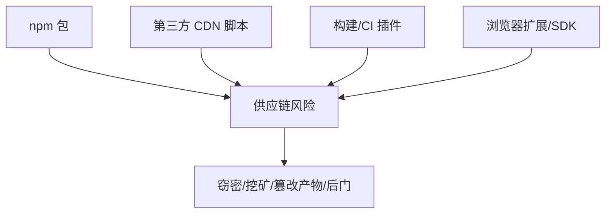

# 供应链与依赖安全

## 学习目标

- 理解前端供应链攻击的入口：npm 依赖、CDN 脚本、构建工具
- 掌握依赖审计、锁文件、SRI、最小权限等防御手段
- 能在 CI 中拦截高危依赖，建立依赖更新机制
- 了解 typosquatting、依赖混淆等真实攻击手法

## 为什么需要

一个现代前端项目动辄上千个 `node_modules` 依赖，你真正写的代码可能不到 1%。任何一个间接依赖被植入恶意代码，都能在用户浏览器或构建机器上执行——窃取环境变量、注入挖矿脚本、篡改打包产物。供应链是前端最容易被忽视、却影响面最大的攻击面。

> 核心心法：**你的安全水位 = 所有依赖里最低的那个。** 减少依赖、锁定版本、持续审计、最小信任。

---

## 一、攻击入口



| 入口 | 典型手法 |
|------|---------|
| npm 依赖 | 恶意包、被劫持的维护者账号、post-install 脚本 |
| typosquatting | 仿冒名（`reactt`、`croee-env`）骗安装 |
| 依赖混淆 | 同名内部包发到公共 registry，优先被拉取 |
| CDN 脚本 | CDN 被攻破，返回篡改后的 JS |
| 传递依赖 | 你信任 A，A 信任了恶意的 B |

---

## 二、防御手段

### 2.1 依赖审计（CI 必跑）

```bash
pnpm audit --audit-level=high      # 发现高危即非零退出
npm audit --omit=dev               # 只看生产依赖
```

```yaml
# GitHub Actions：审计失败阻断合并
- run: pnpm audit --audit-level=high
```

配合 **Dependabot / Renovate** 自动提交升级 PR。

### 2.2 锁文件（保证可复现）

```bash
pnpm install --frozen-lockfile     # CI 严格按锁文件安装
```

- 提交 `pnpm-lock.yaml`/`package-lock.yaml` 到仓库
- CI 用 frozen/ci 模式，禁止隐式升级
- 锁文件含 integrity 校验（`sha512-...`），防包内容被篡改

### 2.3 禁用/审查 install 脚本

```bash
# 恶意包常用 postinstall 执行任意代码
pnpm install --ignore-scripts      # 按需禁用生命周期脚本
```

pnpm 默认对未知包的构建脚本采取更严格策略；对必须运行脚本的包做白名单。

### 2.4 SRI（子资源完整性，给 CDN 脚本上锁）

```html
<script src="https://cdn.example.com/lib@1.2.3/dist.js"
        integrity="sha384-oqVuAfXRKap7fdgcCY5uykM6+R9GqQ8K/uxy9rx7HNQlGYl1kPzQho1wx4JwY8wC"
        crossorigin="anonymous"></script>
```

浏览器校验下载内容的 hash，CDN 即使被攻破返回篡改脚本也会被拒绝执行。

### 2.5 最小化与自托管

- 能用平台原生 API 就别引库（如 `date-fns` 之于一次性格式化）
- 关键第三方脚本**自托管**而非外链 CDN，纳入自己的 CSP/SRI 管控
- 定期清理无用依赖：`pnpm dlx depcheck`

### 2.6 锁定 registry 与作用域

```ini
# .npmrc：内部包指向私有 registry，防依赖混淆
@mycompany:registry=https://npm.internal.com
```

---

## 三、CI 集成示例

```yaml
jobs:
  security:
    runs-on: ubuntu-latest
    steps:
      - uses: actions/checkout@v4
      - uses: pnpm/action-setup@v4
      - run: pnpm install --frozen-lockfile --ignore-scripts
      - run: pnpm audit --audit-level=high
      # 可选：更强的 SCA 工具
      # - run: npx snyk test --severity-threshold=high
```

---

## 四、排查实战

### 案例 A：audit 报传递依赖高危

- **现象：** `pnpm audit` 报某间接依赖原型污染漏洞
- **定位：** `pnpm why <pkg>` 找出是谁引入的
- **修复：** 升级直接依赖；无法升级用 `overrides`/`resolutions` 强制版本
- **验证：** audit 0 high

```json
// package.json — 强制传递依赖版本
{ "pnpm": { "overrides": { "lodash@<4.17.21": "4.17.21" } } }
```

### 案例 B：typosquatting 误装

- **现象：** 安装了 `crossenv`（仿 `cross-env`），含恶意 postinstall
- **定位：** 检查 package.json 依赖名拼写、lockfile 来源
- **修复：** 卸载、清 `node_modules`、轮换可能泄露的密钥
- **验证：** 仅保留正确包名，CI 审计通过

### 案例 C：CDN 脚本被篡改

- **现象：** 第三方统计脚本注入了恶意代码
- **修复：** 加 SRI；或自托管该脚本 + CSP 限制
- **验证：** 篡改后 hash 不符，浏览器拒绝执行

---

## 常见误区与最佳实践

| 误区 | 正确理解 |
|------|---------|
| "依赖是别人维护的，不关我事" | 你为最终产物负责，含所有依赖 |
| "audit 报的都是误报" | 高危需评估，至少记录决策 |
| "锁文件可有可无" | 锁文件是可复现与防篡改的基础 |
| "CDN 比自托管安全" | CDN 被攻破会殃及所有引用方，需 SRI |
| "装一次就一劳永逸" | 依赖需持续更新与监控 |

**可执行清单：**

- [ ] 提交锁文件，CI 用 `--frozen-lockfile`
- [ ] CI 跑 `pnpm audit --audit-level=high` 阻断高危
- [ ] 接入 Dependabot/Renovate 自动升级
- [ ] 第三方 CDN 脚本加 SRI 或自托管
- [ ] 内部包用私有 registry + scope 防依赖混淆
- [ ] 定期 depcheck 清理无用依赖
- [ ] 评估禁用未知包的 install 脚本

## 面试高频问答（追问链）

> 大厂对一个考点通常追问到能力边界：**概念 → 机制 → 边界 → ⭐ 原理（触底）→ 实战（落地）**。实战层是区分「背过」和「做过」的关键。

### 链一：供应链安全

1. **概念**：typosquatting 是什么？→ 仿冒包名诱导安装恶意包。
2. **机制**：SRI 作用？→ 校验 CDN 脚本完整性哈希，防篡改。
3. **边界**：lockfile 为什么重要？→ 保证 CI 与本地依赖版本一致、可复现。
4. **应用**：依赖混淆攻击怎么防？→ 私有包名被公开覆盖，配 scope + 私有 registry 优先。
5. ⭐ **原理（触底）**：一个 postinstall 脚本就能窃取 token，怎么系统性防供应链投毒？→ 最小依赖 + 审计(audit/Snyk) + 锁文件 + 禁危险脚本(--ignore-scripts/沙箱) + CI 拦截高危 + SBOM 追踪 + 私有镜像，纵深治理「最薄弱一环」。
6. **实战（落地）**：你怎么系统性防供应链投毒并落地到 CI（attack-defense-verify）？→ 攻击面：postinstall 脚本/typosquatting/依赖混淆都能窃取 token，可在测试环境模拟恶意 install 脚本验证；防御：精简依赖 + 锁文件(可复现) + scope+私有 registry 优先 + CI 安装加 `--ignore-scripts`/沙箱 + 第三方 script 上 SRI；验证：CI 跑 npm audit/Snyk 拦高危、生成 SBOM 追踪、定期复扫；结果：高危依赖合入即被 fail，最薄弱一环被纵深防住。

## 小结

- 供应链风险 = 所有依赖里最薄弱的一环
- 核心防御：审计 + 锁文件 + SRI + 最小依赖 + 私有 registry
- CI 中自动拦截高危依赖，建立持续更新机制
- CDN 脚本必须 SRI，内部包防依赖混淆

## 延伸阅读

- [OWASP: Vulnerable and Outdated Components](https://owasp.org/Top10/A06_2021-Vulnerable_and_Outdated_Components/)
- [npm: SRI](https://developer.mozilla.org/zh-CN/docs/Web/Security/Subresource_Integrity)
- [pnpm overrides](https://pnpm.io/package_json#pnpmoverrides)
