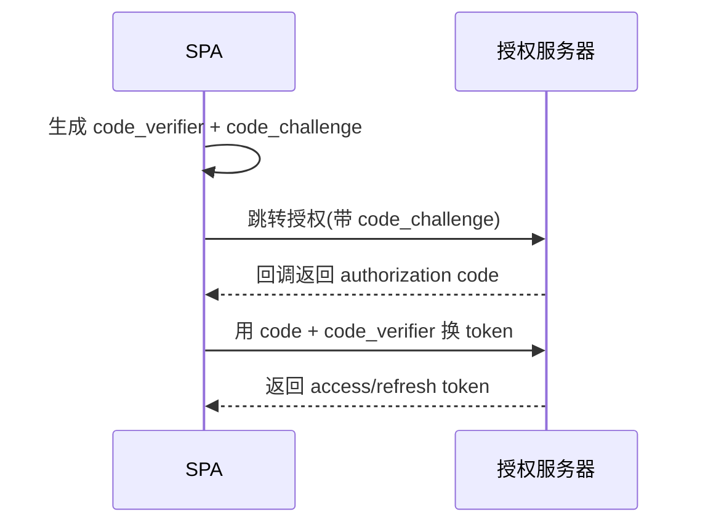

# 认证授权与 Token 安全

## 学习目标

- 区分认证（你是谁）与授权（你能做什么）
- 掌握 JWT 的结构、常见误用与安全存储
- 理解 OAuth 2.0 授权码 + PKCE 流程
- 能正确处理前端越权、Token 刷新与登出

## 为什么需要

认证授权是所有需要登录的应用的核心。前端常见误区——把 token 存 localStorage、在 JWT 里塞敏感信息、仅靠前端路由守卫做权限——每一个都可能导致账号被盗或越权访问。前端要理解整条链路，才能配合后端守住边界。

> 核心心法：**认证解决「你是谁」，授权解决「你能做什么」；前端只做体验优化，最终裁决永远在后端。**

---

## 一、认证 vs 授权

| 维度 | 认证 Authentication | 授权 Authorization |
|------|--------------------|--------------------|
| 回答 | 你是谁 | 你能做什么 |
| 手段 | 密码、验证码、生物识别、SSO | 角色/权限、RBAC、ABAC |
| 凭证 | Session / Token | 权限列表、scope |
| 顺序 | 先认证 | 后授权 |

---

## 二、JWT 安全

### 2.1 结构

JWT = `Header.Payload.Signature`，三段 Base64URL 拼接：

```
eyJhbG...header.eyJzdWI...payload.SflKxw...signature
```

```javascript
// payload 仅 Base64 编码，不是加密！任何人可解码
JSON.parse(atob(token.split('.')[1]));
```

> **关键认知：JWT payload 是「编码」不是「加密」，任何人都能读。** 绝不能放密码、身份证等敏感信息。签名只保证「未被篡改」，不保证「保密」。

### 2.2 常见误用

| 误用 | 风险 | 正确做法 |
|------|------|---------|
| payload 存密码/隐私 | 可被解码 | 只存 `sub`、`exp`、`role` |
| 存 localStorage | XSS 可窃取 | HttpOnly Cookie 或内存 |
| 永不过期 | 泄露即长期有效 | 短 `exp` + refresh token |
| 前端校验签名 | 密钥会泄露 | 签名校验在后端 |
| 算法设 `none` | 伪造 token | 后端固定算法白名单 |

### 2.3 存储方案对比

| 方案 | 抗 XSS | 抗 CSRF | 说明 |
|------|--------|---------|------|
| localStorage | ✗ | ✓ | XSS 直接偷走，不推荐存敏感 token |
| HttpOnly Cookie | ✓ | ✗（需配 SameSite/Token） | JS 读不到，最推荐 |
| 内存（JS 变量） | 较好 | ✓ | 刷新即失，配 refresh token |

**推荐组合：** access token 放内存（短期）+ refresh token 放 HttpOnly Cookie（`Secure; SameSite`）。

---

## 三、OAuth 2.0 + PKCE（SPA 标准）

SPA 是公开客户端，无法保存 client secret，必须用**授权码 + PKCE**：



```javascript
// 生成 PKCE 参数
const verifier = base64url(crypto.getRandomValues(new Uint8Array(32)));
const challenge = base64url(await crypto.subtle.digest('SHA-256',
  new TextEncoder().encode(verifier)));
// 授权请求带 code_challenge，换 token 时带 code_verifier
```

> 不要用隐式流（implicit flow，token 直接走 URL）——已被废弃，token 易泄露。统一用授权码 + PKCE。

---

## 四、前端越权防护（配合后端）

前端权限控制**只是体验优化，不是安全边界**：

```jsx
// 前端按权限隐藏 UI（防误操作，非安全）
{user.can('delete') && <DeleteButton />}

// 路由守卫（可被绕过，仅体验）
<Route element={user.isAdmin ? <Admin /> : <Navigate to="/403" />} />
```

```javascript
// 真正的边界：每个 API 后端都要校验权限
// 前端统一处理 401/403
axios.interceptors.response.use(null, (err) => {
  if (err.response?.status === 401) redirectToLogin();
  if (err.response?.status === 403) showForbidden();
  return Promise.reject(err);
});
```

> **越权两类：** 水平越权（访问同级别其他用户数据，如改 URL 里的 id）、垂直越权（普通用户访问管理员功能）。两者都必须由后端按当前用户身份校验，前端隐藏按钮拦不住直接调 API。

---

## 五、Token 刷新与登出

### 5.1 无感刷新

```javascript
// access token 过期 → 用 refresh token 静默换新
axios.interceptors.response.use(null, async (err) => {
  if (err.response?.status === 401 && !err.config._retry) {
    err.config._retry = true;
    await refreshAccessToken();        // 用 HttpOnly refresh cookie
    return axios(err.config);          // 重放原请求
  }
  return Promise.reject(err);
});
```

> 注意并发请求同时 401 的「刷新风暴」——用单例 Promise 合并刷新请求。

### 5.2 安全登出

```javascript
async function logout() {
  await api.post('/logout');     // 后端使 refresh token 失效（关键）
  clearMemoryToken();            // 清内存 access token
  location.href = '/login';
}
```

> 仅前端删 token 不够，后端必须让 refresh token 失效，否则被盗 token 仍可用。

---

## 排查实战

### 案例 A：localStorage token 被 XSS 窃取

- **现象：** XSS 漏洞导致大量账号被盗
- **定位：** access/refresh token 都存 localStorage
- **修复：** refresh token 改 HttpOnly Cookie，access token 放内存 + 短过期
- **验证：** `document.cookie`/`localStorage` 读不到敏感 token

### 案例 B：水平越权

- **现象：** 改 URL `?orderId=` 能看别人订单
- **定位：** 后端未校验订单归属
- **修复：** 后端按当前用户校验资源所有权（前端配合 403 处理）
- **验证：** 访问他人资源返回 403

### 案例 C：登出后 token 仍有效

- **现象：** 登出只清了前端，旧 token 被抓包后仍能用
- **修复：** 后端登出接口吊销 refresh token / 加入黑名单
- **验证：** 旧 token 调接口返回 401

---

## 常见误区与最佳实践

| 误区 | 正确理解 |
|------|---------|
| "JWT 是加密的" | 只是编码，payload 人人可读 |
| "token 存哪都行" | localStorage 易被 XSS 偷 |
| "前端路由守卫=安全" | 可绕过，后端才是边界 |
| "登出删本地 token 就行" | 后端必须吊销 token |
| "SPA 用隐式流" | 已废弃，用授权码+PKCE |

**可执行清单：**

- [ ] JWT payload 不放敏感信息，签名校验在后端
- [ ] access token 内存 + 短 `exp`，refresh token HttpOnly Cookie
- [ ] OAuth 用授权码 + PKCE，禁隐式流
- [ ] 每个敏感 API 后端校验权限（防水平/垂直越权）
- [ ] 前端统一处理 401/403，无感刷新合并并发
- [ ] 登出由后端吊销 refresh token

## 面试高频问答（追问链）

> 大厂对一个考点通常追问到能力边界：**概念 → 机制 → 边界 → ⭐ 原理（触底）→ 实战（落地）**。实战层是区分「背过」和「做过」的关键。

### 链一：Token 存储与刷新

1. **概念**：JWT 放 localStorage 安全吗？→ XSS 可窃取，推荐 access 内存 + refresh HttpOnly Cookie。
2. **机制**：JWT 是加密的吗？→ payload 仅 Base64 编码非加密，只放非敏感 sub/exp/role。
3. **边界**：无感刷新怎么做、并发请求怎么不重复刷？→ 401 拦截 → 刷新队列(单飞)→ 重放失败请求。
4. ⭐ **原理（触底）**：JWT 怎么实现「主动注销/踢人」？→ 无状态 JWT 无法直接吊销，需短 access + refresh 黑名单/版本号(jti/token version)或改用服务端 session，权衡无状态与可控性。
5. **实战（落地）**：你怎么设计 Token 存储与无感刷新并验证（attack-defense-verify）？→ 攻击：XSS 注入 `localStorage.getItem('token')` 验证可窃取；防御：access 放内存、refresh 放 HttpOnly+Secure+SameSite Cookie，401 拦截器单飞刷新队列防并发重复刷，登出后端吊销 refresh；验证：注入脚本读不到 refresh、并发 10 请求只触发一次刷新、登出后旧 token 立即失效；结果：XSS 无法持久窃取凭证，并发刷新无风暴。

### 链二：授权与越权

1. **概念**：认证 vs 授权？→ 认证=你是谁，授权=你能做什么。
2. **机制**：OAuth PKCE 解决什么？→ SPA 无法存 client secret，用 code_verifier 防授权码拦截。
3. **边界**：水平 vs 垂直越权？→ 水平同级互访、垂直低权访高权。
4. ⭐ **原理（触底）**：前端隐藏按钮算不算权限控制？怎么做才安全？→ 不算，仅体验；权限必须后端按身份对每个接口/资源校验，前端 RBAC 仅控制 UI，后端是最终裁判。
5. **实战（落地）**：你怎么防水平/垂直越权并验证（attack-defense-verify）？→ 攻击：用普通用户 token 直接调管理接口/改 URL 访问他人订单复现越权；防御：前端 RBAC 仅控 UI 展示，后端每个接口按身份+资源 ID 校验归属与角色，OAuth SPA 走 PKCE；验证：用低权 token 重放高权接口确认 403、水平越权改他人 ID 确认被拒；结果：前端隐藏按钮不算权限，后端逐接口校验才是最终裁判。

## 小结

- 认证=你是谁，授权=你能做什么，后端是最终裁判
- JWT payload 是编码非加密，只放非敏感的 sub/exp/role
- token 存储：access 内存 + refresh HttpOnly Cookie
- SPA 用 OAuth 授权码 + PKCE
- 越权由后端按身份校验，前端隐藏 UI 仅为体验

## 延伸阅读

- [OWASP: Broken Access Control](https://owasp.org/Top10/A01_2021-Broken_Access_Control/)
- [OAuth 2.0 for Browser-Based Apps](https://datatracker.ietf.org/doc/html/draft-ietf-oauth-browser-based-apps)
- [JWT Best Practices (RFC 8725)](https://datatracker.ietf.org/doc/html/rfc8725)
