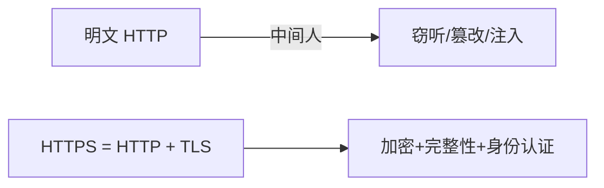

# 传输与数据安全

## 学习目标

- 理解 HTTPS 如何保证传输的机密性与完整性
- 掌握 HSTS、混合内容、安全响应头的配置
- 知道前端如何安全处理敏感数据与隐私合规
- 了解客户端存储的安全边界

## 为什么需要

数据在「传输中」和「存储时」都可能泄露。明文 HTTP 会被中间人窃听篡改；前端随手把敏感信息塞进 localStorage、日志、URL，都会造成泄露。前端是数据接触的第一线，必须懂传输加密与数据最小化。

> 核心心法：**传输全程 HTTPS，敏感数据最小化、不落地、不进日志。**

---

## 一、HTTPS 与传输安全

### 1.1 HTTPS 解决什么



- **机密性：** TLS 加密，中间人看不到内容
- **完整性：** 防篡改（防运营商插广告、注入脚本）
- **身份认证：** 证书验证服务器身份，防钓鱼

### 1.2 HSTS（强制 HTTPS）

```http
Strict-Transport-Security: max-age=31536000; includeSubDomains; preload
```

告诉浏览器「今后一律用 HTTPS 访问本站」，防止首次 http 跳转被劫持（SSL Stripping）。`preload` 可加入浏览器预置列表。

### 1.3 混合内容（Mixed Content）

HTTPS 页面里加载 http 资源会被浏览器拦截或警告：

```http
# 自动把页面内 http 请求升级为 https
Content-Security-Policy: upgrade-insecure-requests
```

排查：DevTools Console 报 `Mixed Content`，把资源 URL 改为 https 或相对协议。

---

## 二、安全响应头全家桶

一次配齐常用安全头：

```http
Strict-Transport-Security: max-age=31536000; includeSubDomains
Content-Security-Policy: default-src 'self'
X-Content-Type-Options: nosniff
X-Frame-Options: DENY
Referrer-Policy: strict-origin-when-cross-origin
Permissions-Policy: geolocation=(), camera=(), microphone=()
```

| 响应头 | 作用 |
|--------|------|
| `Strict-Transport-Security` | 强制 HTTPS |
| `X-Content-Type-Options: nosniff` | 禁 MIME 嗅探，防把图片当脚本执行 |
| `Referrer-Policy` | 控制 Referer 泄露范围 |
| `Permissions-Policy` | 限制摄像头/定位等敏感 API |
| `Cache-Control: no-store` | 敏感页面禁缓存 |

> 可用 [securityheaders.com](https://securityheaders.com) 一键扫描评分。

---

## 三、敏感数据处理

### 3.1 数据最小化原则

- 前端只拿**渲染必需**的字段，后端做字段裁剪（别返回整个用户对象含密码 hash）
- 身份证/手机号等展示时脱敏：`138****8000`
- 不在 URL/query 放敏感信息（会进浏览器历史、日志、Referer）

### 3.2 不进日志 / 不进监控

```javascript
// 上报错误前过滤敏感字段
Sentry.init({
  beforeSend(event) {
    scrub(event, ['password', 'token', 'idCard', 'phone']);
    return event;
  },
});
```

### 3.3 客户端存储安全边界

| 存储 | 特点 | 安全建议 |
|------|------|---------|
| localStorage | 持久、同源 JS 可读 | 不存敏感/token |
| sessionStorage | 标签级、关闭即清 | 临时非敏感 |
| Cookie | 可 HttpOnly | 敏感凭证用 HttpOnly+Secure |
| IndexedDB | 大容量 | 敏感数据需加密 |

> 浏览器存储**都不是保险箱**：同源 JS（含 XSS）几乎都能读。真正敏感的数据不落地，或仅存服务端。

---

## 四、隐私合规（GDPR / 个人信息保护）

- Cookie 同意横幅：非必要 Cookie 需用户授权后再加载（埋点/广告）
- 提供数据导出与删除入口
- 第三方 SDK 数据流向透明化，最小授权
- 埋点数据匿名化/假名化

---

## 五、排查实战

### 案例 A：混合内容导致功能失效

- **现象：** HTTPS 站点某接口/图片加载失败
- **定位：** Console `Mixed Content` 警告，资源是 http
- **修复：** 资源改 https；加 `upgrade-insecure-requests`
- **验证：** 无混合内容警告

### 案例 B：敏感信息进了错误日志

- **现象：** Sentry 里看到用户 token/手机号
- **修复：** `beforeSend` 脱敏；请求体/响应体过滤
- **验证：** 新上报中无敏感字段

### 案例 C：MIME 嗅探导致 XSS

- **现象：** 上传的「图片」被当 HTML 执行
- **修复：** 响应加 `X-Content-Type-Options: nosniff` + 正确 Content-Type
- **验证：** 文件按声明类型处理，不被当脚本

---

## 常见误区与最佳实践

| 误区 | 正确理解 |
|------|---------|
| "内网不用 HTTPS" | 内网也有中间人/横向风险 |
| "localStorage 加密就安全" | 密钥也在前端，XSS 仍可读 |
| "敏感数据放 URL 方便" | 会进历史/日志/Referer 泄露 |
| "前端加密能替代 HTTPS" | 前端加密密钥可见，仅辅助 |
| "监控不会泄露隐私" | 默认会采集请求体，需脱敏 |

**可执行清单：**

- [ ] 全站 HTTPS + HSTS
- [ ] 配齐安全响应头（nosniff/Referrer-Policy/Permissions-Policy）
- [ ] `upgrade-insecure-requests` 消除混合内容
- [ ] 敏感字段展示脱敏，不放 URL
- [ ] 监控/日志上报前过滤敏感数据
- [ ] 敏感数据不落客户端存储
- [ ] 隐私合规：Cookie 同意、数据删除入口

## 面试高频问答（追问链）

> 大厂对一个考点通常追问到能力边界：**概念 → 机制 → 边界 → ⭐ 原理（触底）→ 实战（落地）**。实战层是区分「背过」和「做过」的关键。

### 链一：传输安全

1. **概念**：HSTS 作用？→ 强制 HTTPS，防降级/SSL 剥离攻击。
2. **机制**：混合内容危害？→ HTTPS 页面加载 HTTP 资源可被中间人篡改。
3. **边界**：安全响应头全家桶有哪些？→ CSP、HSTS、X-Content-Type-Options、Referrer-Policy、Permissions-Policy。
4. ⭐ **原理（触底）**：HSTS 首次访问仍可能被劫持，怎么彻底解决？→ 首访无 HSTS 记录有窗口，用 HSTS preload 列表内置浏览器、配 includeSubDomains，从源头消除明文窗口。
5. **实战（落地）**：你怎么把传输安全基线落地并验证（attack-defense-verify）？→ 攻击面：用 SSL stripping/混合内容篡改验证中间人可改 HTTP 资源；防御：全站 HTTPS + HSTS(max-age+includeSubDomains+preload) + 清混合内容 + 配 X-Content-Type-Options/Referrer-Policy/Permissions-Policy；验证：securityheaders.com 评级 A、首次访问即走 HTTPS 无明文窗口、混合内容控制台清零；结果：传输层攻击面关闭，安全响应头全家桶一次配齐。

### 链二：数据安全

1. **概念**：数据最小化原则？→ 只收集必要数据，不进日志/监控。
2. **机制**：前端存储能放敏感数据吗？→ 不能，localStorage/IndexedDB 都非保险箱，敏感留服务端。
3. **应用**：日志/监控怎么防泄漏？→ 上报前脱敏(手机/身份证/token 打码)。
4. ⭐ **原理（触底）**：GDPR/隐私合规对前端有什么具体要求？→ 同意管理(Cookie banner 先同意后采集)、数据可删除/导出、第三方脚本受控加载、跨境传输合规，前端要落地同意态与脱敏。
5. **实战（落地）**：你怎么落地隐私合规并验证（attack-defense-verify）？→ 攻击面：未同意即采集 Cookie/埋点、日志明文带手机号/token 验证泄漏面；防御：Cookie banner 先同意后采集、第三方脚本受控加载、上报前脱敏(手机/身份证/token 打码)、提供数据删除/导出入口；验证：未同意不触发采集、抓包确认上报无敏感明文、删除请求可追踪完成；结果：满足 GDPR 最小化与同意管理，监控/日志不再泄漏 PII。

## 小结

- HTTPS + HSTS 保证传输机密性、完整性、身份认证
- 安全响应头全家桶一次配齐，securityheaders.com 验收
- 敏感数据最小化、脱敏、不落地、不进日志
- 客户端存储都非保险箱，敏感数据留服务端
- 隐私合规是产品与法律要求，前端要落地同意与脱敏

## 延伸阅读

- [MDN: HTTPS](https://developer.mozilla.org/zh-CN/docs/Glossary/HTTPS)
- [MDN: HSTS](https://developer.mozilla.org/zh-CN/docs/Web/HTTP/Headers/Strict-Transport-Security)
- [OWASP Secure Headers](https://owasp.org/www-project-secure-headers/)
