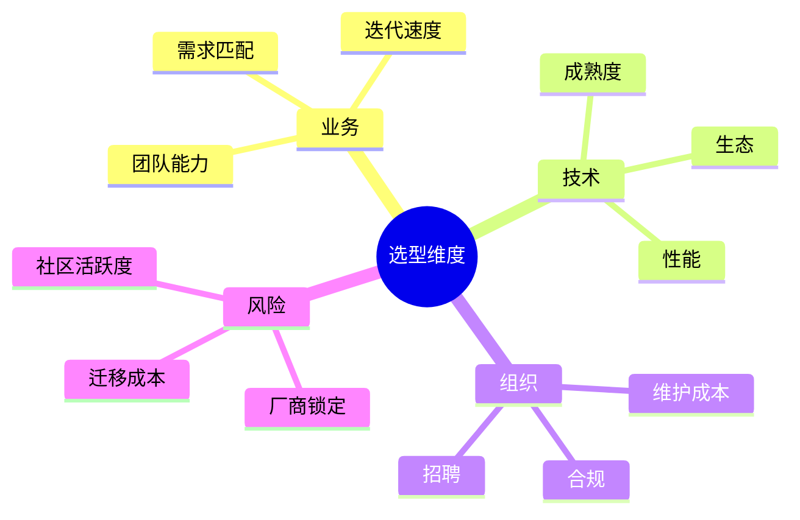
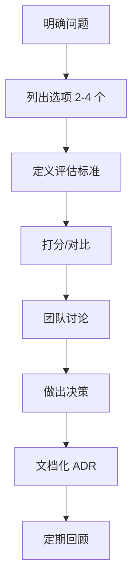

# 技术选型与决策

## 学习目标

- 掌握技术选型的评估框架
- 理解权衡分析（Trade-off）思维
- 了解常见选型场景的方法论
- 能组织选型讨论并做出可执行的决策

## 为什么需要

架构师核心职责之一是**做技术决策并对结果负责**。错误选型导致：

- 技术债务累积
- 团队学习成本浪费
- 项目延期或难以维护

选型不是"选最新的"，而是**在约束下选最合适的**。

## 核心原理

### 1. 选型评估维度



| 维度 | 问题 |
|------|------|
| 业务匹配 | 解决什么问题？3 年后还适用吗？ |
| 团队能力 | 现有栈？学习曲线？ |
| 生态成熟度 | 文档、社区、第三方库？ |
| 性能与规模 | 预期 QPS、数据量？ |
| 维护成本 | 谁维护？升级路径？ |
| 风险 | 单点依赖？开源协议？ |

### 2. 决策流程



**避免：**

- 只考虑技术先进性，忽略团队和业务
- 选项过多，分析 paralysis
- 决策后不文档化，后人不知为何
- 个人偏好代替数据

### 3. 权衡分析示例

**场景：状态管理选型**

| 选项 | 优点 | 缺点 | 适用 |
|------|------|------|------|
| Redux Toolkit | 生态成熟、DevTools | 样板多 | 大型、多团队协作 |
| Zustand | 简单、少样板 | 复杂中间件弱 | 中小型 |
| Context | 内置 | 性能、拆分难 | 低频全局状态 |
| Jotai/Recoil | 原子化 | 生态较新 | 细粒度更新 |

**决策：** 团队 5 人，项目中等复杂度，已有 React Query 管服务端状态 → **Zustand** 管客户端 UI 状态。

**记录：** ADR-001: 采用 Zustand 作为客户端状态管理

### 4. 常见场景选型参考

**构建工具：**

- 新项目 → Vite
- 复杂 Webpack 定制、遗留 → Webpack
- 库打包 → Rollup/tsup

**框架：**

- 团队 Vue 熟 → Vue 3
- 生态、招聘 → React
- 不要"为了新而新"

**Monorepo：**

- 多包、共享代码 → pnpm + Turborepo
- 单应用 → 不必 Monorepo

**微前端：**

- 多团队、独立部署、技术栈差异 → 考虑
- 小团队 → 模块化 Monolith

### 5. 决策沟通

**向上：** 业务价值、风险、成本、时间线  
**向团队：** 理由、学习资源、迁移计划  
**向未来：** ADR 文档，便于回顾

```markdown
## 决策摘要
我们选用 X，因为 Y。主要权衡是放弃了 Z 的 A，换取 B。

## 后续行动
- [ ] 搭建 POC
- [ ] 团队培训 2 小时
- [ ] 2 周后回顾
```

## 常见误区与最佳实践

| 误区 | 正确理解 |
|------|---------|
| "选大厂用的就对了" | 上下文不同，抄作业可能翻车 |
| "选型一次定终身" | 可演进，定期回顾 |
| "架构师一个人定" | 引入团队 input，共识执行 |
| "POC 浪费时间" | 关键决策前 POC 降风险 |

**最佳实践：**

- 2-4 个选项，明确评估标准
- 写 ADR，记录决策和理由
- 重大选型做 POC，有退出策略
- 决策后支持团队，不甩锅

## 小结

- 选型 = 约束下的最优解，非最新最贵
- 评估：业务、团队、生态、风险
- 流程：问题 → 选项 → 评估 → 决策 → 文档
- 权衡分析透明，ADR 记录

## 延伸阅读

- [ThoughtWorks Technology Radar](https://www.thoughtworks.com/radar)
- [Architecture Decision Records](https://adr.github.io/)
- 《Software Architecture: The Hard Parts》
