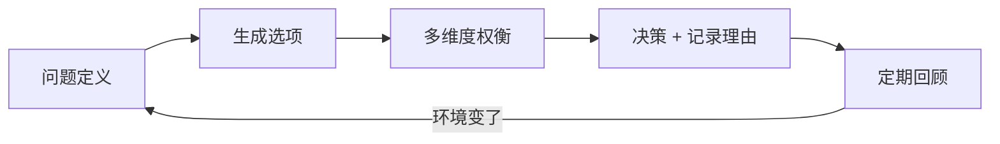

# 技术选型与决策

## 学习目标

- 走完一次完整选型：问题 → 选项 → 打分 → POC → ADR
- 能用评估矩阵和 ROI 说服团队与上级
- 建立技术雷达与债务偿还机制

## 为什么需要

选型不是「选最新的」，而是在约束下**对结果负责**。文档化避免后人重复争论。

> 核心心法：**决策 = 问题定义 + 权衡透明 + 可退出策略。**

---

## 一、底层原理：技术决策的本质

### 决策不是选「最好的」，是选「最合适的」

技术选型是在**约束条件**下做**权衡**：



| 维度 | 说明 |
|------|------|
| 团队能力 | 现有技术栈、学习曲线、招聘市场 |
| 业务约束 | 上线时间、性能要求、合规需求 |
| 技术特性 | 生态、社区、性能、可维护性 |
| 组织成本 | 迁移成本、运维复杂度、供应商锁定 |
| 风险 | 成熟度、退出策略、fallback 方案 |

### 常见认知偏差（必须主动对抗）

| 偏差 | 表现 | 对抗 |
|------|------|------|
| 从众/权威 | 「大厂用这个所以我们也用」 | 上下文不同，独立评估 |
| 新奇偏见 | 「新框架一定更好」 | 成熟度、生态、团队成本 |
| 沉没成本 | 「已经投了这么多不能换」 | 退出策略、增量迁移 |
| 确认偏见 | 只找支持自己观点的证据 | 强制写「备选方案」和「为什么不选」 |
| 分析瘫痪 | 无限调研不决策 | 设时间盒 + POC 验证 |

### 决策的可逆性（Two-Way vs One-Way Door）

Jeff Bezos 的「单向门 vs 双向门」框架：

- **双向门（可逆）：** 错了可以低成本回退 → 快速决策、小步试错（如选个状态库、加个 lint 规则）
- **单向门（不可逆）：** 错了代价极高 → 必须深思熟虑、POC、ADR（如选数据库、微前端架构、自研框架）

> 大部分技术选型是双向门，却常被当成单向门无限纠结——识别可逆性可以大幅加速决策。

---

## 二、完整走查：状态管理选型

### 背景

- 团队 8 人，React 中台，Redux 样板多，服务端状态手写 fetch

### Step 1：明确问题

| 问题 | 量化 |
|------|------|
| 样板代码多 | 新增 API 平均 120 行 |
| 缓存重复请求 | 同接口 3 组件各 fetch |
| 学习成本 | 新人 2 周上手 Redux |

### Step 2：选项（2-4 个）

- A：继续 Redux Toolkit + RTK Query
- B：Zustand + TanStack Query
- C：仅 TanStack Query + Context

### Step 3：打分矩阵（1-5 分）

| 维度 | 权重 | A | B | C |
|------|------|---|---|---|
| 团队熟悉度 | 20% | 5 | 3 | 4 |
| 服务端缓存 | 25% | 4 | 5 | 5 |
| 样板代码 | 20% | 3 | 5 | 4 |
| 生态/招聘 | 15% | 5 | 4 | 4 |
| 迁移成本 | 20% | 5 | 3 | 4 |
| **加权** | | **4.2** | **4.1** | **4.3** |

### Step 4：POC（1 周）

用 **C** 做「用户列表+详情+权限」模块：代码量、请求次数、新人反馈。

**结果：** 代码 -40%，重复请求 0；缺全局 UI 状态 → 加 Zustand → 定 **B**

### Step 5：ADR

```markdown
# ADR-003: 采用 Zustand + TanStack Query

## 决策
客户端 UI 用 Zustand，服务端用 TanStack Query，逐步废弃 Redux。

## 理由
POC 代码量降 40%；Query 解决缓存；Zustand 补 theme/sidebar。

## 后果
需 1 次培训；旧模块迁移 2 个 sprint。

## 退出策略
Zustand/Query 均为独立库，可模块级回退 Redux。
```

### Step 6：回顾（2 周后）

- 指标：新增 API 代码行数、bug 数、新人上手天数
- 决策保留或调整

---

## 三、ROI 估算模板

```
收益：节省开发时间 X 人日/月 + 减少线上 bug Y 次
成本：迁移 Z 人日 + 培训 W 人日 + 风险缓冲 20%
ROI = (收益 - 成本) / 成本
```

---

## 四、技术雷达（季度）

| 象限 | 示例 |
|------|------|
| Adopt | TypeScript strict, pnpm |
| Trial | React Compiler |
| Assess | Bun runtime |
| Hold | 新微前端框架 |

---

## 五、技术债务

- 刻意债务：记录 ticket + 偿还 sprint
- 每 sprint 10-20% 容量 refactor

---

## 常见误区

| 误区 | 正确 |
|------|------|
| 抄大厂 | 上下文不同 |
| 无 POC 上大 | 关键决策必 POC |
| 无 ADR | 后人不知为何 |

## 面试高频问答（追问链）

> 大厂对一个考点通常追问到能力边界：**概念 → 机制 → 边界 → ⭐ 原理（触底）→ 实战（落地）**。实战层是区分「背过」和「做过」的关键。软实力题无标准答案，面试官用真实场景验证是否真做过；实战层用 STAR 口述 + 量化指标回应。

### 链一：技术选型

1. **概念**：技术选型步骤？→ 明确问题 → 列备选 → 打分矩阵 → POC → ADR → 回顾。
2. **机制**：One-Way Door 决策怎么处理？→ 难逆转(如数据库)更慎重、可逆决策快速试。
3. **边界**：怎么对抗认知偏差？→ 新技术偏见/沉没成本/从众，用数据和 POC。
4. ⭐ **原理（触底）**：举一个你主导的有争议选型，怎么说服团队、结果如何？→ 给出量化打分矩阵 + POC 数据 + ROI + 退出策略 + 上线后复盘指标，体现「权衡而非站队」与可负责。
5. **实战（落地）**：状态管理选型你怎么从争论到落地？→ **S**：8 人 React 中台，Redux 新增 API 平均 120 行、同接口 3 组件重复 fetch；**T**：前端负责人，目标降样板+统一缓存；**A**：3 方案打分矩阵 + 1 周 POC + ADR-003 定 Zustand+TanStack Query，1 次培训+按模块渐进迁移；**R**：新增 API 代码 -40%、重复请求归零、新人上手 14 天→5 天，2 周后复盘指标达标。

### 链二：技术债

1. **概念**：技术债务怎么处理？→ 登记、量化影响、每 Sprint 留容量偿还。
2. **机制**：怎么向上争取还债资源？→ 把债务转成业务语言(故障率/交付速度/成本)。
3. ⭐ **原理（触底）**：产品需求永远排满，怎么落地长期技术规划？→ 债务可视化看板 + 绑定业务指标讲「不还的代价」+ 渐进式重构(绞杀者模式)随需求顺带改造，而非申请大块停工期。
4. **实战（落地）**：业务排满时技术债怎么还？→ **S**：需求永远排满，老模块 bug 月均 3 次、联调占交付 30%；**T**：架构师推动债务可视化+渐进偿还；**A**：建债务看板(影响×修复成本打分)，每 Sprint 固定 20% 容量、绞杀者模式随需求顺带改造核心链路、用故障率/交付周期数据争取产品认可；**R**：核心链路 bug 3 次/月→0.5 次/月，同需求交付周期缩短 25%。

## 小结

- 原理：选型是在约束下权衡，非选「最好」；识别双向门/单向门加速决策
- 主动对抗认知偏差：从众、新奇偏见、沉没成本、确认偏见
- 选型流程可重复：问题→选项→矩阵→POC→ADR→回顾
- 权衡写清楚比结论更重要；ROI 和退出策略让决策可负责

## 延伸阅读

- [ADR](https://adr.github.io/)
- [ThoughtWorks Radar](https://www.thoughtworks.com/radar)
