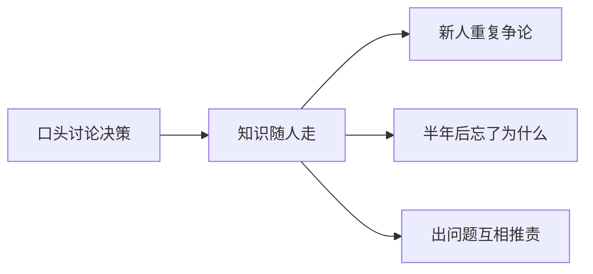
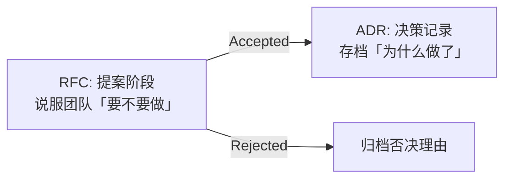

# 技术方案文档（RFC / ADR）

## 学习目标

- 能写一份可评审、可执行的 RFC
- 能写 ADR 记录决策并归档
- 能组织评审会议并产出 action items

## 为什么需要

架构师产出主要是**文档**。好文档 = 减少重复讨论 + 新人可接手 + 决策可追溯。

> 核心心法：**RFC 说服人做；ADR 记录为什么做了。**

---

## 一、底层原理：为什么需要文档化决策

### 口头决策的代价



架构师的核心产出不是代码，是**可传递的判断**。文档化解决三个问题：

| 问题 | RFC/ADR 如何解决 |
|------|-----------------|
| 为什么做这个？ | ADR 记录决策理由和权衡 |
| 考虑过什么？ | RFC 列出备选方案和否决理由 |
| 怎么执行？ | RFC 含迁移计划、风险、成功指标 |

### RFC vs ADR 的分工



| 文档 | 时机 | 读者 | 核心内容 |
|------|------|------|---------|
| **RFC** | 决策前 | 评审者、利益相关方 | 背景、目标、方案、备选、风险、指标 |
| **ADR** | 决策后 | 未来的自己/新人 | 决定了什么、为什么、后果、备选 |

### 好文档的特征

- **可评审：** 有明确的目标/非目标，评审者能判断「该不该做」
- **可执行：** 有迁移步骤和负责人，不是空谈
- **可追溯：** 编号 + 状态 + 日期，PR 关联编号
- **可演进：** Accepted RFC 不可改（修订用新 RFC）；ADR 只增不改（supersede 用新 ADR）

---

## 二、RFC 完整范例（节选：引入 Module Federation）

```markdown
# RFC-007: 主应用与子应用 Module Federation 集成

## 元信息
- 作者：张三 | 状态：Accepted | 日期：2025-06-01
- 评审：@前端负责人 @运维

## 摘要
主应用 webpack5 通过 MF 加载 3 个子应用，实现独立部署，解决 monolith 发布耦合。

## 背景
- 现状：单仓 40 万行，发布需全量回归 4h
- 数据：Q2 因发布延迟需求延期 3 次
- 不做代价：继续阻塞，Q3 预计 5 团队并行

## 目标 / 非目标
**目标：** 子应用独立 CI；共享 react 单例；路由 /app-a/* 加载
**非目标：** 不改子应用技术栈；不做 SSR 统一

## 方案
### 架构图
（Mermaid：Host -- remoteEntry --> SubA/SubB）

### 详细设计
- Host `ModuleFederationPlugin` shared react singleton
- Sub 暴露 `./App`，publicPath 自动
- 路由：React Router 嵌套 + lazy import('subA/App')

### 备选
| 方案 | 优 | 劣 |
|------|----|----|
| qiankun | 框架无关 | 运行时沙箱复杂 |
| MF | 构建集成、共享依赖 | 绑 webpack |

## 迁移计划
- W1：POC 1 个子应用
- W2-4：迁移 3 个子应用
- W5：下线 monolith 对应模块

## 风险
| 风险 | 缓解 |
|------|------|
| 双 react | shared singleton + pnpm why 检查 |
| 版本不兼容 | 约定 shared 版本范围 |

## 成功指标
- 子应用发布无需主应用发版
- 主包体积不增 >10%

## 开放问题
- [ ] 子应用 CI 模板谁维护？
```

---

## 三、ADR 范例

```markdown
# ADR-007: 采用 Module Federation 集成子应用

## 状态
Accepted（ superseded by ADR-012 若未来迁移）

## 决策
Host/Sub 使用 Webpack 5 Module Federation，react/react-dom shared singleton。

## 理由
RFC-007 评审通过；POC 验证加载 <500ms；团队 webpack 熟。

## 后果
+ 独立部署达成
- 需统一 webpack 5 升级
- 运维多 3 条 CDN 路径

## 备选
qiankun：沙箱好但 bundle 重复
```

---

## 四、评审会议流程（60 分钟）

| 时间 | 内容 |
|------|------|
| 0-5 | 作者讲摘要+推荐方案 |
| 5-25 | 评审人提问（提前 24h 读 RFC） |
| 25-45 | 讨论备选与风险 |
| 45-55 | 投票 Accepted / Needs revision |
| 55-60 | 记录 action items + 负责人 |

**评审清单：**

- [ ] 问题是否量化？
- [ ] 非目标是否明确？
- [ ] 有无更简单方案？
- [ ] 迁移与回滚是否可执行？
- [ ] 成功指标是否可测？

---

## 五、文档驱动与知识库

```
docs/
├── rfcs/007-module-federation.md
├── adr/007-mf-adoption.md
└── runbooks/deploy-subapp.md
```

- PR 链接 RFC/ADR 编号
- Accepted RFC 不可改，修订用新 RFC
- ADR 只增不改，supersede 用新 ADR

---

## 实战作业

1. 选你当前项目一个真实痛点
2. 按 RFC 模板写 2 页
3. 找同事做 30 分钟 review
4. 产出 ADR 1 页

---

## 面试高频问答（追问链）

> 大厂对一个考点通常追问到能力边界：**概念 → 机制 → 边界 → ⭐ 原理（触底）→ 实战（落地）**。实战层是区分「背过」和「做过」的关键。软实力题无标准答案，面试官用真实场景验证是否真做过；实战层用 STAR 口述 + 量化指标回应。

### 链一：技术文档

1. **概念**：RFC 和 ADR 区别？→ RFC 决策前提案讨论、ADR 决策后记录及后果。
2. **机制**：好 RFC 包含什么？→ 背景、目标/非目标、方案、备选、风险、迁移计划。
3. **应用**：评审会议怎么高效开？→ 60min：背景 10 + 方案 30 + 讨论 15 + 结论 5，带 checklist 和 action items。
4. ⭐ **原理（触底）**：文档驱动开发怎么真正落地不流于形式？→ 重大改动强制 RFC 准入 + 模板化降低成本 + 决策与代码 PR 关联 + 编号/状态/不可篡改(修订发新版)，让文档成为决策事实来源而非事后补。
5. **实战（落地）**：RFC/ADR 怎么真正改变开发流程？→ **S**：单仓 40 万行，全量回归 4h、Q2 因发布延迟延期 3 次；**T**：写 RFC-007 推动 Module Federation 解耦；**A**：60min 评审(checklist+action items) → ADR-007 存档 → PR 强制关联 RFC 编号+模板化；**R**：子应用独立 CI、发布无需主应用发版、集成周期 2 周→2 天，文档成为决策事实来源而非事后补。

## 小结

- 原理：文档化决策解决知识流失、重复争论、责任不清
- RFC = 提案说服（决策前）；ADR = 决策存档（决策后）
- 好 RFC 有背景数据、备选、风险、指标；好 ADR 有理由和后果
- 评审要限时、有 checklist、有 action items
- 编号 + 状态 + 不可篡改（修订用新文档）

## 延伸阅读

- [ADR GitHub](https://adr.github.io/)
- Google [Design Docs](https://google.github.io/eng-practices/review/)
