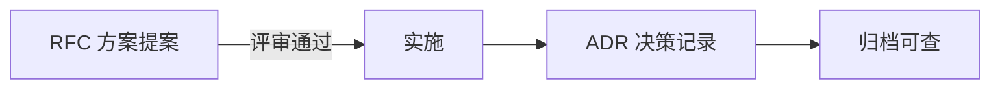
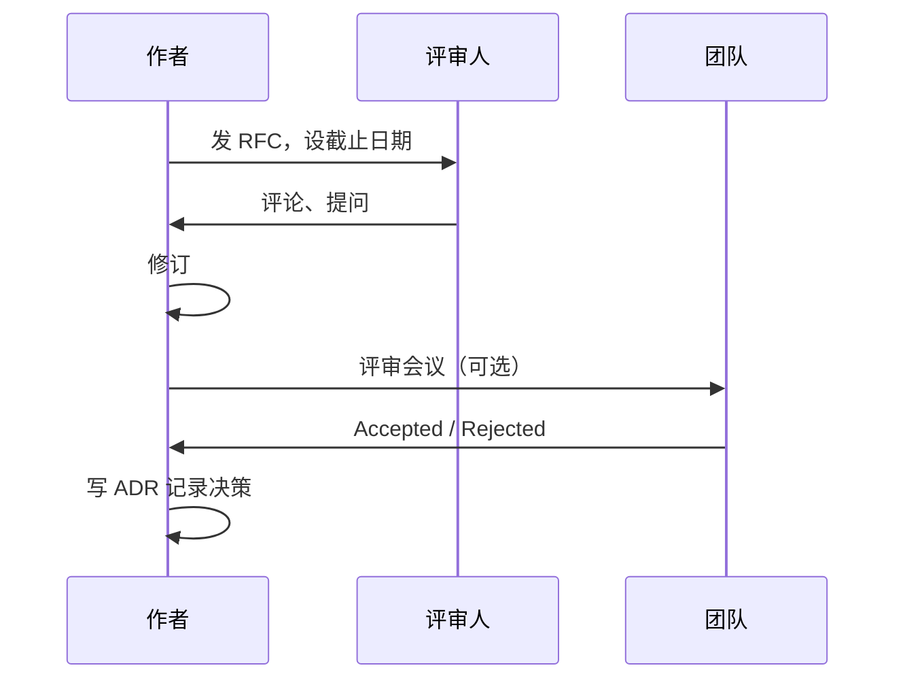

# 技术方案文档（RFC / ADR）

## 学习目标

- 理解 RFC 和 ADR 的用途与区别
- 掌握技术方案文档的结构与写作要点
- 了解如何组织评审与达成共识
- 能写出可执行、可追溯的技术文档

## 为什么需要

架构师大量工作通过**文档**完成：

- 方案评审需要清晰输入
- 决策需要记录，避免重复讨论
- 新人/oncall 需要理解决策背景
- 复盘需要追溯"当时为什么"

好的文档 = 可执行的共识 + 可追溯的历史。

## 核心原理

### 1. RFC vs ADR



| 类型 | 用途 | 时机 | 篇幅 |
|------|------|------|------|
| **RFC** Request for Comments | 提案、讨论、评审 | 实施前 | 长，详细 |
| **ADR** Architecture Decision Record | 记录已做决策 | 决策后 | 短，精炼 |

### 2. RFC 结构模板

```markdown
# RFC-001: 微前端架构改造方案

## 元信息
- 作者：张三
- 日期：2025-06-09
- 状态：Draft | Review | Accepted | Rejected
- 评审人：@李四 @王五

## 摘要
一段话说明要解决什么问题， proposed 方案是什么。

## 背景与动机
- 当前痛点（数据、案例）
- 为什么现在要做
- 不做的代价

## 目标与非目标
### 目标
- 各团队独立部署
- 技术栈可异构

### 非目标
- 不在此 RFC 解决 XX
- 不改造 YY 模块

## 方案设计
### 整体架构
（架构图 Mermaid）

### 详细设计
- 主应用职责
- 子应用规范
- 路由、通信、样式

### 备选方案
| 方案 | 优点 | 缺点 |
|------|------|------|
| A qiankun | ... | ... |
| B Module Federation | ... | ... |

## 迁移计划
- Phase 1: POC（2 周）
- Phase 2: 试点 1 个子应用（1 月）
- Phase 3: 全面推广

## 风险与缓解
| 风险 | 影响 | 缓解 |
|------|------|------|
| 样式冲突 | 高 | strictStyleIsolation |

## 成功指标
- 子应用独立部署率 100%
- 主应用构建时间 < 5min

## 开放问题
- [ ] 共享依赖版本策略？
- [ ] 子应用 CI 模板？

## 附录
- 参考资料链接
```

### 3. ADR 结构模板

```markdown
# ADR-001: 采用 Zustand 作为客户端状态管理

## 状态
Accepted

## 背景
项目需要全局 UI 状态（主题、侧边栏），Redux 样板过重。

## 决策
采用 Zustand 管理客户端状态，服务端状态继续用 React Query。

## 理由
- 团队 5 人，Zustand API 简单
-  bundle 小，无 boilerplate
- 与 React Query 职责清晰分离

## 后果
### 正面
- 开发效率提升
- 代码量减少

### 负面
- 复杂中间件需自研
- 团队需学习新库（1 天）

## 备选
- Redux Toolkit：过重
- Context：性能问题

## 相关
- RFC-002 状态管理方案
```

**ADR 原则：**

- 一篇一决策
- 不可修改，只能 supersede（新 ADR 替代）
- 简短，1-2 页

### 4. 评审流程



**评审要点：**

- 问题是否清晰
- 方案是否可行
- 风险是否识别
- 迁移计划是否可执行
- 是否有更简单方案

### 5. 写作技巧

**DO：**

- 先结论后细节（摘要）
- 用图（Mermaid、架构图）
- 量化（性能数字、时间线）
- 明确非目标，防止 scope creep
- 列出开放问题，而非假装完美

**DON'T：**

- 只有实现细节，没有问题背景
- 只有一个方案，无备选
- 过长无人读（RFC 控制在 5-10 页）
- 决策后不更新状态

### 6. 文档存放

```
docs/
├── rfcs/
│   ├── 001-micro-frontend.md
│   └── 002-state-management.md
├── adr/
│   ├── 001-zustand.md
│   └── 002-vite-migration.md
└── README.md  # 索引
```

## 常见误区与最佳实践

| 误区 | 正确理解 |
|------|---------|
| "文档写了没人看" | 结构清晰、有摘要、评审强制读 |
| "ADR 和 RFC 混用" | RFC 提案，ADR 记录决策 |
| "方案一次完美" | Draft → Review → 迭代 |
| "决策后不记录" | ADR 5 分钟，长期受益 |

**最佳实践：**

- 重大变更先 RFC，评审后 ADR
- ADR 放 repo，与代码同版本
- 定期 review 开放 RFC 和 ADR 有效性
- 模板统一，降低写作门槛

## 小结

- RFC：实施前的方案提案，详细、可讨论
- ADR：决策后的记录，简短、不可改
- 结构：背景 → 方案 → 备选 → 风险 → 计划
- 文档是架构师的核心产出

## 延伸阅读

- [ADR GitHub Organization](https://adr.github.io/)
- [Google Engineering Practices - Design Docs](https://google.github.io/eng-practices/review/)
- [Write the Docs](https://www.writethedocs.org/)
