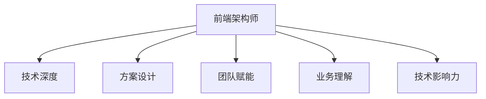

# 团队管理与技术规划

## 学习目标

- 理解大厂架构师在团队管理、技术规划、影响力上的考察标准
- 能制定季度/年度技术路线图
- 能在面试中展示技术领导力

## 为什么需要

P7+/T11+ 不只是「技术最深的人」，而是能**带团队、定方向、出结果**的人。面试和晋升都会考察管理与规划能力。

## 一、架构师角色模型

## 二、技术规划方法

### 2.1 规划输入

- 业务 OKR（Q 目标）
- 技术债务清单
- 团队能力雷达
- 行业技术趋势

### 2.2 规划输出（季度模板）

| 维度 | Q3 目标 | 关键举措 | 衡量指标 |
|------|---------|---------|---------|
| 性能 | LCP P75 < 2.0s | 性能预算 + CI 门禁 | RUM 大盘 |
| 工程 | 构建提速 50% | Rspack 迁移 | CI 耗时 |
| 质量 | 线上错误率 < 0.1% | Sentry + 告警 | 错误率 |
| 人才 | 2 人晋升准备 | Code Review + 导师 | 晋升通过率 |

### 2.3 技术雷达（季度更新）

- **采纳**：已验证推广（如 TanStack Query）
- **试验**：POC 阶段（如 React Compiler）
- **观望**：持续关注（如 Turbopack 生产）
- **淘汰**：计划下线（如旧 Webpack 4 项目）

## 三、团队管理实践

### Code Review 文化

- PR 模板：背景、方案、测试、风险
- Review 关注：设计、边界、可维护性，不只格式
- 24h 内响应

### 技术债务治理

- 每个 Sprint 留 20% 容量还债务
- 债务登记（问题、影响、修复成本）
- 与产品沟通「不还的后果」

### 人才培养

- 导师制：P7 带 P5/P6
- 技术分享：双周一次
- 轮岗：让成员接触不同模块

## 四、技术影响力

- 内部：RFC/ADR、组件库、脚手架、最佳实践文档
- 外部：技术博客、开源贡献、会议分享
- 跨团队：推动接口规范、设计系统共建

## 面试高频问答（追问链）

> 大厂对一个考点通常追问到能力边界：**概念 → 机制 → 边界 → ⭐ 原理（触底）→ 实战（落地）**。实战层是区分「背过」和「做过」的关键。软实力题无标准答案，面试官用真实场景验证是否真做过；实战层用 STAR 口述 + 量化指标回应。

### 链一：技术规划

1. **概念**：如何做技术规划？→ 对齐业务 OKR → 盘点债务与能力 → 排优先级 → 定指标 → 季度复盘。
2. **机制**：产品需求很紧怎么办？→ 债务可视化，用数据讲「不还的代价」。
3. ⭐ **原理（触底）**：怎么衡量架构师的价值？→ 业务指标(性能/转化/效率)+ 团队效能(交付周期/故障率)+ 技术资产(复用度)，把技术动作翻译成可量化的业务与组织收益。
4. **实战（落地）**：季度技术规划你怎么落地并量化？→ **S**：Q 初业务 OKR 要求转化提升，构建慢+错误率高；**T**：前端架构师定季度路线图；**A**：对齐 OKR 排 4 维度(性能/工程/质量/人才)设可测指标，Rspack 迁移+性能预算 CI 门禁+Sentry 告警；**R**：LCP P75 2.8s→1.9s、CI 耗时 -50%、线上错误率 0.3%→0.08%，季度复盘调整优先级。

### 链二：团队协作与影响力

1. **概念**：团队有人不配合怎么办？→ 先理解原因(能力/认同/利益)→ 1:1 → 数据+小胜利建信任 → 必要时升级。
2. **机制**：怎么建立技术影响力？→ 文档、工具、规范、人才培养，让能力规模化。
3. ⭐ **原理（触底）**：跨团队推动一个技术规范落地，遇到阻力怎么破？→ 找痛点共识 + 标杆团队试点出数据 + 工具化降低接入成本 + 自上而下背书，靠「让人愿意用」而非强制。
4. **实战（落地）**：跨团队推规范遇到阻力你怎么破局？→ **S**：3 个团队接口字段/错误码不统一，联调占 30% 工时；**T**：推统一 BFF 契约+组件规范；**A**：找各自痛点共识→标杆团队试点 2 周出联调耗时数据→脚手架/CLI 一键生成契约代码降低接入成本→技术委员会背书；**R**：联调工时 30%→12%，规范文档+工具被 5 团队采用，靠「让人愿意用」而非行政强制。

## 小结

- 架构师 = 技术深度 + 方案设计 + 团队赋能 + 业务理解
- 技术规划对齐业务，用指标衡量
- 影响力通过文档、工具、规范、人才培养建立

## 延伸阅读

- [01-技术选型与决策](./01-技术选型与决策.md)
- [03-项目难点包装与晋升答辩](./03-项目难点包装与晋升答辩.md)
