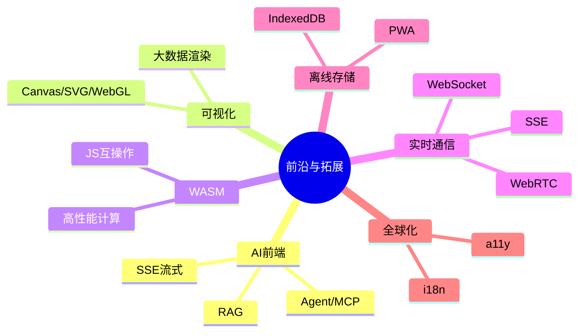
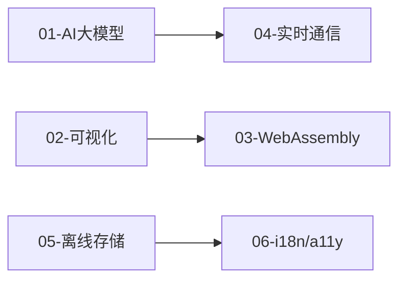

# 09-前沿与拓展 · 本章导读

## 模块定位

本模块覆盖大厂 2026 年前端架构师面试中**高频但传统资料缺失**的前沿领域：AI 大模型前端、可视化图形、WebAssembly、实时通信、离线存储、国际化与无障碍。与 01-08 基础模块互补，是架构师「技术广度 + 趋势敏感度」的考察重点。

## 知识地图

## 章节列表

| 文件 | 主题 |
|------|------|
| [01-AI大模型前端应用](./01-AI大模型前端应用.md) | SSE/RAG/Agent/MCP |
| [02-可视化与图形渲染](./02-可视化与图形渲染.md) | Canvas/SVG/WebGL |
| [03-WebAssembly与高性能计算](./03-WebAssembly与高性能计算.md) | WASM/Emscripten |
| [04-实时通信](./04-实时通信(WebSocket-SSE-WebRTC).md) | WS/SSE/WebRTC |
| [05-浏览器存储与离线](./05-浏览器存储与离线(IndexedDB-PWA).md) | IndexedDB/PWA |
| [06-国际化与无障碍](./06-国际化与无障碍(i18n-a11y).md) | i18n/a11y |

## 章节依赖

**前置依赖**：完成 [01-基础内功](../01-基础内功/00-本章导读.md)、[03-工程化](../03-工程化/00-本章导读.md) 中的 Node/BFF 章节。

## 学习建议

1. **AI 前端**是当前最高频新题，优先学习 SSE 流式与 RAG 架构
2. **可视化**结合业务场景（大屏、图表、编辑器）理解选型
3. **i18n/a11y** 大厂越来越重视，组件库和设计系统必考

## 自测清单

- [ ] SSE 和 WebSocket 流式输出 LLM 响应的区别？
- [ ] RAG 前端需要做什么？向量检索结果如何展示？
- [ ] Canvas、SVG、WebGL 各自适用什么场景？
- [ ] WASM 和 JS 如何互操作？适用哪些性能场景？
- [ ] WebRTC 信令流程？SSE 如何实现断线重连？
- [ ] IndexedDB 和 localStorage 选型？PWA 更新策略？
- [ ] i18n 按需加载怎么做？WCAG 核心要求？
