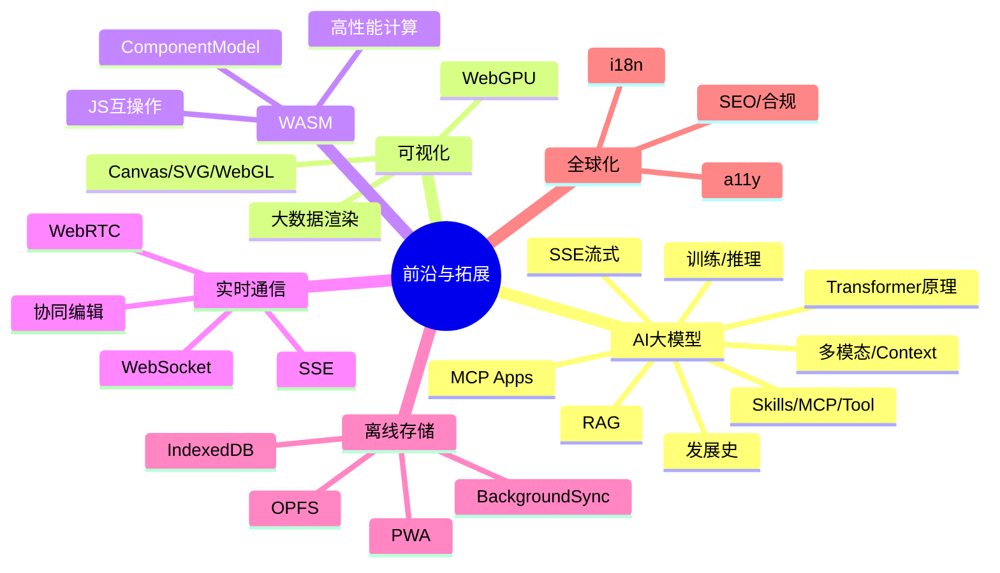
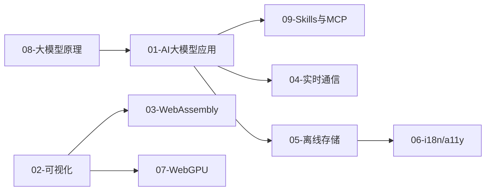

# 09-前沿与拓展 · 本章导读

## 模块定位

本模块覆盖大厂 2026 年前端架构师面试中**高频但传统资料缺失**的前沿领域：AI 大模型前端、可视化图形、WebAssembly、实时通信、离线存储、国际化与无障碍、WebGPU。与 01-08 基础模块互补，是架构师「技术广度 + 趋势敏感度」的考察重点。

**深度标准**：每篇均含原理 + 运用 + 排查实战 + 完整追问链（含实战落地层），与 01-08 模块同级。

## 知识地图

## 章节列表

| 文件 | 主题 |
|------|------|
| [01-AI大模型前端应用](./01-AI大模型前端应用.md) | SSE/RAG/Agent/多模态/Context |
| [08-大模型发展史与底层原理](./08-大模型发展史与底层原理.md) | 发展史/Transformer/训练推理/2026前沿/知识体系（01 的理论前置） |
| [09-AI-Agent-Skills与MCP协议详解](./09-AI-Agent-Skills与MCP协议详解.md) | Skills/MCP/Tool选型/MCP Apps/安全/追问链（01 的 Agent 能力深化） |
| [02-可视化与图形渲染](./02-可视化与图形渲染.md) | Canvas/SVG/WebGL/四叉树/编辑器 |
| [03-WebAssembly与高性能计算](./03-WebAssembly与高性能计算.md) | WASM/Emscripten/COOP/COEP |
| [04-实时通信](./04-实时通信(WebSocket-SSE-WebRTC).md) | WS/SSE/WebRTC/协同 |
| [05-浏览器存储与离线](./05-浏览器存储与离线(IndexedDB-PWA).md) | IndexedDB/OPFS/PWA |
| [06-国际化与无障碍](./06-国际化与无障碍(i18n-a11y).md) | i18n/a11y/SEO/合规 |
| [07-WebGPU与新一代图形](./07-WebGPU与新一代图形.md) | WebGPU/WGSL/Compute |

## 章节依赖

**前置依赖**：完成 [01-基础内功](../01-基础内功/00-本章导读.md)、[03-工程化](../03-工程化/00-本章导读.md) 中的 Node/BFF 章节。建议先读 [08-大模型发展史与底层原理](./08-大模型发展史与底层原理.md) 再学 01-AI 应用。

**交叉引用**：
- AI 流式 ↔ [04-前端系统设计专题](../04-架构设计/04-前端系统设计专题.md) 监控 SDK
- 图形编辑器 ↔ [04-前端系统设计专题](../04-架构设计/04-前端系统设计专题.md) 富文本/图形编辑器
- IM 消息 ↔ [04-实时通信](./04-实时通信(WebSocket-SSE-WebRTC).md) + 系统设计 IM 专节

## 学习建议

1. **AI 前端**是当前最高频新题，建议路径：08 原理 → 01 应用 → 09 Skills/MCP
2. **可视化 + WebGPU** 结合业务场景（大屏、图表、编辑器）理解选型
3. **存储**重点掌握 IndexedDB vs OPFS 分工与 local-first 架构
4. **i18n/a11y** 大厂越来越重视，组件库和设计系统必考

## 自测清单

- [ ] Transformer 比 RNN 强在哪？Self-Attention 怎么算？为什么 LLM 能流式输出？
- [ ] 大模型为什么会幻觉？RAG 和微调怎么选？temperature/top-p 调什么？
- [ ] 什么是推理模型/测试时计算？MoE 和混合 Mamba 架构解决什么？为什么 2026 模型「便宜又强」？多模型路由是什么？
- [ ] 什么是 AI Agent？Agent Loop（思考→行动→观察）和普通 LLM 有何区别？
- [ ] Skills、MCP、Tool Calling 三者区别？Skills 和 Rules 又有什么区别？
- [ ] 为什么「MCP 是手，Skills 是脑」？为什么不能把所有 SOP 都写成 Rules？
- [ ] MCP Host/Client/Server 分工？MCP Apps 沙箱 iframe 安全怎么做？
- [ ] SSE 和 WebSocket 流式输出 LLM 响应的区别？
- [ ] RAG 前端需要做什么？流式 Markdown 卡顿怎么排查？
- [ ] Canvas、SVG、WebGL、WebGPU 各自适用什么场景？
- [ ] WASM 和 JS 如何互操作？COOP/COEP 怎么配？
- [ ] WebRTC 信令流程？IM 断线重连怎么设计？
- [ ] IndexedDB vs OPFS？PWA 更新策略？Background Sync？
- [ ] i18n 按需加载？Modal a11y 要做哪些？hreflang 怎么配？
- [ ] WebGPU 相对 WebGL 的优势？如何做特性检测降级？
