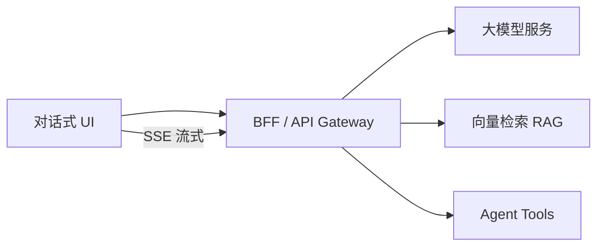
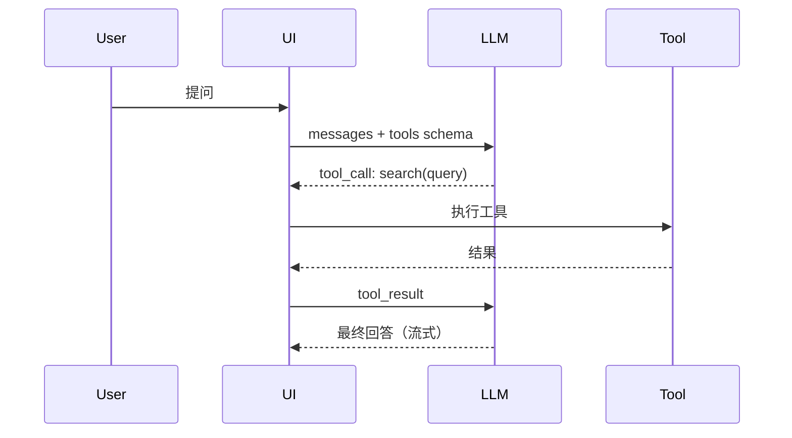

# AI 大模型前端应用

## 学习目标

- 理解 LLM 应用的前端架构：流式输出、对话式 UI、RAG、Agent
- 掌握 SSE 流式渲染、Markdown 增量解析、Token 计费展示
- 了解 MCP 协议与前端 Tool 调用集成

## 为什么需要

阿里通义、字节豆包、腾讯混元等产品线大量招聘「AI 应用前端/架构」。2026 年架构师面试 increasingly 考察：**如何把大模型能力嵌入现有前端体系**，而非只会调 API。

## 一、整体架构



| 层 | 职责 |
|----|------|
| 展示层 | 消息列表、流式打字机、Markdown/代码高亮、引用溯源 |
| 状态层 | 会话历史、多轮 context、乐观更新 |
| 传输层 | SSE / WebSocket 流式、取消（AbortController） |
| 安全层 | Prompt 注入防护、敏感词、输出过滤 |

## 二、SSE 流式输出

### 原理

Server-Sent Events：服务端单向推送，`text/event-stream` 格式，自动重连。

```javascript
async function streamChat(messages, { onDelta, onDone, signal }) {
  const res = await fetch('/api/chat', {
    method: 'POST',
    headers: { 'Content-Type': 'application/json' },
    body: JSON.stringify({ messages, stream: true }),
    signal,
  });
  const reader = res.body.getReader();
  const decoder = new TextDecoder();
  let buffer = '';
  while (true) {
    const { done, value } = await reader.read();
    if (done) break;
    buffer += decoder.decode(value, { stream: true });
    const lines = buffer.split('\n');
    buffer = lines.pop();
    for (const line of lines) {
      if (!line.startsWith('data: ')) continue;
      const data = line.slice(6);
      if (data === '[DONE]') return onDone?.();
      try { onDelta?.(JSON.parse(data).choices[0].delta.content || ''); } catch {}
    }
  }
}
```

### 前端关键点

- **打字机效果**：增量 append，避免整段 replace 导致闪烁
- **Markdown 流式渲染**：用 `marked` 增量解析或专用流式 MD 库
- **取消生成**：`AbortController.abort()` 停止 fetch
- **重试**：网络中断后从最后完整消息重发

## 三、对话式 UI 设计

```typescript
interface Message {
  id: string;
  role: 'user' | 'assistant' | 'system';
  content: string;
  status: 'pending' | 'streaming' | 'done' | 'error';
  citations?: Citation[];  // RAG 引用
  tokenUsage?: { prompt: number; completion: number };
}
```

**体验要点**：
- 用户消息立即上屏（乐观）
- Assistant 消息 `streaming` 状态显示光标动画
- 错误可重试单条，不必重发整轮
- 长会话分页加载历史

## 四、RAG 前端

**RAG（检索增强生成）**：先检索知识库，再拼入 Prompt 生成。

前端职责：
1. **引用展示**：回答下方展示 `[1][2]` 溯源卡片，点击跳转原文
2. **检索状态**：「正在检索知识库…」loading
3. **知识库管理 UI**：文档上传、切片预览、索引状态（管理后台）
4. **反馈闭环**：点赞/点踩、纠错提交用于微调

```javascript
function renderCitations(citations) {
  return citations.map((c, i) => ({
    index: i + 1,
    title: c.metadata.title,
    snippet: c.content.slice(0, 200),
    url: c.metadata.source,
  }));
}
```

## 五、Agent 与 Tool Calling

**Agent**：LLM 决策调用外部工具（搜索、数据库、API）。



前端实现：
- 解析 `tool_calls` JSON，展示「正在搜索…」步骤 UI
- Tool 执行可在 BFF 完成，前端只展示进度
- 支持用户确认敏感操作（发邮件、下单）再执行

## 六、MCP 协议（Model Context Protocol）

MCP 是 Anthropic 推出的**标准化工具/上下文接入协议**，让 AI 应用统一连接数据源和工具。

| 概念 | 说明 |
|------|------|
| MCP Server | 暴露 resources、tools、prompts |
| MCP Client | 宿主应用（IDE、Chat UI） |
| 前端角色 | 作为 Client UI，展示 Server 提供的上下文和工具调用结果 |

架构师关注点：MCP 让 Tool 集成从「每家 LLM 自定义格式」走向标准化，前端可复用同一套 Tool 进度/结果展示组件。

## 七、Web LLM 与端侧推理

- **WebLLM / ONNX Runtime Web**：浏览器端跑小模型，隐私场景、离线
- **Trade-off**：模型小、能力弱 vs 云端强但需网络
- 前端：Worker 中推理，主线程不阻塞；模型文件 CDN 加载 + IndexedDB 缓存

## 运用：项目落地 Checklist

- [ ] 流式用 SSE/fetch ReadableStream，支持 AbortController 取消
- [ ] 消息状态机：pending → streaming → done/error
- [ ] RAG 引用可点击溯源
- [ ] Tool 调用有进度 UI 和用户确认门
- [ ] Token 用量展示，成本可控
- [ ] Prompt 输入消毒，防 XSS（输出也要净化）

## 面试高频问答（追问链）

> 大厂对一个考点通常追问到能力边界：**概念 → 机制 → 边界 → ⭐ 原理（触底）→ 实战（落地）**。实战层是区分「背过」和「做过」的关键。

### 链一：流式输出

1. **概念**：SSE 和 WebSocket 做流式输出怎么选？→ SSE 单向简单/自动重连/HTTP 友好；WS 双向适合频繁交互。
2. **机制**：SSE 断线怎么办？→ 浏览器自动重连 + Last-Event-ID 续传。
3. **边界**：流式 Markdown 渲染难点？→ 未闭合语法块需容错、增量解析避免全量 re-render。
4. ⭐ **原理（触底）**：长文本流式输出怎么保证滚动/性能/中断体验？→ 增量 diff 渲染 + 虚拟化长列表 + AbortController 可停止生成 + 节流 setState 避免每 token 重渲。
5. **实战（落地）**：长文本流式对话页你怎么落地？→ 场景：客服 AI 助手需流式+可取消；步骤：fetch ReadableStream 解析 SSE + 消息状态机(pending→streaming→done) + 节流 setState(50ms 合并) + react-window 虚拟化历史 + AbortController 停止生成；验证：模拟 2000 字流式输出 FPS≥55、中断后 UI 无闪烁；结果：首字延迟<300ms、长会话滚动不掉帧，用户可中途取消节省 Token。

### 链二：RAG 与 Agent

1. **概念**：RAG 前端要做什么？→ 引用溯源、检索 loading、知识库 UI、反馈闭环（检索在服务端）。
2. **机制**：Agent Tool 调用前端职责？→ 解析 tool_calls 展示步骤、敏感操作确认、结果回传由 BFF 编排。
3. **边界**：MCP 解决什么？→ 标准化模型与工具/数据源的连接协议，复用工具生态。
4. ⭐ **原理（触底）**：怎么防止 LLM 输出导致 XSS / prompt 注入？→ 输出当不可信数据净化(DOMPurify)、工具调用做白名单与权限校验、用户输入与系统提示隔离，绝不直接 eval/innerHTML 模型产物。
5. **实战（落地）**：RAG 问答+Tool 调用你怎么防 XSS 并落地？→ 场景：内部知识库 AI 需引用溯源+搜索 Tool；步骤：BFF 藏 Key+限流、输出走 DOMPurify 白名单渲染、Tool 白名单+敏感操作二次确认、Prompt 与系统提示隔离；验证：构造 `<script>` 注入 payload 确认不执行、未授权 Tool 被拒；结果：通过安全评审上线，引用卡片可点击溯源、Tool 步骤 UI 有进度反馈。

## 常见误区

| 误区 | 正确理解 |
|------|---------|
| "前端只调 OpenAI API" | 需 BFF 藏 Key、限流、日志、Prompt 管理 |
| "流式 = WebSocket" | SSE + fetch stream 同样可行且更简单 |
| "RAG 纯后端事" | 引用展示和反馈是前端核心体验 |

## 小结

- AI 前端核心：SSE 流式 + 对话状态机 + RAG 溯源 + Agent 步骤 UI
- BFF 层负责 Key 安全、Tool 编排、Prompt 管理
- MCP 是 Tool 接入标准化趋势
- 安全：输入输出都要防 XSS 和 Prompt 注入

## 延伸阅读

- [OpenAI Streaming](https://platform.openai.com/docs/api-reference/streaming)
- [Model Context Protocol](https://modelcontextprotocol.io/)
- [Vercel AI SDK](https://sdk.vercel.ai/docs)
