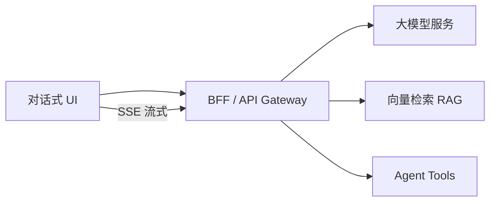
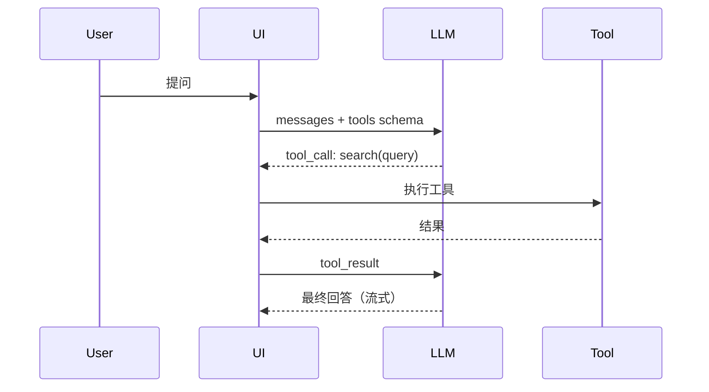

# AI 大模型前端应用

## 学习目标

- 理解 LLM 应用的前端架构：流式输出、对话式 UI、RAG、Agent
- 掌握 SSE 流式渲染、Markdown 增量解析、Token 计费展示
- 了解 Agent Tool 调用与 MCP/Skills 集成（详见 [09-AI-Agent-Skills与MCP协议详解](./09-AI-Agent-Skills与MCP协议详解.md)）

## 为什么需要

阿里通义、字节豆包、腾讯混元等产品线大量招聘「AI 应用前端/架构」。2026 年架构师面试 increasingly 考察：**如何把大模型能力嵌入现有前端体系**，而非只会调 API。

## 一、整体架构



| 层 | 职责 |
|----|------|
| 展示层 | 消息列表、流式打字机、Markdown/代码高亮、引用溯源 |
| 状态层 | 会话历史、多轮 context、乐观更新 |
| 传输层 | SSE / WebSocket 流式、取消（AbortController） |
| 安全层 | Prompt 注入防护、敏感词、输出过滤 |

## 二、SSE 流式输出

### 原理

Server-Sent Events：服务端单向推送，`text/event-stream` 格式，自动重连。

```javascript
async function streamChat(messages, { onDelta, onDone, signal }) {
  const res = await fetch('/api/chat', {
    method: 'POST',
    headers: { 'Content-Type': 'application/json' },
    body: JSON.stringify({ messages, stream: true }),
    signal,
  });
  const reader = res.body.getReader();
  const decoder = new TextDecoder();
  let buffer = '';
  while (true) {
    const { done, value } = await reader.read();
    if (done) break;
    buffer += decoder.decode(value, { stream: true });
    const lines = buffer.split('\n');
    buffer = lines.pop();
    for (const line of lines) {
      if (!line.startsWith('data: ')) continue;
      const data = line.slice(6);
      if (data === '[DONE]') return onDone?.();
      try { onDelta?.(JSON.parse(data).choices[0].delta.content || ''); } catch {}
    }
  }
}
```

### 前端关键点

- **打字机效果**：增量 append，避免整段 replace 导致闪烁
- **Markdown 流式渲染**：用 `marked` 增量解析或专用流式 MD 库
- **取消生成**：`AbortController.abort()` 停止 fetch
- **重试**：网络中断后从最后完整消息重发

## 三、对话式 UI 设计

```typescript
interface Message {
  id: string;
  role: 'user' | 'assistant' | 'system';
  content: string;
  status: 'pending' | 'streaming' | 'done' | 'error';
  citations?: Citation[];  // RAG 引用
  tokenUsage?: { prompt: number; completion: number };
}
```

**体验要点**：
- 用户消息立即上屏（乐观）
- Assistant 消息 `streaming` 状态显示光标动画
- 错误可重试单条，不必重发整轮
- 长会话分页加载历史

## 四、RAG 前端

**RAG（检索增强生成）**：先检索知识库，再拼入 Prompt 生成。

前端职责：
1. **引用展示**：回答下方展示 `[1][2]` 溯源卡片，点击跳转原文
2. **检索状态**：「正在检索知识库…」loading
3. **知识库管理 UI**：文档上传、切片预览、索引状态（管理后台）
4. **反馈闭环**：点赞/点踩、纠错提交用于微调

```javascript
function renderCitations(citations) {
  return citations.map((c, i) => ({
    index: i + 1,
    title: c.metadata.title,
    snippet: c.content.slice(0, 200),
    url: c.metadata.source,
  }));
}
```

## 五、Agent 与 Tool Calling

**Agent**：LLM 决策调用外部工具（搜索、数据库、API）。



前端实现：
- 解析 `tool_calls` JSON，展示「正在搜索…」步骤 UI
- Tool 执行可在 BFF 完成，前端只展示进度
- 支持用户确认敏感操作（发邮件、下单）再执行

## 六、Agent Skills 与 MCP（概要）

> **深度专题**见 [09-AI-Agent-Skills与MCP协议详解](./09-AI-Agent-Skills与MCP协议详解.md)，含 Skills/MCP/Tool 选型、MCP Apps 沙箱 UI、追问链与排查实战。

| 抽象 | 一句话 | 前端职责 |
|------|--------|---------|
| **Tool Calling** | 模型单次调函数 | 解析 tool_calls、步骤进度 UI |
| **MCP** | 连外部系统的标准协议（手） | Host UI 展示、BFF 代理调用 |
| **Agent Skills** | 工作流/规范文件包（脑） | Skills 目录管理、启用状态展示 |

**MCP Apps（2026）**：Server 声明 `ui://` 交互 UI，Host 沙箱 iframe 渲染——前端架构师必懂的安全模型（sandbox + postMessage + 用户确认门）。

## 七、Web LLM 与端侧推理

- **WebLLM / ONNX Runtime Web**：浏览器端跑小模型，隐私场景、离线
- **Trade-off**：模型小、能力弱 vs 云端强但需网络
- 前端：Worker 中推理，主线程不阻塞；模型文件 CDN 加载 + IndexedDB/OPFS 缓存

## 八、多模态与 Context 管理

### 多模态前端

| 能力 | 前端职责 |
|------|---------|
| 图片/文件输入 | 预览、压缩、格式校验、大小限制 |
| Vision API | Base64/URL 上传，展示模型「看图」进度 |
| 语音（可选） | MediaRecorder 采集 → BFF 转写 |

```typescript
// 多模态消息结构
interface MultimodalMessage {
  role: 'user';
  content: Array<
    | { type: 'text'; text: string }
    | { type: 'image_url'; image_url: { url: string } }
  >;
}
```

### Context 窗口管理

长会话必然触及 Token 上限，前端需配合 BFF：

1. **滑动窗口**：只发最近 N 轮 + 系统 Prompt
2. **摘要压缩**：旧对话由服务端摘要后注入 `summary` 字段
3. **Token 预算 UI**：展示已用/上限，接近阈值提示用户开新会话
4. **会话分页**：历史消息懒加载，不全量进 context

```javascript
function buildContext(messages, { maxTokens = 8000, keepRecent = 10 }) {
  const recent = messages.slice(-keepRecent);
  const summary = messages.find(m => m.role === 'system' && m.type === 'summary');
  return summary ? [summary, ...recent] : recent;
}
```

## 手写实现：消息状态机 + SSE 解析

```javascript
// 最小消息状态机
function createMessageReducer() {
  let id = 0;
  return function reducer(messages, action) {
    switch (action.type) {
      case 'USER_SEND':
        return [...messages, { id: ++id, role: 'user', content: action.text, status: 'done' }];
      case 'ASSISTANT_START':
        return [...messages, { id: ++id, role: 'assistant', content: '', status: 'streaming' }];
      case 'ASSISTANT_DELTA':
        return messages.map(m =>
          m.status === 'streaming' ? { ...m, content: m.content + action.delta } : m
        );
      case 'ASSISTANT_DONE':
        return messages.map(m => (m.status === 'streaming' ? { ...m, status: 'done' } : m));
      case 'ASSISTANT_ERROR':
        return messages.map(m =>
          m.status === 'streaming' ? { ...m, status: 'error', error: action.error } : m
        );
      default:
        return messages;
    }
  };
}

// SSE 行解析（fetch stream 通用）
function parseSSELine(line) {
  if (!line.startsWith('data: ')) return null;
  const payload = line.slice(6).trim();
  if (payload === '[DONE]') return { done: true };
  try {
    return { done: false, data: JSON.parse(payload) };
  } catch {
    return null;
  }
}
```

## 排查实战

### 案例 A：流式输出闪烁/卡顿

| 步骤 | 动作 |
|------|------|
| 读懂 | 每 token 触发整段 Markdown 重渲染 |
| 定位 | React Profiler 见 Message 组件每 50ms render |
| 解决 | 节流 setState（50ms 合并 delta）+ 流式 MD 增量解析 |
| 验证 | 2000 字流式 FPS ≥ 55，无整段闪烁 |

### 案例 B：生成无法停止

| 步骤 | 动作 |
|------|------|
| 读懂 | 用户点停止后仍追加文字 |
| 定位 | AbortController 未传给 fetch，或 onDelta 未检查 aborted |
| 解决 | `signal` 贯穿 fetch；abort 后忽略后续 delta |
| 验证 | 停止后 Network 请求 cancelled，UI 冻结在当前内容 |

### 案例 C：RAG 引用 XSS

| 步骤 | 动作 |
|------|------|
| 读懂 | 知识库片段含 `<script>` 被直接渲染 |
| 定位 | 模型输出 / citation snippet 未净化 |
| 解决 | DOMPurify 白名单渲染 + CSP |
| 验证 | 注入 payload 不执行，安全扫描通过 |

## 运用：项目落地 Checklist

- [ ] 流式用 SSE/fetch ReadableStream，支持 AbortController 取消
- [ ] 消息状态机：pending → streaming → done/error
- [ ] RAG 引用可点击溯源
- [ ] Tool 调用有进度 UI 和用户确认门
- [ ] Token 用量展示，成本可控
- [ ] Prompt 输入消毒，防 XSS（输出也要净化）

## 面试高频问答（追问链）

> 大厂对一个考点通常追问到能力边界：**概念 → 机制 → 边界 → ⭐ 原理（触底）→ 实战（落地）**。实战层是区分「背过」和「做过」的关键。

### 链一：流式输出

1. **概念**：SSE 和 WebSocket 做流式输出怎么选？→ SSE 单向简单/自动重连/HTTP 友好；WS 双向适合频繁交互。
2. **机制**：SSE 断线怎么办？→ 浏览器自动重连 + Last-Event-ID 续传。
3. **边界**：流式 Markdown 渲染难点？→ 未闭合语法块需容错、增量解析避免全量 re-render。
4. ⭐ **原理（触底）**：长文本流式输出怎么保证滚动/性能/中断体验？→ 增量 diff 渲染 + 虚拟化长列表 + AbortController 可停止生成 + 节流 setState 避免每 token 重渲。
5. **实战（落地）**：长文本流式对话页你怎么落地？→ 场景：客服 AI 助手需流式+可取消；步骤：fetch ReadableStream 解析 SSE + 消息状态机(pending→streaming→done) + 节流 setState(50ms 合并) + react-window 虚拟化历史 + AbortController 停止生成；验证：模拟 2000 字流式输出 FPS≥55、中断后 UI 无闪烁；结果：首字延迟<300ms、长会话滚动不掉帧，用户可中途取消节省 Token。

### 链二：RAG 与 Agent

1. **概念**：RAG 前端要做什么？→ 引用溯源、检索 loading、知识库 UI、反馈闭环（检索在服务端）。
2. **机制**：Agent Tool 调用前端职责？→ 解析 tool_calls 展示步骤、敏感操作确认、结果回传由 BFF 编排。
3. **边界**：MCP 解决什么？→ 标准化模型与工具/数据源的连接协议，复用工具生态。
4. ⭐ **原理（触底）**：怎么防止 LLM 输出导致 XSS / prompt 注入？→ 输出当不可信数据净化(DOMPurify)、工具调用做白名单与权限校验、用户输入与系统提示隔离，绝不直接 eval/innerHTML 模型产物。
5. **实战（落地）**：RAG 问答+Tool 调用你怎么防 XSS 并落地？→ 场景：内部知识库 AI 需引用溯源+搜索 Tool；步骤：BFF 藏 Key+限流、输出走 DOMPurify 白名单渲染、Tool 白名单+敏感操作二次确认、Prompt 与系统提示隔离；验证：构造 `<script>` 注入 payload 确认不执行、未授权 Tool 被拒；结果：通过安全评审上线，引用卡片可点击溯源、Tool 步骤 UI 有进度反馈。

### 链三：Web LLM 与 Context

1. **概念**：端侧推理适合什么场景？→ 隐私敏感、弱网、简单问答；不适合复杂推理。
2. **机制**：模型文件怎么缓存？→ CDN 首次加载 + IndexedDB/OPFS 持久化，二次打开秒开。
3. **边界**：Context 满了怎么办？→ 滑动窗口 + 服务端摘要 + 前端 Token 预算提示。
4. ⭐ **原理（触底）**：端侧 vs 云端怎么架构选型？→ 按任务复杂度分流：简单本地、复杂走云端；统一消息协议，前端无感切换。
5. **实战（落地）**：长会话 Context 溢出你怎么处理？→ 场景：客服 AI 50 轮后回答变差；步骤：前端展示 Token 用量、80% 阈值提示新会话、BFF 自动摘要旧对话注入 system、最近 10 轮原文保留；验证：100 轮对话仍连贯、成本可控；结果：平均 Token 降 40%，用户投诉「忘记前文」归零。

## 常见误区

| 误区 | 正确理解 |
|------|---------|
| "前端只调 OpenAI API" | 需 BFF 藏 Key、限流、日志、Prompt 管理 |
| "流式 = WebSocket" | SSE + fetch stream 同样可行且更简单 |
| "RAG 纯后端事" | 引用展示和反馈是前端核心体验 |
| "每 token 立即 setState" | 节流合并 delta，避免渲染风暴 |
| "历史消息全进 context" | 滑动窗口 + 摘要，配合 Token 预算 UI |

## 小结

- AI 前端核心：SSE 流式 + 对话状态机 + RAG 溯源 + Agent 步骤 UI
- 多模态与 Context 管理是长会话产品的必备能力
- BFF 层负责 Key 安全、Tool 编排、Prompt 管理
- Skills（知识）+ MCP（连接）+ Tool（动作）三层分工；MCP Apps 是 2026 前端重点
- 深度见 [09-AI-Agent-Skills与MCP协议详解](./09-AI-Agent-Skills与MCP协议详解.md)
- 安全：输入输出都要防 XSS 和 Prompt 注入
- 排查闭环：Profiler 查渲染 → AbortController 查取消 → DOMPurify 查 XSS

## 延伸阅读

- [OpenAI Streaming](https://platform.openai.com/docs/api-reference/streaming)
- [09-AI-Agent-Skills与MCP协议详解](./09-AI-Agent-Skills与MCP协议详解.md)
- [Model Context Protocol](https://modelcontextprotocol.io/)
- [Vercel AI SDK](https://sdk.vercel.ai/docs)
