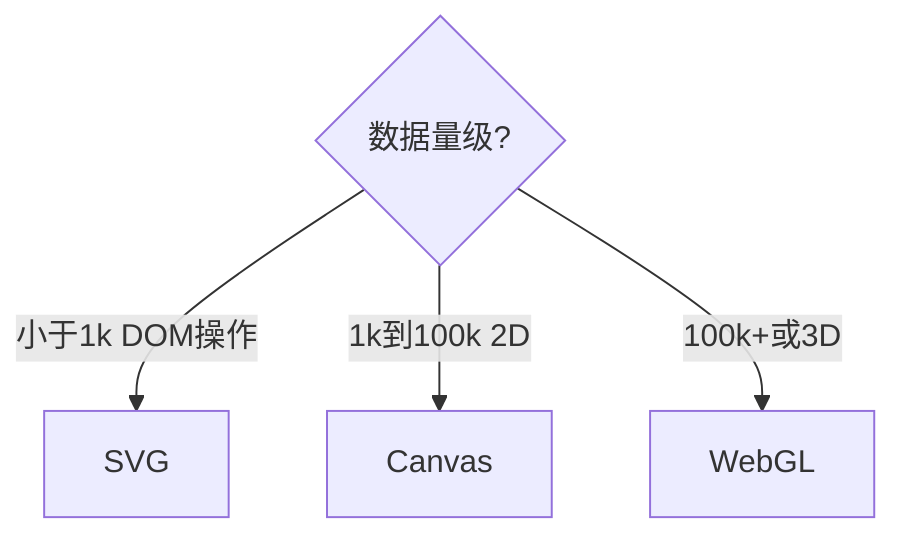
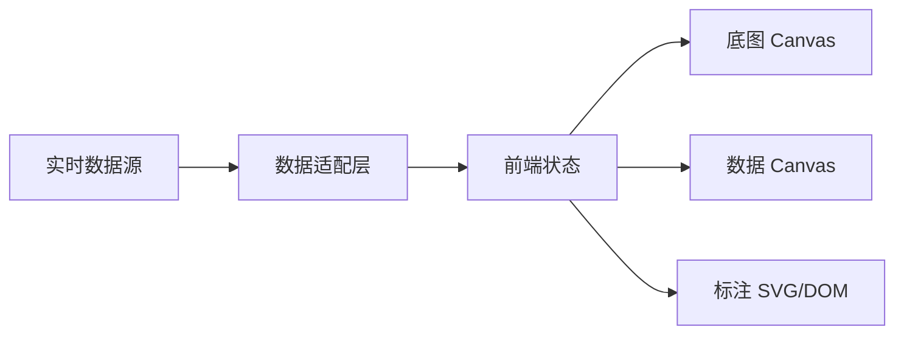

# 可视化与图形渲染

## 学习目标

- 掌握 Canvas、SVG、WebGL 选型与渲染原理
- 理解大数据量可视化优化（分层、离屏、虚拟化）
- 能设计图表库/大屏/图形编辑器的渲染架构

## 为什么需要

阿里 DataV、字节可视化、腾讯游戏/H5 大量考察图形渲染。架构师需回答：**万级数据点怎么画？事件怎么做命中检测？**

## 一、三种技术选型

| 技术 | 渲染方式 | 优势 | 劣势 | 适用 |
|------|---------|------|------|------|
| SVG | DOM/矢量 | 缩放清晰、CSS/事件原生 | 节点多时 DOM 慢 | <1000 元素、图标、地图标注 |
| Canvas | 位图逐帧绘制 | 大量图形性能好 | 无 DOM 事件、分辨率敏感 | 图表、游戏、粒子 |
| WebGL | GPU 着色器 | 海量数据、3D | 开发复杂、兼容性 | 3D、热力图、地理可视化 |



## 二、Canvas 渲染原理

```javascript
const canvas = document.getElementById('chart');
const ctx = canvas.getContext('2d');
const dpr = window.devicePixelRatio || 1;

// 高清屏适配
canvas.width = rect.width * dpr;
canvas.height = rect.height * dpr;
ctx.scale(dpr, dpr);

function draw(data) {
  ctx.clearRect(0, 0, width, height);
  data.forEach(({ x, y }) => {
    ctx.beginPath();
    ctx.arc(x, y, 3, 0, Math.PI * 2);
    ctx.fill();
  });
}
```

**动画循环**：`requestAnimationFrame` 与显示器刷新率同步（通常 60fps）。

## 三、大数据量优化

| 策略 | 原理 |
|------|------|
| 分层渲染 | 静态层（底图）+ 动态层（数据点）分开 Canvas，静态层不每帧重绘 |
| 离屏 Canvas | `OffscreenCanvas` 在 Worker 中绘制，不阻塞主线程 |
| 视口裁剪 | 只绘制可见区域数据（结合缩放级别 LOD） |
| 聚合 | 缩小时把邻近点合并为一个（网格聚合/Supercluster） |
| 虚拟化 | 表格/列表只渲染可见行，图表只渲染可见区间 |

```javascript
// 视口裁剪示例
function visibleData(data, xRange) {
  return data.filter(d => d.x >= xRange[0] && d.x <= xRange[1]);
}
```

## 四、事件命中检测

Canvas 无 DOM 事件，需手动实现：

```javascript
canvas.addEventListener('click', (e) => {
  const { x, y } = getCanvasCoords(e);
  const hit = data.find(d => Math.hypot(d.x - x, d.y - y) < 5);
  if (hit) onPointClick(hit);
});
```

**优化**：四叉树 / 网格索引，O(1) 查找邻近点，避免 O(n) 遍历。

## 五、图表库原理（以 ECharts 为例）

- **声明式配置**：option 描述图表类型和数据
- **渲染器选择**：Canvas（默认）或 SVG
- **组件系统**：坐标系、系列、图例、tooltip 各自独立
- **数据驱动**：`setOption` 增量更新，diff 后局部重绘

架构师关注点：自研图表 vs 用库 → 库覆盖 80% 场景；深度定制（金融 K 线、拓扑图）才自研。

## 六、坐标系与变换

```
屏幕坐标 ← 视口变换（平移/缩放）← 世界坐标 ← 数据坐标
```

缩放平移用矩阵变换（`ctx.translate/scale` 或 WebGL MVP 矩阵），避免重算所有数据点。

## 七、脏矩形与双缓冲

**脏矩形（Dirty Rectangle）**：只重绘变化区域，而非每帧 `clearRect` 全画布。

```javascript
let dirty = null;
function markDirty(x, y, w, h) {
  dirty = dirty ? unionRect(dirty, { x, y, w, h }) : { x, y, w, h };
}
function render() {
  if (!dirty) return;
  ctx.save();
  ctx.beginPath();
  ctx.rect(dirty.x, dirty.y, dirty.w, dirty.h);
  ctx.clip();
  drawScene(); // 仅重绘脏区
  ctx.restore();
  dirty = null;
}
```

**双缓冲**：离屏 Canvas 绘制完整帧，再 `drawImage` 到屏幕，避免闪烁。

## 八、WebGL 与 Three.js 选型

| 层级 | 适用 |
|------|------|
| 原生 WebGL | 极致定制、shader 级控制、包体敏感 |
| Three.js | 3D 场景、相机/光照/模型开箱即用 |
| deck.gl | 地理空间海量点（GPU 聚合） |
| WebGPU | 新一代 API，见 [07-WebGPU与新一代图形](./07-WebGPU与新一代图形.md) |

WebGL 管线：`顶点着色器 → 图元装配 → 光栅化 → 片元着色器 → 帧缓冲`

## 九、与图形编辑器的关系

富文本/图形编辑器（见 [04-前端系统设计专题](../04-架构设计/04-前端系统设计专题.md)）渲染层常采用：

- **Canvas 自绘** + 四叉树命中（Figma 类）
- **SVG 层** 做选中框/标注，Canvas 做海量图元
- **分层**：静态层缓存 bitmap，编辑层实时重绘

## 手写实现：四叉树命中检测

```javascript
class Quadtree {
  constructor(bounds, capacity = 4) {
    this.bounds = bounds;
    this.capacity = capacity;
    this.points = [];
    this.divided = false;
  }
  subdivide() {
    const { x, y, w, h } = this.bounds;
    const hw = w / 2, hh = h / 2;
    this.children = [
      new Quadtree({ x, y, w: hw, h: hh }),
      new Quadtree({ x: x + hw, y, w: hw, h: hh }),
      new Quadtree({ x, y: y + hh, w: hw, h: hh }),
      new Quadtree({ x: x + hw, y: y + hh, w: hw, h: hh }),
    ];
    this.divided = true;
  }
  insert(point) {
    if (!this.contains(point)) return false;
    if (this.points.length < this.capacity && !this.divided) {
      this.points.push(point);
      return true;
    }
    if (!this.divided) { this.subdivide(); this.points.forEach(p => this.insertToChildren(p)); this.points = []; }
    return this.insertToChildren(point);
  }
  insertToChildren(point) {
    return this.children.some(c => c.insert(point));
  }
  contains(p) {
    const b = this.bounds;
    return p.x >= b.x && p.x <= b.x + b.w && p.y >= b.y && p.y <= b.y + b.h;
  }
  query(range, found = []) {
    if (!this.intersects(range)) return found;
    this.points.forEach(p => { if (this.pointInRange(p, range)) found.push(p); });
    if (this.divided) this.children.forEach(c => c.query(range, found));
    return found;
  }
  intersects(r) {
    const b = this.bounds;
    return !(r.x > b.x + b.w || r.x + r.w < b.x || r.y > b.y + b.h || r.y + r.h < b.y);
  }
  pointInRange(p, r) {
    return p.x >= r.x && p.x <= r.x + r.w && p.y >= r.y && p.y <= r.y + r.h;
  }
}

// 点击查询：以点击点为中心的小范围
function hitTest(tree, x, y, radius = 5) {
  const hits = tree.query({ x: x - radius, y: y - radius, w: radius * 2, h: radius * 2 });
  return hits.sort((a, b) => Math.hypot(a.x - x, a.y - y) - Math.hypot(b.x - x, b.y - y))[0];
}
```

## 排查实战

### 案例 A：Canvas 模糊

| 步骤 | 动作 |
|------|------|
| 读懂 | Retina 屏线条发虚 |
| 定位 | `canvas.width` 未乘 devicePixelRatio |
| 解决 | `canvas.width = cssW * dpr`，`ctx.scale(dpr, dpr)` |
| 验证 | 1px 线条锐利，截图对比 |

### 案例 B：缩放后点击偏移

| 步骤 | 动作 |
|------|------|
| 读懂 | 放大后点击点与数据点不对齐 |
| 定位 | 屏幕坐标未逆变换到数据坐标 |
| 解决 | `dataX = (screenX - offsetX) / scale` |
| 验证 | 各缩放级别点击命中正确 |

### 案例 C：内存持续上涨

| 步骤 | 动作 |
|------|------|
| 读懂 | 大屏跑久后 Tab 内存涨 |
| 定位 | 每帧创建 ImageData/未释放离屏 Canvas |
| 解决 | 复用离屏 Canvas、分层静态底图 |
| 验证 | Memory 快照 30min 曲线平稳 |

## 运用：大屏架构



- 数据层 WebSocket 推送 + 节流更新（最多 1fps 全量刷新）
- 多屏自适应：`resize` + `transform: scale` 或 rem 布局

## 面试高频问答（追问链）

> 大厂对一个考点通常追问到能力边界：**概念 → 机制 → 边界 → ⭐ 原理（触底）→ 实战（落地）**。实战层是区分「背过」和「做过」的关键。

### 链一：渲染选型

1. **概念**：Canvas 和 SVG 怎么选？→ <1000 可交互元素用 SVG；大量数据点/动画用 Canvas；3D 用 WebGL。
2. **机制**：Canvas 怎么做事件？→ 无 DOM，需坐标转换 + 命中检测（四叉树/颜色拾取优化）。
3. **边界**：高清屏 Canvas 为什么模糊？→ 按 devicePixelRatio 放大像素尺寸再 scale 上下文。
4. ⭐ **原理（触底）**：万级/十万级数据点怎么流畅渲染？→ 视口裁剪 + LOD 聚合 + 离屏 Canvas/分层 + 避免每帧全清 + 数据量超阈值切 WebGL(GPU 批量绘制)。
5. **实战（落地）**：万级散点图卡顿你怎么优化？→ 场景：运营大屏 5 万数据点 Canvas 帧率<15fps；步骤：分层(静态底图+动态数据层) + 视口裁剪只绘可见区间 + 缩放 LOD 网格聚合 + dpr 高清适配；验证：Performance 录制约 60fps、缩放平移无全量重绘；结果：帧率 15fps→58fps，交互命中用四叉树 O(1) 查找。

### 链二：动画与 WebGL

1. **概念**：为什么用 requestAnimationFrame？→ 与刷新同步、不可见时暂停，比 setInterval 流畅省电。
2. **机制**：WebGL 为什么快？→ 顶点/片元着色器在 GPU 并行处理，批量绘制(instancing)。
3. ⭐ **原理（触底）**：图表库(ECharts)底层渲染原理？→ 数据 → 坐标系映射 → 图元 → Canvas/SVG/WebGL 渲染器抽象层 + 增量/脏矩形重绘 + 事件分发，渲染器可切换以适配数据量。
4. **实战（落地）**：自研图表 vs 用 ECharts 你怎么决策？→ 场景：金融 K 线需深度定制+十万级 tick；步骤：评估 ECharts 渲染器可切 Canvas/WebGL + 自定义 series 扩展 vs 完全自研成本，POC 对比 10 万点渲染耗时与事件分发；验证：ECharts WebGL 模式 10 万点<100ms、满足 80% 定制需求；结果：基于 ECharts 二开渲染层，开发周期节省 60%，仅拓扑图单独 Canvas 自研。

### 链三：图形编辑器渲染

1. **概念**：Figma 类编辑器为什么用 Canvas 而非纯 DOM？→ 海量图元 DOM 爆炸，Canvas 批量绘制性能好。
2. **机制**：选中框和图元怎么分层？→ Canvas 绘内容 + SVG/DOM 绘 UI 控件（选中框、手柄）。
3. **边界**：协同编辑渲染层要注意什么？→ 远端光标/选区用独立层，不触发全量重绘。
4. ⭐ **原理（触底）**：视口变化时如何只重绘可见区？→ 世界坐标→屏幕坐标变换 + 视口裁剪 + 脏矩形，静态层缓存 bitmap。
5. **实战（落地）**：简易白板编辑器你怎么做命中与渲染？→ 场景：在线白板 5000 图元；步骤：四叉树索引 + 分层(静态/动态) + 脏矩形局部重绘 + 屏幕坐标逆变换命中；验证：缩放平移 60fps、点击命中<5ms；结果：较全量遍历命中快 100 倍。

## 常见误区

| 误区 | 正确理解 |
|------|---------|
| "Canvas 一定比 SVG 快" | 少量元素 SVG 更简单；Canvas 胜在大量绘制 |
| "每帧 clearRect 全画布" | 分层 + 脏矩形，静态层不必每帧重绘 |
| "忽略 devicePixelRatio" | 高清屏必须适配，否则模糊 |
| "命中检测暴力遍历" | 万级数据用四叉树/网格索引 |

## 小结

- SVG 适合少量矢量交互；Canvas 适合大量 2D；WebGL/WebGPU 适合海量/3D
- 大数据：分层、离屏、裁剪、聚合、脏矩形
- 命中检测需自实现，四叉树优化
- 图表库声明式配置 + 增量更新是主流模式
- 进阶图形见 [07-WebGPU与新一代图形](./07-WebGPU与新一代图形.md)

## 延伸阅读

- [Canvas API - MDN](https://developer.mozilla.org/zh-CN/docs/Web/API/Canvas_API)
- [ECharts 渲染器](https://echarts.apache.org/handbook/zh/best-practices/canvas-vs-svg)
