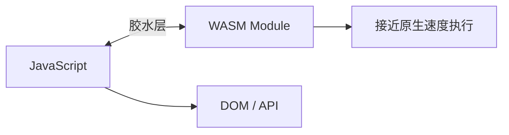

# WebAssembly 与高性能计算

## 学习目标

- 理解 WASM 编译执行原理与 JS 互操作
- 掌握 WASM 适用场景与架构选型
- 了解 Emscripten 编译流程与性能优化

## 为什么需要

FFmpeg.wasm、图像处理、加密、游戏引擎等场景，大厂面试常问：**什么时候用 WASM 而不是 JS？边界在哪？**

## 一、WASM 原理

```
C/C++/Rust 源码 → 编译器 → .wasm 二进制 → 浏览器 WASM 引擎 → 机器码执行
```

| 特性 | JS | WASM |
|------|-----|------|
| 执行 | 解释 + JIT | 预编译接近原生速度 |
| 启动 | 快 | 需下载+编译模块，冷启动慢 |
| DOM 访问 | 直接 | 必须通过 JS 胶水代码 |
| 适用 | 业务逻辑、UI | 计算密集、已有 C/Rust 库 |



## 二、JS 与 WASM 互操作

```javascript
// 加载 WASM 模块
const response = await fetch('module.wasm');
const { instance } = await WebAssembly.instantiateStreaming(response, imports);

// 调用导出函数
const result = instance.exports.add(1, 2);

// imports：WASM 调用 JS（访问 DOM 必须通过 imports）
const imports = {
  env: {
    consoleLog: (ptr, len) => {
      const bytes = new Uint8Array(instance.exports.memory.buffer, ptr, len);
      console.log(new TextDecoder().decode(bytes));
    },
  },
};
```

**内存共享**：WASM 线性内存（`WebAssembly.Memory`），JS 通过 `TypedArray` 读写。

```javascript
const memory = new WebAssembly.Memory({ initial: 256 }); // 16MB pages
const view = new Float64Array(memory.buffer);
view[0] = 3.14;
```

## 三、适用场景

| 场景 | 为什么 WASM |
|------|------------|
| 音视频编解码 | FFmpeg.wasm，C 库直接复用 |
| 图像处理 | OpenCV、滤镜、压缩 |
| 加密/哈希 | 性能敏感，已有成熟 C 库 |
| 游戏/物理引擎 | Unity WebGL 导出 |
| 科学计算 | 矩阵运算、仿真 |

**不适合**：
- 简单业务逻辑（WASM 冷启动开销不值）
- 频繁 DOM 操作（胶水层开销大）
- 小包体敏感场景（.wasm 文件体积）

## 四、Emscripten 编译流程

```bash
# C 代码编译为 WASM + JS 胶水
emcc hello.c -o hello.js -s WASM=1 -s EXPORTED_FUNCTIONS='["_add"]'
```

产出：
- `hello.wasm`：二进制模块
- `hello.js`：加载器 + 内存管理 + JS 互操作

**Rust 路径**：`wasm-pack` 更适合现代项目，类型安全的互操作。

## 五、性能优化

- **流式编译**：`instantiateStreaming` 边下载边编译
- **缓存**：Service Worker 缓存 .wasm，二次访问快
- **SIMD / 多线程**：`WebAssembly SIMD`、SharedArrayBuffer + Atomics（需 COOP/COEP 头）
- **减少 JS↔WASM 边界调用**：批量传数据，减少跨边界次数

## 六、与 Web Worker 配合

```javascript
// 主线程
const worker = new Worker('wasm-worker.js');
worker.postMessage({ imageData, width, height });
worker.onmessage = (e) => updateCanvas(e.data);

// wasm-worker.js：在 Worker 中加载 WASM，不阻塞主线程
```

## 面试高频问答（追问链）

> 大厂对一个考点通常追问到能力边界：**概念 → 机制 → 边界 → ⭐ 原理（触底）→ 实战（落地）**。实战层是区分「背过」和「做过」的关键。

### 链一：WASM 原理与取舍

1. **概念**：WASM 比 JS 快多少？→ 计算密集 2-10 倍，但胶水层/冷启动有开销需实测。
2. **机制**：为什么快？→ 预编译机器码、无需 JIT 预热、类型固定利于优化。
3. **边界**：能直接操作 DOM 吗？→ 不能，必须通过 JS imports 胶水层。
4. **应用**：什么时候不该用？→ 简单逻辑、频繁 DOM、小包体、团队无 C/Rust 能力。
5. ⭐ **原理（触底）**：JS 和 WASM 之间传大数据为什么是瓶颈？怎么优化？→ 跨边界基本类型可直传，复杂数据需在共享线性内存(ArrayBuffer)序列化拷贝；优化是减少调用次数、用共享内存批量传、避免频繁字符串编解码。
6. **实战（落地）**：JS↔WASM 传大图像你怎么优化？→ 场景：前端图片滤镜 4K 图处理卡 UI 3s+；步骤：滤镜算法 Rust 编译 WASM 放 Worker、共享 ArrayBuffer 批量传像素、减少每像素跨边界调用、instantiateStreaming 边下边编；验证：对比纯 JS 处理耗时、主线程 Long Task 消失；结果：4K 滤镜 3.2s→0.4s，主线程零阻塞。

### 链二：多线程与安全

1. **概念**：WASM 怎么用多线程？→ Web Worker + SharedArrayBuffer + Atomics。
2. **机制**：SharedArrayBuffer 为什么需要 COOP/COEP？→ 防 Spectre 侧信道，要求跨域隔离才启用。
3. ⭐ **原理（触底）**：一个典型落地场景(如音视频/图像处理)你怎么设计 JS+WASM 架构？→ 重计算放 WASM(在 Worker 中)、UI/DOM 留 JS 主线程、共享内存传帧数据、用消息控制，兼顾性能与不卡 UI。
4. **实战（落地）**：音视频/图像处理 JS+WASM 架构你怎么落地？→ 场景：浏览器端视频缩略图提取；步骤：FFmpeg.wasm 放 Worker 解码帧 → 共享内存传帧数据到主线程 Canvas 预览、主线程只管 UI/进度条；验证：4K 视频抽帧主线程 INP 不受影响；结果：无需服务端转码即可完成客户端预览，首帧<2s。

## 小结

- WASM = 近原生速度 + 复用 C/Rust 生态，通过 JS 胶水访问 Web API
- 适用计算密集；不适用 DOM 密集和简单逻辑
- 优化：流式编译、Worker、减少跨边界调用、SIMD
- Rust + wasm-pack 是近年主流工具链

## 延伸阅读

- [WebAssembly MDN](https://developer.mozilla.org/zh-CN/docs/WebAssembly)
- [Emscripten 文档](https://emscripten.org/docs/getting_started/index.html)
- [wasm-pack](https://rustwasm.github.io/wasm-pack/)
