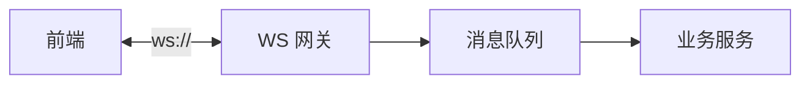
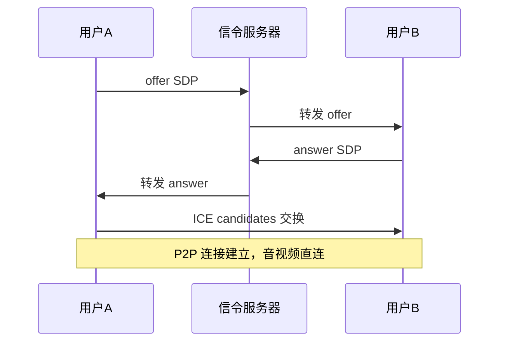

# 实时通信（WebSocket / SSE / WebRTC）

## 学习目标

- 掌握三种实时通信方案的原理、选型与架构设计
- 能设计长连接体系：心跳、重连、鉴权、消息有序
- 理解 WebRTC 信令与点对点通信流程

## 为什么需要

IM、直播、协同编辑、AI 流式输出都依赖实时通信。大厂面试高频：**WebSocket 断了怎么办？SSE 和 WS 怎么选？**

## 一、三方案对比

| 方案 | 方向 | 协议 | 自动重连 | 适用 |
|------|------|------|---------|------|
| WebSocket | 双向 | ws:// | 需手动 | IM、游戏、协同 |
| SSE | 服务端→客户端 | HTTP | 浏览器自动 | 推送、AI 流式、股票行情 |
| WebRTC | 点对点 | UDP/P2P | 需 ICE 重连 | 音视频、屏幕共享 |

## 二、WebSocket 架构



### 连接管理（手写骨架）

```javascript
class ReconnectingWebSocket {
  constructor(url, { maxRetries = 10, heartbeat = 30000 } = {}) {
    this.url = url;
    this.retries = 0;
    this.heartbeat = heartbeat;
    this.connect();
  }
  connect() {
    this.ws = new WebSocket(this.url);
    this.ws.onopen = () => { this.retries = 0; this.startHeartbeat(); };
    this.ws.onclose = () => this.reconnect();
    this.ws.onmessage = (e) => this.onMessage?.(JSON.parse(e.data));
  }
  reconnect() {
    if (this.retries >= this.maxRetries) return;
    const delay = Math.min(1000 * 2 ** this.retries, 30000);
    setTimeout(() => { this.retries++; this.connect(); }, delay);
  }
  startHeartbeat() {
    this.pingTimer = setInterval(() => {
      if (this.ws.readyState === WebSocket.OPEN) this.ws.send(JSON.stringify({ type: 'ping' }));
    }, this.heartbeat);
  }
}
```

**鉴权**：连接时带 token（query `?token=` 或首条消息 auth）；HTTPS 页面必须用 `wss://`。

## 三、SSE 流式

```javascript
const es = new EventSource('/api/stream?topic=news');
es.onmessage = (e) => handleData(JSON.parse(e.data));
es.onerror = () => { /* 浏览器自动重连 */ };
// 关闭
es.close();
```

**限制**：仅 GET、单向；每个连接占一个 HTTP 连接（HTTP/2 多路复用可缓解）。

**AI 流式**：也可用 `fetch` + `ReadableStream` 替代 SSE，更灵活（POST body）。

## 四、WebRTC 原理



| 组件 | 作用 |
|------|------|
| SDP | 会话描述（编解码器、媒体类型） |
| ICE | 打洞穿透 NAT，收集候选地址 |
| STUN | 获取公网 IP |
| TURN | 中继（对称 NAT 无法直连时） |

前端职责：信令交换（通过 WebSocket）、`RTCPeerConnection` 管理、媒体流 `getUserMedia`。

## 五、消息可靠性

| 问题 | 方案 |
|------|------|
| 消息丢失 | ACK 确认 + 重发 |
| 消息乱序 | 服务端 seq + 客户端排序缓冲 |
| 重复消息 | 幂等 ID 去重 |
| 离线消息 | 上线后拉取增量（lastSeq） |

## 六、fetch ReadableStream vs EventSource

| 方式 | 优势 | 劣势 |
|------|------|------|
| EventSource | 自动重连、Last-Event-ID | 仅 GET、不能 POST body |
| fetch + ReadableStream | POST body、自定义头、AbortController | 需手写解析与重连 |

AI 流式推荐 fetch + ReadableStream（见 [01-AI大模型前端应用](./01-AI大模型前端应用.md)）；推送通知类可用 EventSource。

## 七、协同编辑与 OT/CRDT 简述

实时协同（见 [04-前端系统设计专题](../04-架构设计/04-前端系统设计专题.md)）：

- **OT**：中心化服务端转换操作，Google Docs 类
- **CRDT**：去中心化无冲突合并，本地优先/离线友好
- **前端**：WebSocket 传操作增量，本地先应用（乐观），远端光标独立层渲染

## 八、WebRTC 最小示例

```javascript
const pc = new RTCPeerConnection({
  iceServers: [{ urls: 'stun:stun.l.google.com:19302' }],
});

// 本地媒体
const stream = await navigator.mediaDevices.getUserMedia({ video: true, audio: true });
stream.getTracks().forEach(track => pc.addTrack(track, stream));

// 信令（经 WebSocket）
ws.onmessage = async ({ data }) => {
  const msg = JSON.parse(data);
  if (msg.type === 'offer') {
    await pc.setRemoteDescription(msg.sdp);
    const answer = await pc.createAnswer();
    await pc.setLocalDescription(answer);
    ws.send(JSON.stringify({ type: 'answer', sdp: answer }));
  }
  if (msg.type === 'ice') await pc.addIceCandidate(msg.candidate);
};

pc.onicecandidate = (e) => {
  if (e.candidate) ws.send(JSON.stringify({ type: 'ice', candidate: e.candidate }));
};

pc.ontrack = (e) => { remoteVideo.srcObject = e.streams[0]; };
```

## 排查实战

### 案例 A：WebSocket 频繁断连

| 步骤 | 动作 |
|------|------|
| 读懂 | 弱网下每分钟断一次 |
| 定位 | 无心跳，NAT/代理超时；或重连无退避导致风暴 |
| 解决 | 30s ping + 指数退避+jitter 重连 |
| 验证 | Network 模拟 offline/online，连接恢复<3s |

### 案例 B：wss 连接失败

| 步骤 | 动作 |
|------|------|
| 读懂 | HTTPS 页面 ws:// 连不上 |
| 定位 | 混合内容被浏览器拦截 |
| 解决 | 统一 wss://，证书有效 |
| 验证 | Console 无 Mixed Content 警告 |

### 案例 C：WebRTC 黑屏

| 步骤 | 动作 |
|------|------|
| 读懂 | 信令成功但无画面 |
| 定位 | ICE 失败，无 TURN 兜底 |
| 解决 | 配 TURN 中继，对称 NAT 场景必用 |
| 验证 | `chrome://webrtc-internals` 看 candidate 类型 |

## 面试高频问答（追问链）

> 大厂对一个考点通常追问到能力边界：**概念 → 机制 → 边界 → ⭐ 原理（触底）→ 实战（落地）**。实战层是区分「背过」和「做过」的关键。

### 链一：WebSocket 连接管理

1. **概念**：WS 和长轮询区别？→ WS 全双工持久连接低开销；长轮询反复建连延迟高。
2. **机制**：心跳为什么必要？→ 检测死连接(NAT 超时/代理断开)，服务端清理僵尸连接。
3. **边界**：断线怎么重连？→ 指数退避重连 + 重连后状态补偿(拉取断连期间消息)。
4. ⭐ **原理（触底）**：百万长连接的 IM，前端和架构要注意什么？→ 前端连接复用/心跳节流/弱网降级；架构侧连接层水平扩展 + 网关路由 + 消息有序(seq)/不丢(ack)/不重(去重)，前端配合乱序缓冲。
5. **实战（落地）**：IM 长连接断线重连你怎么落地？→ 场景：IM 弱网频繁断连、消息丢失投诉；步骤：封装 ReconnectingWebSocket(指数退避+jitter) + 30s 心跳 + 重连后 lastSeq 增量拉取 + 服务端 seq 排序缓冲 + 幂等 ID 去重；验证：Chrome DevTools 模拟 offline/online 确认消息不丢不重；结果：断连恢复<3s、消息到达率 99.9%+，用户无感补全断连期间消息。

### 链二：SSE 与 WebRTC

1. **概念**：SSE 断线重连？→ 浏览器自动重连带 Last-Event-ID 续传。
2. **机制**：WebRTC 为什么需要信令服务器？→ P2P 前需交换 SDP 和 ICE candidate，信令中转(常用 WS)。
3. **边界**：WebRTC 连不通怎么办？→ NAT 穿透失败时经 TURN 中继兜底。
4. ⭐ **原理（触底）**：三种实时方案怎么按场景选？→ 服务端单向推送/AI 流式用 SSE；双向高频(IM/协同)用 WS；低延迟音视频/P2P 用 WebRTC，必要时组合(WS 做信令 + WebRTC 传流)。
5. **实战（落地）**：三种实时方案按场景你怎么组合落地？→ 场景：在线教育(聊天+直播+连麦)；步骤：IM 用 WS 双向(聊天/信令)、课程通知/AI 助教回复用 SSE 流式、音视频连麦用 WebRTC(WS 做 SDP/ICE 信令)+TURN 兜底；验证：弱网降级(WebRTC→仅音频→文字)、各通道独立重连互不影响；结果：聊天延迟<200ms、AI 流式首字<500ms、连麦 P2P 直连率 85% TURN 兜底 15%。

## 常见误区

| 误区 | 正确理解 |
|------|---------|
| "WebSocket 不用心跳" | NAT/代理会静默断开，必须心跳+重连 |
| "HTTPS 页面可用 ws://" | 必须 wss://，否则混合内容拦截 |
| "WebRTC 不需要信令" | P2P 前必须交换 SDP/ICE |
| "重连立即重试" | 指数退避+jitter，防重连风暴 |

## 小结

- IM/协同用 WebSocket；推送/AI 流式用 SSE；音视频用 WebRTC
- 长连接必备：心跳、指数退避重连、鉴权、消息有序
- WebRTC 核心：SDP 协商 + ICE 打洞 + STUN/TURN

## 延伸阅读

- [WebSocket API - MDN](https://developer.mozilla.org/zh-CN/docs/Web/API/WebSocket)
- [WebRTC 入门](https://webrtc.org/getting-started/overview)
