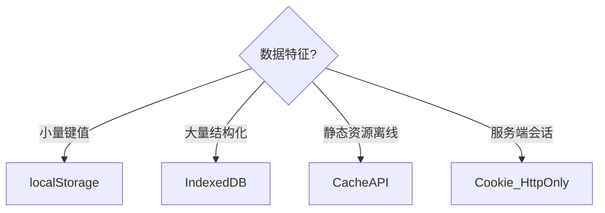

# 浏览器存储与离线（IndexedDB / PWA）

## 学习目标

- 掌握浏览器存储体系全景与选型
- 能使用 IndexedDB 实现结构化离线存储
- 理解 PWA 安装、更新策略与 Service Worker 缓存

## 为什么需要

离线优先、大容量本地存储、可安装 Web App 是大厂 C 端/B 端高频场景。架构师需设计：**数据存哪、配额怎么管、离线怎么同步？**

## 一、存储体系全景

| 存储 | 容量 | 类型 | 同步/异步 | 适用 |
|------|------|------|----------|------|
| Cookie | ~4KB | 字符串 | 同步 | 会话标识（HttpOnly） |
| localStorage | ~5MB | 字符串 | 同步 | 简单配置、主题 |
| sessionStorage | ~5MB | 字符串 | 同步 | 单 Tab 临时数据 |
| IndexedDB | 数百 MB~GB | 结构化 | 异步 | 大量离线数据、IM 消息 |
| Cache API | 取决于磁盘 | Response | 异步 | SW 缓存静态资源 |
| OPFS | 大 | 文件 | 异步 | 大文件、WASM 模型缓存 |



## 二、IndexedDB 实战

```javascript
function openDB(name, version, upgrade) {
  return new Promise((resolve, reject) => {
    const req = indexedDB.open(name, version);
    req.onupgradeneeded = (e) => upgrade(e.target.result, e.oldVersion);
    req.onsuccess = () => resolve(req.result);
    req.onerror = () => reject(req.error);
  });
}

// 使用
const db = await openDB('myApp', 1, (db) => {
  if (!db.objectStoreNames.contains('messages')) {
    const store = db.createObjectStore('messages', { keyPath: 'id' });
    store.createIndex('bySeq', 'seq', { unique: false });
  }
});

function put(store, data) {
  return new Promise((resolve, reject) => {
    const tx = db.transaction(store, 'readwrite');
    tx.objectStore(store).put(data);
    tx.oncomplete = () => resolve();
    tx.onerror = () => reject(tx.error);
  });
}
```

**推荐封装**：`idb` 库（Jake Archibald）简化 Promise API。

### 索引与查询

```javascript
// 按 seq 范围查询
const tx = db.transaction('messages', 'readonly');
const index = tx.objectStore('messages').index('bySeq');
const range = IDBKeyRange.bound(lastSeq + 1, Infinity);
const req = index.openCursor(range);
```

## 三、Service Worker 离线策略

| 策略 | 行为 | 适用 |
|------|------|------|
| Cache First | 先缓存，无则网络 | 静态资源（hash 文件名） |
| Network First | 先网络，失败用缓存 | API 数据 |
| Stale-While-Revalidate | 返回缓存同时后台更新 | 频繁更新但不紧急的资源 |

```javascript
// sw.js - Stale-While-Revalidate
self.addEventListener('fetch', (e) => {
  if (!e.request.url.includes('/api/')) return;
  e.respondWith(
    caches.open('api-v1').then(async (cache) => {
      const cached = await cache.match(e.request);
      const fetched = fetch(e.request).then(res => { cache.put(e.request, res.clone()); return res; });
      return cached || fetched;
    })
  );
});
```

## 四、PWA 安装与更新

**安装条件**：HTTPS + manifest.json + SW + 用户交互触发。

```json
// manifest.json
{
  "name": "My App",
  "short_name": "App",
  "start_url": "/",
  "display": "standalone",
  "icons": [{ "src": "/icon-192.png", "sizes": "192x192", "type": "image/png" }]
}
```

**更新策略**：
- SW 文件变化触发 `install` → `waiting` → 提示用户刷新激活
- `skipWaiting()` + `clients.claim()` 强制更新（慎用，可能中断用户操作）

```javascript
// 检测 SW 更新
navigator.serviceWorker.register('/sw.js').then(reg => {
  reg.addEventListener('updatefound', () => {
    const newWorker = reg.installing;
    newWorker.addEventListener('statechange', () => {
      if (newWorker.state === 'installed' && navigator.serviceWorker.controller) {
        showUpdateBanner(); // 提示用户刷新
      }
    });
  });
});
```

## 五、存储配额与管理

```javascript
if (navigator.storage && navigator.storage.estimate) {
  const { usage, quota } = await navigator.storage.estimate();
  console.log(`已用 ${(usage / 1024 / 1024).toFixed(1)}MB / ${(quota / 1024 / 1024).toFixed(1)}MB`);
}

// 持久化存储（防自动清理）
await navigator.storage.persist();
```

**架构建议**：定期清理过期数据；大文件用 OPFS；敏感数据加密后存储。

## 六、OPFS 深潜（Origin Private File System）

OPFS 提供**高性能文件级** API，适合 WASM 模型、大文件、日志：

```javascript
const root = await navigator.storage.getDirectory();
const fileHandle = await root.getFileHandle('model.bin', { create: true });
const writable = await fileHandle.createWritable();
await writable.write(arrayBuffer);
await writable.close();

// 读取
const file = await fileHandle.getFile();
const buffer = await file.arrayBuffer();
```

| 对比 | IndexedDB | OPFS |
|------|-----------|------|
| 数据模型 | 结构化记录 + 索引 | 文件/目录 |
| 性能 | 事务级 | 接近原生文件 IO，适合大块顺序读写 |
| 适用 | IM 消息、配置 | AI 模型缓存、视频分片、WASM 资源 |

**同步访问**（Dedicated Worker）：`createSyncAccessHandle()` 供 WASM 直接读写，零拷贝场景。

## 七、Background Sync 离线队列

```javascript
// sw.js
self.addEventListener('sync', (e) => {
  if (e.tag === 'sync-forms') {
    e.waitUntil(replayPendingWrites());
  }
});

async function replayPendingWrites() {
  const db = await openDB('offline-queue');
  const items = await db.getAll('pending');
  for (const item of items) {
    await fetch(item.url, { method: item.method, body: item.body });
    await db.delete('pending', item.id);
  }
}

// 页面：注册同步
await registration.sync.register('sync-forms');
```

用户离线时写入 IndexedDB 队列，恢复网络后 SW 自动重放。

## 八、IndexedDB 版本迁移

```javascript
await openDB('app', 3, {
  upgrade(db, oldVersion) {
    if (oldVersion < 2) {
      db.createObjectStore('messages', { keyPath: 'id' });
    }
    if (oldVersion < 3) {
      const store = db.transaction('messages').objectStore('messages');
      store.createIndex('bySeq', 'seq');
    }
  },
});
```

**原则**：只增 store/index，不删列；破坏性变更用新 DB 名或导出迁移脚本。

## 九、敏感数据与加密

- 离线存 Token：**禁止**明文 localStorage，用 HttpOnly Cookie 或服务端会话
- 必须本地存：Web Crypto API `subtle.encrypt` + 用户派生密钥
- 与 [07-安全](../07-安全/07-认证授权与Token安全.md) 配合：前端存储非保险箱

## 排查实战

### 案例 A：用户永远看旧版（SW）

| 步骤 | 动作 |
|------|------|
| 读懂 | 发版后部分用户仍是旧 UI |
| 定位 | SW CacheFirst 缓存了 index.html |
| 解决 | HTML NetworkFirst + 版本化静态资源 hash |
| 验证 | 发版后普通刷新即更新，提供「清除缓存」入口 |

### 案例 B：IndexedDB 事务挂起

| 步骤 | 动作 |
|------|------|
| 读懂 | 写入后读不到新数据 |
| 定位 | 未等 `transaction.oncomplete` 就开新事务 |
| 解决 | Promise 封装 tx，complete 后再读 |
| 验证 | 写入立即可查 |

### 案例 C：配额超限静默失败

| 步骤 | 动作 |
|------|------|
| 读懂 | 大量离线数据后写入失败 |
| 定位 | `QuotaExceededError` 未处理 |
| 解决 | `storage.estimate()` 监控 + LRU 清理 + 用户提示 |
| 验证 | 超 80% 配额弹窗引导清理 |

## 面试高频问答（追问链）

> 大厂对一个考点通常追问到能力边界：**概念 → 机制 → 边界 → ⭐ 原理（触底）→ 实战（落地）**。实战层是区分「背过」和「做过」的关键。

### 链一：存储选型

1. **概念**：IndexedDB 和 localStorage 区别？→ IDB 异步/大容量/结构化+索引；localStorage 同步/5MB/仅字符串。
2. **机制**：为什么 IM 消息用 IDB？→ 量大、需索引查询、异步不阻塞 UI。
3. **边界**：存储配额满了怎么办？→ navigator.storage 估算 + LRU 清理 + 持久化申请(persist)。
4. ⭐ **原理（触底）**：localStorage 为什么会卡主线程？大量数据怎么办？→ 同步 API 读写阻塞主线程且序列化耗时；改用 IndexedDB 异步，或 Web Worker + OPFS 处理大文件。
5. **实战（落地）**：IM 大量消息本地存储你怎么设计？→ 场景：IM 客户端需离线看历史 10 万条消息；步骤：IndexedDB 建 messages 表+bySeq 索引、idb 库封装 Promise API、navigator.storage.estimate 监控配额 + LRU 清理 30 天前消息 + persist() 申请持久化；验证：10 万条写入/范围查询<200ms、配额告警触发清理；结果：离线首屏读本地<100ms 响应，不阻塞 UI。

### 链二：离线与 PWA

1. **概念**：SW 缓存策略有哪些？→ CacheFirst/NetworkFirst/StaleWhileRevalidate 按资源选。
2. **机制**：SW 更新用户无感知怎么办？→ updatefound 提示刷新，或 skipWaiting 强制(评估中断)。
3. **应用**：离线数据怎么与服务端同步？→ lastSeq 增量拉取 + 本地操作队列 + 冲突解决。
4. ⭐ **原理（触底）**：怎么设计一个「本地优先(local-first)」离线可用应用？→ 本地 IDB 为数据源即时响应 + 后台同步队列 + 版本向量/CRDT 解决冲突 + Background Sync 断网恢复重试，UI 永远先读本地。
5. **实战（落地）**：local-first 离线应用你怎么落地？→ 场景：现场巡检 App 经常无网；步骤：IndexedDB 为数据源即时响应 + 操作队列(增删改)后台 Background Sync 重试 + lastSeq 增量同步 + 简单 last-write-wins 冲突解决 + SW Stale-While-Revalidate 缓存静态资源；验证：断网 CRUD 正常、恢复网络后 30s 内同步完成；结果：离线可用率 100%、同步成功率 99.5%，UI 永远先读本地零等待。

### 链三：OPFS 与大文件

1. **概念**：OPFS 和 IndexedDB 怎么选？→ 结构化记录用 IDB，大文件/模型/顺序 IO 用 OPFS。
2. **机制**：WASM 怎么读 OPFS？→ Worker 中 `createSyncAccessHandle` 零拷贝读写。
3. **边界**：OPFS 容量限制？→ 与源站同源配额共享，`storage.estimate()` 监控。
4. ⭐ **原理（触底）**：AI 模型浏览器缓存架构？→ 首次 CDN 流式下载 → OPFS 分片写入 → 二次启动直接读本地 → Worker 加载推理，主线程零阻塞。
5. **实战（落地）**：端侧 AI 模型缓存你怎么落地？→ 场景：WebLLM 7B 模型 4GB；步骤：OPFS 分片下载+断点续传、Worker 读 OPFS 加载、storage.estimate 监控配额、低空间 LRU 淘汰旧模型；验证：二次打开模型加载<3s、主线程无 Long Task；结果：弱网场景可用率从 60%→95%。

## 常见误区

| 误区 | 正确理解 |
|------|---------|
| "localStorage 存大量数据" | 同步阻塞，5MB 上限，应用 IndexedDB/OPFS |
| "SW 缓存 HTML 长缓存" | HTML 应 NetworkFirst，否则永不过期 |
| "IDB 事务不用等 complete" | 必须等 oncomplete 再读，否则脏读 |
| "离线 Token 明文存" | 敏感数据加密或服务端会话 |

## 小结

- 小数据 localStorage；大量结构化 IndexedDB；大文件/模型 OPFS；静态资源 Cache API
- PWA = manifest + SW + HTTPS，注意更新提示策略
- Background Sync 实现离线队列重放；IDB 版本迁移只增不删
- 存储配额用 `storage.estimate` 监控，重要数据 `persist()`

## 延伸阅读

- [IndexedDB - MDN](https://developer.mozilla.org/zh-CN/docs/Web/API/IndexedDB_API)
- [Workbox 缓存策略](https://developer.chrome.com/docs/workbox/caching-strategies-overview)
- [idb 库](https://github.com/jakearchibald/idb)
