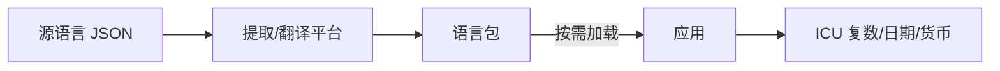

# 国际化与无障碍（i18n / a11y）

## 学习目标

- 掌握前端 i18n 架构：按需加载、复数、RTL、时区货币
- 理解 WCAG 无障碍体系与 ARIA 实践
- 能在组件库/设计系统中落地 a11y 规范

## 为什么需要

阿里/腾讯国际化业务、政府/金融合规项目 increasingly 要求 a11y。架构师面试考察：**i18n 不是简单翻译；a11y 不是加个 alt 属性。**

## 一、i18n 架构



### 方案选型

| 方案 | 特点 |
|------|------|
| i18next | 生态全、插件多、React/Vue 官方支持 |
| react-intl (FormatJS) | ICU 消息格式、Intl API 集成 |
| vue-i18n | Vue 官方，组合式 API 友好 |
| 自研 | 简单项目够用，但不推荐重复造轮子 |

### 按需加载

```javascript
// i18next 懒加载语言包
i18n.use(Backend).init({
  backend: {
    loadPath: '/locales/{{lng}}/{{ns}}.json',
  },
  lng: detectLanguage(),  // navigator / URL / Cookie
  fallbackLng: 'en',
});

async function switchLanguage(lng) {
  await i18n.changeLanguage(lng);
  document.documentElement.lang = lng;
  document.documentElement.dir = ['ar', 'he'].includes(lng) ? 'rtl' : 'ltr';
}
```

### ICU 消息格式

```json
{
  "items": "{count, plural, =0 {No items} one {# item} other {# items}}",
  "price": "Price: {amount, number, ::currency/USD}"
}
```

**关键点**：
- **复数规则**各语言不同（中文无复数，阿拉伯语 6 种）
- **RTL 布局**：`dir="rtl"` + CSS 逻辑属性（`margin-inline-start` 替代 `margin-left`）
- **时区**：用 `Intl.DateTimeFormat` + 用户时区设置，不硬编码
- **不要在代码里拼接句子**：语序因语言而异

## 二、无障碍（a11y）体系

### WCAG 2.1 四个原则（POUR）

| 原则 | 含义 | 前端实践 |
|------|------|---------|
| Perceivable 可感知 | 信息可被感官获取 | alt 文本、对比度、字幕 |
| Operable 可操作 | 界面可操作 | 键盘导航、焦点管理 |
| Understandable 可理解 | 内容易懂 | 错误提示清晰、一致导航 |
| Robust 健壮 | 兼容辅助技术 | 语义 HTML、ARIA |

### 语义化 HTML 优先

```html
<!-- 好 -->
<button type="button" aria-expanded="false" aria-controls="menu">Menu</button>
<nav aria-label="Main navigation">...</nav>

<!-- 差 -->
<div onclick="openMenu()">Menu</div>
```

**规则**：原生元素有语义和键盘行为，优先用 `<button>` `<a>` `<input>`，不够再 ARIA。

### ARIA 常用

| 属性 | 用途 |
|------|------|
| `aria-label` | 无可见文字的元素描述 |
| `aria-labelledby` | 引用其他元素作标签 |
| `aria-expanded` | 折叠/展开状态 |
| `aria-live="polite"` | 动态内容通知读屏 |
| `role="dialog"` | 模态框 |

### 焦点管理

```javascript
// Modal 打开：焦点移入，关闭：焦点还原
function openModal() {
  lastFocus = document.activeElement;
  modal.showModal();
  modal.querySelector('[autofocus], button')?.focus();
}
function closeModal() {
  modal.close();
  lastFocus?.focus();
}
```

**焦点陷阱**：Tab 键不应逃出 Modal；用 `focus-trap` 库或自实现。

### 键盘导航

- 所有交互元素可 Tab 到达
- `Enter`/`Space` 触发按钮
- `Escape` 关闭弹层
- 自定义组件（Tabs、Menu）实现 [WAI-ARIA Authoring Practices](https://www.w3.org/WAI/ARIA/apg/)

## 三、自动化检测

```javascript
// jest-axe 单元测试
import { axe } from 'jest-axe';
test('Button accessible', async () => {
  const { container } = render(<Button>Submit</Button>);
  expect(await axe(container)).toHaveNoViolations();
});
```

| 工具 | 用途 |
|------|------|
| axe DevTools | 浏览器插件扫描 |
| Lighthouse a11y | CI 门禁 |
| eslint-plugin-jsx-a11y | 编码阶段拦截 |
| 屏幕阅读器 | NVDA/VoiceOver 人工测试 |

### 对比度

- 正文文字对比度 ≥ 4.5:1（WCAG AA）
- 大文字 ≥ 3:1
- 用 `@axe-core/playwright` 或在线对比度计算器验证

## 四、组件库 a11y 规范

- 所有组件有键盘操作文档
- Focus 样式可见（`:focus-visible`）
- 图标按钮必须有 `aria-label`
- 表单：`<label htmlFor>` 关联、错误信息 `aria-describedby`
- 颜色不作为唯一信息载体（色盲友好）

## 五、SEO 与多语言路由

```html
<link rel="alternate" hreflang="en" href="https://example.com/en/page" />
<link rel="alternate" hreflang="zh-CN" href="https://example.com/zh/page" />
<link rel="alternate" hreflang="x-default" href="https://example.com/page" />
```

| 路由策略 | 适用 |
|---------|------|
| 子路径 `/en/` `/zh/` | 最常见，SEO 友好 |
| 子域名 `en.example.com` | 地区强隔离 |
| Query `?lang=en` | 不推荐 SEO |

`document.documentElement.lang` 与 hreflang 保持一致。

## 六、合规要求简述

| 标准 | 范围 | 前端要点 |
|------|------|---------|
| WCAG 2.1 AA | 国际通用 | 对比度、键盘、读屏 |
| Section 508 | 美国政府 | 等同 WCAG |
| 欧盟 EAA (2025) | 欧盟数字产品 | 可访问性为法律要求 |
| 国标 GB/T 37668 | 中国 | 政府/金融项目常引用 |

架构师职责：组件库内置 a11y、CI 门禁、发布前 axe + 读屏抽检。

## 排查实战

### 案例 A：RTL 布局错位

| 步骤 | 动作 |
|------|------|
| 读懂 | 阿拉伯语镜像后图标方向反了 |
| 定位 | 硬编码 `margin-left`、方向性图标未翻转 |
| 解决 | CSS 逻辑属性 + `dir=rtl` + 图标 `transform: scaleX(-1)` 按需 |
| 验证 | ar/he 语言手测布局 |

### 案例 B：Modal 焦点丢失

| 步骤 | 动作 |
|------|------|
| 读懂 | 关 Modal 后 Tab 不知去哪 |
| 定位 | 未保存/还原 `document.activeElement` |
| 解决 | open 时存 lastFocus，close 时 `lastFocus.focus()` |
| 验证 | 键盘全程可走通 |

### 案例 C：漏译上线

| 步骤 | 动作 |
|------|------|
| 读懂 | 新功能英文有、日文显示 key |
| 定位 | 硬编码字符串未提取 |
| 解决 | i18n key 提取进 CI + 缺失 key 告警 |
| 验证 | PR 门禁拦截未翻译 key |

## 面试高频问答（追问链）

> 大厂对一个考点通常追问到能力边界：**概念 → 机制 → 边界 → ⭐ 原理（触底）→ 实战（落地）**。实战层是区分「背过」和「做过」的关键。

### 链一：国际化

1. **概念**：i18n 按需加载怎么做？→ 语言包拆文件，切换时动态 import/fetch，不全量打包。
2. **机制**：复数、日期、货币怎么处理？→ ICU MessageFormat + Intl API，不手拼字符串。
3. **边界**：RTL 怎么处理？→ `dir=rtl` + CSS 逻辑属性(margin-inline 等)。
4. ⭐ **原理（触底）**：大型应用 i18n 架构怎么设计才可维护？→ key 规范化 + 命名空间分包 + 翻译平台同步 + 缺失 key 兜底与告警 + 提取/校验进 CI，避免硬编码与漏译。
5. **实战（落地）**：大型应用 i18n 你怎么落地可维护？→ 场景：出海产品支持 12 语言、包体膨胀；步骤：key 命名空间分包 + i18next 懒加载语言包 + ICU 复数/货币/日期 + 翻译平台同步 + CI 检测缺失 key 告警 + RTL 用逻辑属性；验证：切换语言包按需加载<100KB、阿拉伯语 RTL 布局无错位；结果：主包体积不随语言增长，漏译 CI 拦截率 100%。

### 链二：无障碍

1. **概念**：aria-label 和 aria-labelledby 区别？→ label 直接写描述；labelledby 引用可见文本 id。
2. **机制**：为什么不用 div 做按钮？→ 无语义/无键盘/读屏不识别，违反 WCAG Operable。
3. **应用**：怎么测试 a11y？→ 自动化(axe/Lighthouse)+ 键盘手测 + 读屏器 + CI 门禁。
4. ⭐ **原理（触底）**：Modal 弹窗的无障碍要做哪些？→ 焦点移入并困住(focus trap)、Esc 关闭、关闭后焦点还原、aria-modal + role=dialog、背景 inert，保证键盘与读屏用户可用。
5. **实战（落地）**：组件库 Modal a11y 你怎么落地并守门？→ 场景：设计系统 20+ 组件需 WCAG AA 合规；步骤：语义 HTML 优先 + focus trap + Esc 关闭 + 焦点还原 + aria-modal/role=dialog + jest-axe 单测 + eslint-plugin-jsx-a11y CI 门禁 + Lighthouse a11y≥95；验证：键盘全程可操作、NVDA 读屏测试通过；结果：组件库 a11y 自动化覆盖率 100%、Lighthouse a11y 平均 97 分。

## 常见误区

| 误区 | 正确理解 |
|------|---------|
| "i18n = 翻译 JSON" | 还需复数、RTL、时区、路由、SEO |
| "拼接字符串翻译" | 语序因语言而异，用 ICU 占位 |
| "a11y = 加 alt" | 键盘、焦点、对比度、语义 HTML 同等重要 |
| "div 模拟按钮够用" | 违反 Operable，应用 button 或补全 ARIA+键盘 |

## 小结

- i18n：ICU 格式、按需加载、RTL、Intl API、hreflang SEO，禁止拼接句子
- a11y：语义 HTML 优先，ARIA 补充，焦点管理，键盘可达
- 合规：WCAG AA 为基线，出海关注 EAA
- 组件库必须内置 a11y，用 axe + eslint 自动化保障

## 延伸阅读

- [WCAG 2.1](https://www.w3.org/WAI/WCAG21/quickref/)
- [WAI-ARIA APG](https://www.w3.org/WAI/ARIA/apg/)
- [FormatJS](https://formatjs.io/)
