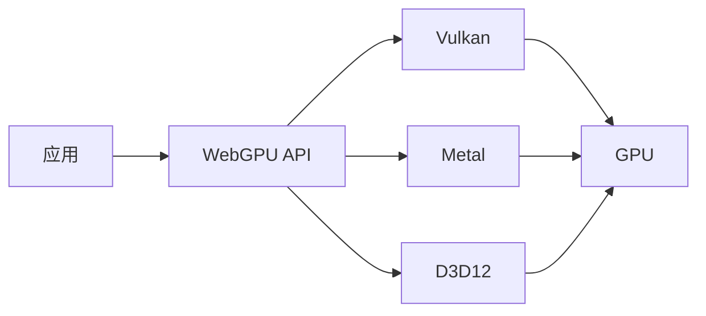

# WebGPU 与新一代图形

## 学习目标

- 理解 WebGPU 相对 WebGL 的架构升级与选型依据
- 掌握 WebGPU 基础管线：设备、缓冲区、着色器、渲染通道
- 能判断何时从 Canvas/WebGL 迁移到 WebGPU

## 为什么需要

WebGPU 是 W3C 标准的新一代图形与计算 API（Chrome 113+、Safari 17+、Firefox 141+），字节/腾讯图形与可视化岗 increasingly 问：**WebGPU 和 WebGL 区别？百万粒子怎么画？**

与 [02-可视化与图形渲染](./02-可视化与图形渲染.md) 互补：02 讲 Canvas/SVG/WebGL 选型，本篇聚焦 WebGPU 原理与落地。

## 一、WebGPU vs WebGL

| 维度 | WebGL | WebGPU |
|------|-------|--------|
| 设计年代 | OpenGL ES 2.0 风格 | 现代 API（Vulkan/Metal/D3D12 思维） |
| 状态机 | 全局状态，易踩坑 | 显式管线状态对象（PSO） |
| 计算着色器 | 无（需 hack） | 原生 Compute Pipeline |
| CPU 开销 | 驱动翻译成本高 | 更低 CPU 开销，多线程友好 |
| 学习曲线 | 相对平缓 | 更冗长但更可控 |



## 二、核心概念

| 概念 | 说明 |
|------|------|
| Adapter | 物理 GPU 适配器 |
| Device | 逻辑设备，创建资源 |
| Buffer | 顶点/索引/Uniform 数据 |
| Shader Module | WGSL 着色器模块 |
| Pipeline | 渲染/计算管线（状态打包） |
| CommandEncoder | 录制 GPU 命令 |
| SwapChain | 交换链，呈现到 Canvas |

**WGSL**（WebGPU Shading Language）：类似 Rust 语法的着色器语言，替代 GLSL。

## 三、最小三角形示例

```javascript
async function initWebGPU(canvas) {
  const adapter = await navigator.gpu.requestAdapter();
  const device = await adapter.requestDevice();
  const context = canvas.getContext('webgpu');
  const format = navigator.gpu.getPreferredCanvasFormat();

  context.configure({ device, format, alphaMode: 'premultiplied' });

  const shaderModule = device.createShaderModule({
    code: `
      @vertex fn vs(@builtin(vertex_index) i: u32) -> @builtin(position) vec4f {
        var pos = array<vec2f, 3>(vec2f(0, 0.5), vec2f(-0.5, -0.5), vec2f(0.5, -0.5));
        return vec4f(pos[i], 0, 1);
      }
      @fragment fn fs() -> @location(0) vec4f { return vec4f(1, 0, 0, 1); }
    `,
  });

  const pipeline = device.createRenderPipeline({
    layout: 'auto',
    vertex: { module: shaderModule, entryPoint: 'vs' },
    fragment: { module: shaderModule, entryPoint: 'fs', targets: [{ format }] },
    primitive: { topology: 'triangle-list' },
  });

  function frame() {
    const encoder = device.createCommandEncoder();
    const view = context.getCurrentTexture().createView();
    const pass = encoder.beginRenderPass({
      colorAttachments: [{ view, clearValue: [0, 0, 0, 1], loadOp: 'clear', storeOp: 'store' }],
    });
    pass.setPipeline(pipeline);
    pass.draw(3);
    pass.end();
    device.queue.submit([encoder.finish()]);
    requestAnimationFrame(frame);
  }
  frame();
}
```

## 四、适用场景

| 场景 | 为什么 WebGPU |
|------|--------------|
| 百万级粒子/点云 | Compute Shader 并行，GPU 聚合 |
| 3D 大场景 | 更低 CPU 开销，多 Draw Call 批处理 |
| 图像/视频处理 | Compute Pipeline 通用计算 |
| 科学可视化 | 与 WASM 配合，数据在 GPU 处理 |

**暂不适合**：
- 简单 2D 图表（Canvas/ECharts 够用）
- 需支持极老浏览器（WebGL 降级）
- 团队无图形学基础（学习成本高）

## 五、与 WASM 协同

```
WASM 处理业务逻辑/数据准备 → 写入 GPU Buffer → WebGPU Compute/Raster
```

大计算在 WASM Worker，GPU 缓冲通过 `device.queue.writeBuffer` 上传，避免主线程阻塞（见 [03-WebAssembly与高性能计算](./03-WebAssembly与高性能计算.md)）。

## 六、迁移策略

1. **特性检测**：`if (!navigator.gpu) fallback WebGL/Canvas`
2. **抽象渲染器层**：ECharts/自研引擎的 Renderer 接口，底层可切换
3. **渐进迁移**：仅海量数据场景切 WebGPU，其余保持 Canvas

## 手写实现：特性检测与降级

```javascript
async function createRenderer(canvas) {
  if (navigator.gpu) {
    try {
      const adapter = await navigator.gpu.requestAdapter();
      if (adapter) return new WebGPURenderer(canvas, adapter);
    } catch (e) {
      console.warn('WebGPU init failed, fallback', e);
    }
  }
  return new Canvas2DRenderer(canvas);
}
```

## 排查实战

### 案例 A：WebGPU 不可用

| 步骤 | 动作 |
|------|------|
| 读懂 | `navigator.gpu` 为 undefined |
| 定位 | 浏览器版本低 / 禁用了硬件加速 |
| 解决 | 特性检测 + WebGL/Canvas 降级 |
| 验证 | 各浏览器矩阵测试 |

### 案例 B：黑屏无报错

| 步骤 | 动作 |
|------|------|
| 读懂 | 管线跑通但画面全黑 |
| 定位 | 顶点坐标系/深度测试/clearColor |
| 解决 | 检查 NDC 坐标 [-1,1]、loadOp/storeOp |
| 验证 | 先画纯色三角形再逐步加逻辑 |

## 面试高频问答（追问链）

> 大厂对一个考点通常追问到能力边界：**概念 → 机制 → 边界 → ⭐ 原理（触底）→ 实战（落地）**。实战层是区分「背过」和「做过」的关键。

### 链一：WebGPU 选型

1. **概念**：WebGPU 和 WebGL 区别？→ WebGPU 现代 API、显式管线、原生 Compute，CPU 开销更低。
2. **机制**：WGSL 是什么？→ WebGPU 官方着色器语言，替代 GLSL。
3. **边界**：什么时候不该上 WebGPU？→ 简单 2D、老浏览器、团队无 GPU 经验。
4. ⭐ **原理（触底）**：为什么 WebGPU 比 WebGL CPU 开销低？→ 状态打包进 Pipeline State Object，减少驱动层状态翻译；Command Buffer 可多线程录制。
5. **实战（落地）**：百万粒子可视化你怎么选型落地？→ 场景：风控大屏 200 万点实时刷新；步骤：POC WebGPU Compute 聚合 + WebGL 对比帧率、抽象 Renderer 接口、不支持则降级 WebGL 网格聚合；验证：WebGPU 稳 60fps、WebGL 降至 15fps；结果：默认 WebGPU，覆盖 92% 浏览器，老浏览器自动降级。

### 链二：与生态集成

1. **概念**：Three.js 怎么用 WebGPU？→ `WebGPURenderer`（r150+）实验性支持。
2. **机制**：WebGPU 和 WASM 怎么配合？→ WASM 准备数据 → writeBuffer 上传 GPU → Compute 处理。
3. ⭐ **原理（触底）**：渲染器抽象层怎么设计可切换？→ 统一接口（init/draw/resize/destroy），工厂按特性检测选 WebGPU/WebGL/Canvas2D。
4. **实战（落地）**：图表库怎么渐进接入 WebGPU？→ 场景：自研图表需支持百万点；步骤：保留 Canvas 渲染器默认、WebGPU 渲染器处理 >10 万点 series、构建时 tree-shake 未用代码；验证：小数据不走 WebGPU 初始化开销；结果：大数据场景帧率 5 倍提升，小图无回归。

## 常见误区

| 误区 | 正确理解 |
|------|---------|
| "WebGPU 替代所有 Canvas" | 简单 2D 用 Canvas 更简单 |
| "WebGPU = WebGL 升级版语法" | 思维模型不同，需重写管线代码 |
| "不做特性检测" | 必须降级，Safari/Firefox 支持晚于 Chrome |
| "每帧 createPipeline" | Pipeline 应缓存复用，创建昂贵 |

## 小结

- WebGPU = 现代 GPU API + WGSL + 原生 Compute，CPU 开销低于 WebGL
- 适合百万级粒子、3D 大场景、GPU 通用计算
- 必须特性检测 + 降级；与 WASM 协同处理大数据
- 渲染器抽象层是渐进迁移的关键

## 延伸阅读

- [WebGPU - MDN](https://developer.mozilla.org/zh-CN/docs/Web/API/WebGPU_API)
- [WebGPU Fundamentals](https://webgpufundamentals.org/)
- [Three.js WebGPURenderer](https://threejs.org/docs/#api/en/renderers/WebGPURenderer)
- 本模块 [02-可视化与图形渲染](./02-可视化与图形渲染.md)
