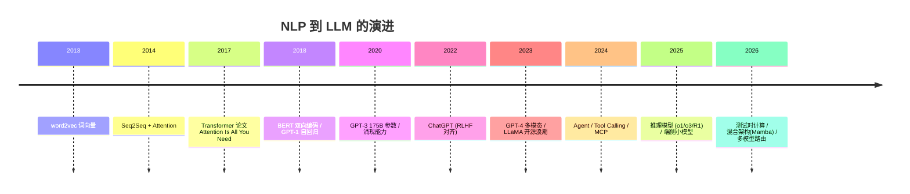
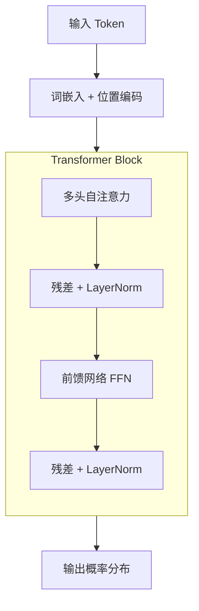
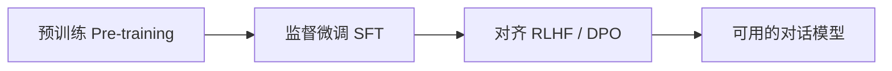
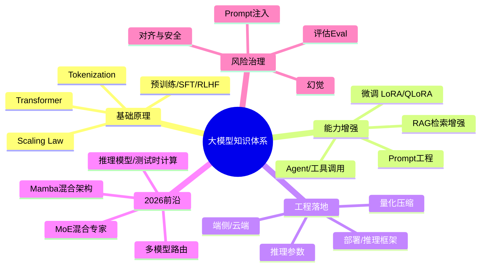

# 大模型发展史与底层原理

## 学习目标

- 理清 NLP 到大语言模型（LLM）的发展脉络与关键转折点
- 掌握 Transformer 架构核心机制（Self-Attention / 训练 / 推理）
- 建立大模型完整知识体系，理解前端架构师该懂到什么程度

## 为什么需要

> 本篇是 [01-AI大模型前端应用](./01-AI大模型前端应用.md) 的**理论前置**：只会调 API 的前端，和懂模型能力边界、能合理选型/调参/控成本的架构师，差距就在这里。

大厂面试官常用「你了解大模型原理吗？」筛掉只会接口的候选人。架构师不需要会训练模型，但必须能回答：**为什么会幻觉？上下文窗口是什么？temperature 调什么？RAG 和微调怎么选？** 这些都源于对底层原理的理解。

## 一、发展史：从统计到大模型



### 关键阶段

| 阶段 | 代表 | 突破 | 局限 |
|------|------|------|------|
| 统计语言模型 | N-gram | 用频率预测下一个词 | 无法捕捉长距离依赖 |
| 词向量 | word2vec/GloVe | 词→稠密向量，语义可计算 | 静态词向量，一词一义 |
| 循环网络 | RNN/LSTM | 处理序列、有记忆 | 串行慢、长序列梯度消失 |
| 注意力 | Seq2Seq+Attention | 解码时关注输入相关部分 | 仍依赖 RNN 串行 |
| **Transformer** | Transformer(2017) | **纯注意力、可并行、长依赖** | 计算随序列长度平方增长 |
| 预训练大模型 | BERT/GPT | 海量无标注预训练 + 下游微调 | 需任务微调 |
| 大规模+对齐 | GPT-3/ChatGPT | 涌现能力 + RLHF 对齐人类偏好 | 幻觉、成本、时效 |
| 多模态+Agent | GPT-4/Claude | 图文理解 + 工具调用 + 推理 | 可控性、安全 |
| 推理模型 | o1/o3/DeepSeek-R1 | 测试时计算、链式思维 RL、强推理 | 推理成本高、延迟大 |
| 混合架构+路由 | Mamba-Transformer/MoE | 长上下文高效、稀疏激活、多模型路由 | 工程复杂度上升 |

**主线规律**：每一代都在解决上一代的瓶颈——长依赖（RNN→Attention）、并行（→Transformer）、泛化（→预训练）、对齐（→RLHF）、能力扩展（→多模态/Agent）、深度推理（→测试时计算）、效率（→MoE/混合架构）。

## 二、Transformer 架构原理

### 整体结构



### 1. Tokenization（分词）

文本先切成 token（子词），用 **BPE/BBPE** 算法：高频组合合并成一个 token。

- 一个中文字 ≈ 1-2 token，一个英文单词 ≈ 1-3 token
- **前端意义**：Token 数决定成本和上下文占用，需做 Token 预算 UI

### 2. Embedding + 位置编码

- **词嵌入**：token id → 高维向量（如 4096 维）
- **位置编码**：Transformer 无序列顺序概念，需注入位置信息（正弦编码 / RoPE 旋转位置编码）

### 3. Self-Attention（自注意力，核心）

每个 token 用三个向量：**Query（我想找什么）、Key（我是什么）、Value（我的内容）**。

```
Attention(Q, K, V) = softmax(Q · Kᵀ / √dₖ) · V
```

直觉：每个词去「查询」其他所有词的相关度（Q·K），归一化为权重（softmax），再加权汇总它们的内容（V）。这让模型能动态关注上下文里相关的词（如代词指代）。

- **√dₖ 缩放**：防止点积过大导致 softmax 梯度消失
- **Multi-Head（多头）**：并行多组 QKV，从不同子空间捕捉关系（语法、语义、指代…）
- **复杂度 O(n²)**：序列越长计算越贵 → 长上下文优化是热点

### 4. 残差连接 + LayerNorm + FFN

- **残差**：缓解深层网络梯度消失
- **LayerNorm**：稳定训练
- **FFN**：逐位置的非线性变换，增强表达能力

### 5. Decoder-only 与自回归生成

主流 LLM（GPT 系）是 **Decoder-only**：

- **因果掩码（Causal Mask）**：每个位置只能看到前面的 token，不能偷看未来
- **自回归生成**：一次预测一个 token，拼回输入再预测下一个，循环直到结束


这正是**流式输出**的原理：token 逐个生成，所以前端能用 SSE 一个个推给用户。

## 三、训练流程



| 阶段 | 数据 | 目标 |
|------|------|------|
| 预训练 | 海量无标注文本（万亿 token） | 学语言规律，预测下一个词 |
| SFT 监督微调 | 高质量「指令-回答」对 | 学会按指令回答 |
| RLHF/DPO 对齐 | 人类偏好排序数据 | 输出更符合人类偏好、更安全 |

- **RLHF**：训练奖励模型 + 强化学习（PPO）优化，让回答更「有用、无害、诚实」
- **DPO**：直接偏好优化，跳过奖励模型，更简单稳定，近年流行

### Scaling Law 与涌现能力

- **Scaling Law**：模型能力随参数量、数据量、算力呈幂律提升 → 「大力出奇迹」
- **涌现能力（Emergence）**：到一定规模后突然具备小模型没有的能力（推理、少样本学习）

## 四、推理与关键参数

| 参数 | 作用 | 前端调优 |
|------|------|---------|
| temperature | 随机性，越高越发散 | 严谨场景调低(0-0.3)，创意调高(0.7-1) |
| top-p (核采样) | 累积概率截断 | 控制多样性，常用 0.9 |
| top-k | 只从概率最高 k 个采样 | 限制候选范围 |
| max_tokens | 最大生成长度 | 控成本、防超长 |
| stop | 停止序列 | 自定义截断 |

**KV Cache**：自回归生成时缓存已算过的 Key/Value，避免重复计算，是推理加速关键（也是显存占用大头）。

**上下文窗口（Context Window）**：模型一次能处理的最大 token 数（如 128K）。超出需截断或摘要——这是前端 Context 管理的根因。

## 五、2026 最新进展与前沿概念

> 大模型迭代极快，以下为截至 2026 年中的关键趋势。**面试官常问「你了解最近的进展吗」来判断你是否持续关注前沿**。具体型号会过时，但下面的**概念和工程范式**才是考点。

### 1. 推理模型与「测试时计算」（Test-Time Compute）

2025-2026 最大范式转变：从「把模型练得更大」转向「让模型在回答时多思考」。

- **代表**：OpenAI o1/o3、DeepSeek-R1、各家「Thinking」模式（如 GPT-5.5 Thinking、Claude Opus 4.8）
- **原理**：模型生成答案前先产出一长串「思维链（Chain-of-Thought）」推理过程，用更多推理算力换取更高准确率（数学/代码/逻辑显著提升）
- **训练方式**：**可验证奖励的强化学习（RLVR）**——用「答案对不对」这种可自动验证的信号做 RL，配合 self-consistency（多次采样投票）、self-refinement（自我修正）
- **新的 Scaling 维度**：不只是扩参数，而是「推理时多花算力」也能提升效果
- **前端影响**：推理模型有「思考阶段」，首字延迟更高 → UI 需展示「思考中…」并可选择性流式渲染思维过程（如 DeepSeek 的思考折叠面板）

### 2. MoE 混合专家（Mixture of Experts）

主流大模型几乎都转向 MoE 架构以平衡能力与成本。

- **原理**：模型有很多「专家」子网络，每个 token 只激活其中少数 → **总参数巨大但单次推理只算一小部分**
- **例子**：DeepSeek V4-Pro 总参数 1.6 万亿、激活仅 490 亿；Nemotron 3 Ultra 550B 总 / 55B 激活
- **新变体**：**LatentMoE**（低维空间路由，支持更多专家而不增推理成本）
- **意义**：解释了为什么 2026 年「便宜又强」的模型大量出现——稀疏激活大幅降低推理成本

### 3. 混合架构：Mamba / 状态空间模型（SSM）

挑战「纯 Transformer」的新架构开始进入主流开源模型。

- **痛点**：Transformer 注意力 O(n²)，长上下文昂贵
- **方案**：**Mamba/SSM** 等线性复杂度的序列层，处理长序列更高效；与 Attention 层交替使用（**Hybrid Mamba-Transformer**）
- **例子**：NVIDIA Nemotron 3、Qwen3.6（用 Gated DeltaNet）
- **分工**：Mamba 层高效处理长序列，Attention 层负责精确「回忆」上下文中的具体事实

### 4. 长上下文与推理加速

- **百万 token 上下文**成为旗舰标配（GPT-5.5、Nemotron 3 均原生 1M context）→ 整个代码库/长文档可一次喂入，弱化部分 RAG 场景
- **投机解码（Speculative Decoding）**：小模型先草拟、大模型验证，加速生成
- **多 Token 预测（MTP）**：一次前向预测多个 token，提升吞吐
- **低精度量化**：NVFP4/FP8（服务端）、GGUF/AWQ（端侧），显著提高吞吐、降低显存

### 5. Agentic AI 与多模型路由

- **长时程智能体（Agentic AI）**：模型自主规划、多步调用工具、操作浏览器/终端（computer use），2026 年是落地主线
- **MCP（Model Context Protocol）**：标准化「模型↔工具/数据源」的连接协议，已成生态事实标准
- **Agent Skills**：可复用工作流/领域知识包（SKILL.md），与 MCP 互补——Skills 教方法，MCP 提供能力（详见 [09-AI-Agent-Skills与MCP协议详解](./09-AI-Agent-Skills与MCP协议详解.md)）
- **MCP Apps**：Server 声明沙箱交互 UI，2026 前端架构师高频考点
- **多模型路由（Multi-Model Routing）**：不再绑定单一模型，按任务难度/成本/延迟动态路由（如简单任务走便宜的 Flash 模型，难题走旗舰推理模型）
- **多智能体系统**：多个 Agent 协作分工，但可靠性仍是工程难点

### 6. 开源生态与成本暴跌

- 开源/开放权重模型（DeepSeek、Qwen、Llama、Gemma、Nemotron）与闭源差距持续缩小（SWE-bench 差距从一年前 15+ 分缩到 7-8 分）
- API 价格大幅下降（如 DeepSeek V4-Flash 约 $0.14/百万输入 token）→ **成本不再是采用 AI 的主要障碍，选型重心转向能力匹配与数据合规**

### 2026 主流模型速览（会过时，记范式即可）

| 厂商 | 代表模型 | 特点 |
|------|---------|------|
| OpenAI | GPT-5.5 / Pro | 强 agentic、1M 上下文、Thinking 推理 |
| Anthropic | Claude Opus 4.8 | agentic 编码生态强（Claude Code/Cursor） |
| Google | Gemini 3.1 Pro | 多模态、长上下文、推理强 |
| DeepSeek | V4-Pro / Flash | 开源 MoE、超低价、性价比标杆 |
| 阿里 | Qwen 3.x | 开源、混合架构、中文强 |
| Meta / NVIDIA | Llama 4 / Nemotron 3 | 开放权重、混合 Mamba-MoE |

> 注：以上为 2026 年 6 月快照，型号更新极快，**面试重点是理解推理模型、MoE、混合架构、多模型路由等范式，而非背版本号**。

## 六、大模型知识体系全景



### 能力增强四件套（架构师必懂选型）

| 方案 | 解决什么 | 成本 | 适用 |
|------|---------|------|------|
| **Prompt 工程** | 引导模型，零训练 | 最低 | 通用，首选 |
| **RAG** | 注入外部/私有知识，可溯源 | 中 | 知识库问答、降幻觉 |
| **微调（LoRA/QLoRA）** | 改变风格/格式/领域能力 | 较高 | 固定任务、私有领域 |
| **Agent** | 调用工具、多步推理 | 高 | 复杂任务编排 |

**经典面试题**：RAG vs 微调怎么选？→ 知识时效性强、需溯源用 RAG；改变模型「行为风格」用微调；二者可结合。

### 风险概念

- **幻觉（Hallucination）**：模型生成看似合理但错误的内容 → 根因是「预测下一个词」而非「查事实」，用 RAG + 引用溯源缓解
- **对齐（Alignment）**：让模型行为符合人类意图与价值观
- **Prompt 注入**：恶意输入劫持模型指令 → 前端需输入/输出隔离与净化

## 七、前端架构师视角：该懂到什么程度

| 原理 | 对应前端决策 |
|------|------------|
| 自回归生成 | 流式输出（SSE）设计 |
| Token / 上下文窗口 | Context 管理、Token 预算、成本控制 |
| temperature/top-p | 不同场景参数预设 |
| 幻觉根因 | RAG 溯源、结果可信度提示 |
| RAG vs 微调 | 方案选型、与算法团队对话 |
| 端侧小模型 | WebLLM 隐私/离线场景选型 |
| 推理模型「思考阶段」 | 思维链展示 UI、首字延迟预期管理 |
| 多模型路由 | 按任务/成本路由，简单任务走廉价模型 |
| API 成本暴跌 | 选型重心从成本转向能力匹配与数据合规 |

**结论**：前端不训练模型，但要懂原理才能做对架构决策、和算法团队高效协作、给产品讲清能力边界。

## 面试高频问答（追问链）

> 大厂对一个考点通常追问到能力边界：**概念 → 机制 → 边界 → ⭐ 原理（触底）→ 实战（落地）**。实战层是区分「背过」和「做过」的关键。

### 链一：Transformer 与生成原理

1. **概念**：Transformer 比 RNN 强在哪？→ 纯注意力、可并行、长距离依赖建模好。
2. **机制**：Self-Attention 怎么算？→ Q·Kᵀ 求相关度 → softmax 归一 → 加权 V 汇总。
3. **边界**：为什么注意力是 O(n²)？→ 每个 token 与所有 token 算相关度，长上下文昂贵。
4. ⭐ **原理（触底）**：为什么 LLM 能流式输出？→ Decoder-only 自回归逐 token 生成，每步产出一个 token，故可边生成边推送。
5. **实战（落地）**：理解自回归对前端流式设计有什么指导？→ 场景：对话产品首字慢；步骤：SSE 逐 token 推送 + 节流渲染 + 首 token 优先返回；验证：首字延迟<300ms；结果：感知速度大幅提升，用户可中途停止省 Token。

### 链二：能力增强与风险

1. **概念**：RAG 和微调区别？→ RAG 外挂知识可溯源；微调改模型行为。
2. **机制**：模型为什么会幻觉？→ 本质是预测下一个词的概率，不查事实。
3. **边界**：上下文窗口满了会怎样？→ 超出被截断，丢失早期信息。
4. ⭐ **原理（触底）**：怎么系统性降低幻觉？→ RAG 注入事实 + 引用溯源 + 降 temperature + 输出校验 + 让模型「不知道就说不知道」的 Prompt 约束。
5. **实战（落地）**：知识库问答选 RAG 还是微调你怎么决策？→ 场景：企业文档时效性强、需溯源；步骤：RAG（检索+引用）做主、Prompt 约束兜底、评估幻觉率；验证：抽样人工标注答案准确率与引用命中率；结果：选 RAG 而非微调，知识更新无需重训、可溯源，准确率达标上线。

### 链三：2026 前沿（推理模型与 MoE）

1. **概念**：什么是推理模型？→ 回答前先产出思维链、用更多推理算力换准确率的模型（o1/R1/Thinking 模式）。
2. **机制**：它是怎么训出来的？→ 可验证奖励的强化学习（RLVR）+ self-consistency/self-refinement，让模型学会一步步推理。
3. **边界**：它有什么代价？→ 推理时算力大、首字延迟高、成本高，不适合简单任务。
4. ⭐ **原理（触底）**：为什么 2026「便宜又强」的模型大量出现？→ MoE 稀疏激活（总参数大但每次只激活少数专家）+ 混合 Mamba 架构降长上下文成本 + 低精度量化，共同把推理成本打下来。
5. **实战（落地）**：产品里同时有简单问答和复杂分析，你怎么用模型？→ 场景：成本与质量都要顾；步骤：做多模型路由——简单意图走廉价 Flash 模型、复杂推理走旗舰 Thinking 模型，前端对推理模型展示「思考中」折叠面板；验证：对比单模型方案的平均成本与满意度；结果：成本下降同时难题质量不降，首字延迟通过 UI 预期管理被用户接受。

## 常见误区

| 误区 | 正确理解 |
|------|---------|
| "大模型在数据库里查答案" | 它是概率预测下一个 token，不查表，故会幻觉 |
| "参数越大一定越好" | 受 Scaling Law 但有成本/时延权衡，端侧小模型也有价值 |
| "RAG 和微调二选一" | 可结合：RAG 给知识，微调改风格 |
| "temperature 越高越聪明" | 只是更随机；严谨任务应调低 |
| "前端不用懂原理" | 不懂原理无法做选型/调参/成本/边界沟通 |
| "推理模型啥都更好" | 推理模型慢且贵，简单任务用普通模型更划算 |
| "MoE 参数 1.6T = 真用 1.6T 算力" | 稀疏激活，单次推理只激活一小部分参数 |
| "上下文 1M 后 RAG 没用了" | 长上下文成本高、有"迷失在中间"问题，RAG 仍重要 |
| "认准一个最强模型就行" | 2026 是多模型路由时代，按任务/成本动态选型 |

## 小结

- 发展主线：N-gram → 词向量 → RNN → Attention → Transformer → 预训练 → RLHF → 多模态/Agent → 推理模型 → MoE/混合架构，每代解决上代瓶颈
- Transformer 核心：Self-Attention（QKV）+ 多头 + 残差/LN + FFN，Decoder-only 自回归生成
- 训练三段：预训练 → SFT → RLHF/DPO；能力源于 Scaling Law 与涌现
- 2026 前沿：测试时计算（推理模型）、MoE 稀疏激活、Mamba 混合架构、多模型路由、成本暴跌
- 知识体系：原理 + 能力增强（Prompt/RAG/微调/Agent）+ 工程落地 + 风险治理
- 前端价值：懂原理才能做对流式/Context/参数/选型/成本决策；记范式而非背版本号
- 应用落地见 [01-AI大模型前端应用](./01-AI大模型前端应用.md)

## 延伸阅读

- [Attention Is All You Need（Transformer 原论文）](https://arxiv.org/abs/1706.03762)
- [The Illustrated Transformer](https://jalammar.github.io/illustrated-transformer/)
- [Andrej Karpathy: Let's build GPT](https://www.youtube.com/watch?v=kCc8FmEb1nY)
- [Hugging Face LLM Course](https://huggingface.co/learn/llm-course)
- [Sebastian Raschka: LLM Research Papers 2026](https://magazine.sebastianraschka.com/p/llm-research-papers-2026-part1)（推理/MoE/混合架构最新综述）
- [DeepSeek-R1（推理模型 + RLVR 论文）](https://arxiv.org/abs/2501.12948)
- [Mamba: Linear-Time Sequence Modeling](https://arxiv.org/abs/2312.00752)
