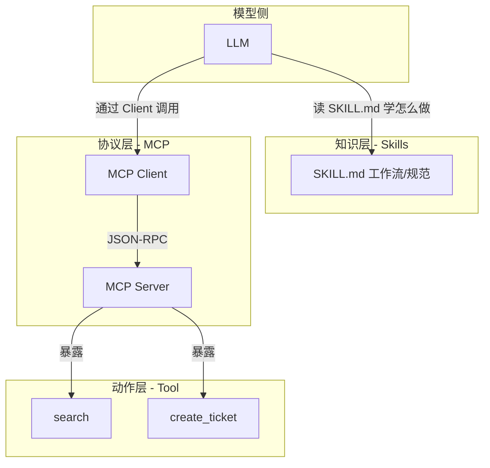
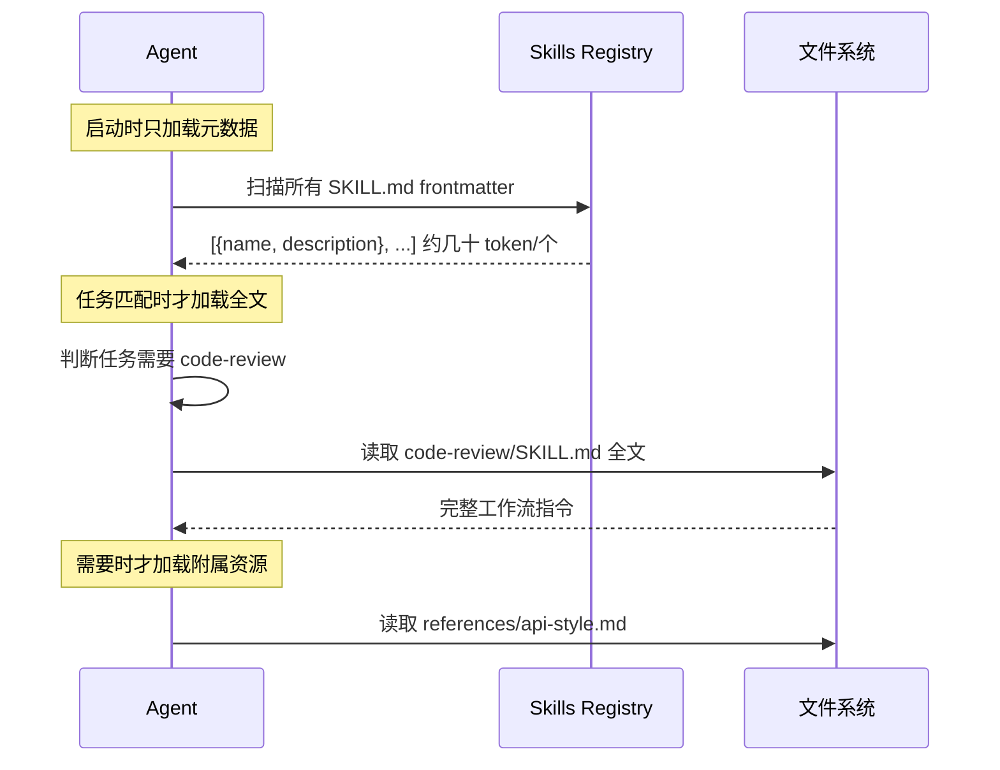
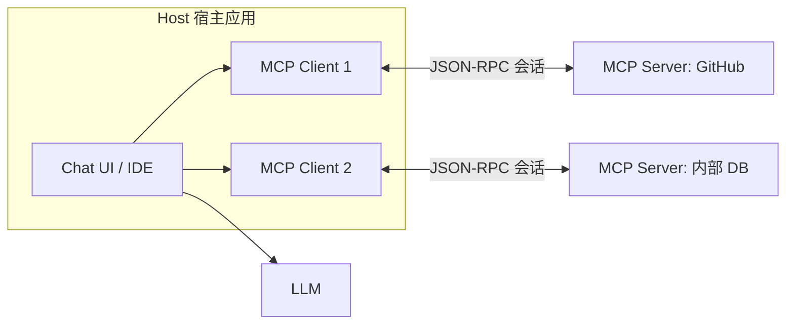
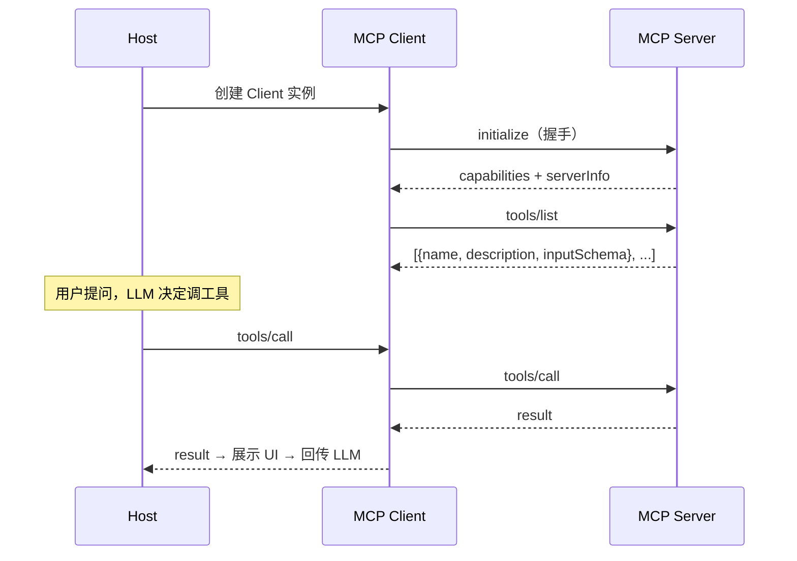
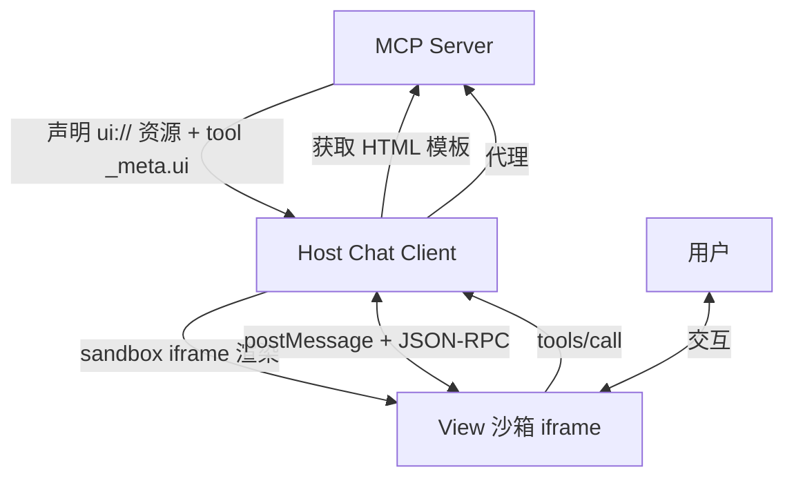
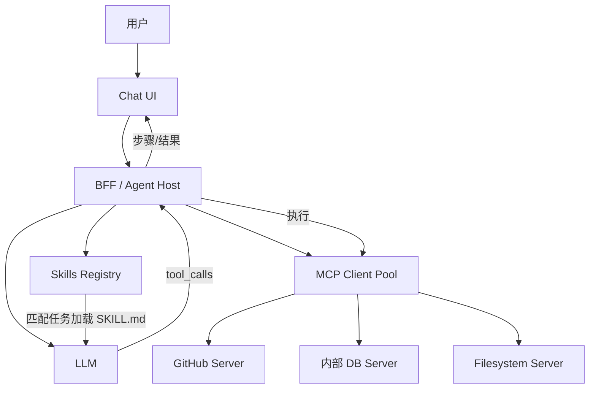

# AI Agent Skills 与 MCP 协议详解

## 学习目标

- 厘清 **Skills / MCP / Tool Calling** 三者的定位与选型
- 掌握 MCP 协议架构（Host/Client/Server）、三大原语与传输层
- 理解 **MCP Apps** 扩展对前端架构师的意义（沙箱 UI、postMessage 通信）
- 能设计 Agent 产品的 Tool 进度 UI、确认门、安全边界

## 为什么需要

2026 年大厂（阿里通义、字节豆包/Coze、腾讯混元）AI 应用岗 increasingly 追问：

- **Skills 和 MCP 有什么区别？能不能互相替代？**
- **MCP 的 Host/Client/Server 各自干什么？前端在哪一层？**
- **MCP Apps 的沙箱 iframe 怎么设计？安全怎么保证？**

只会调 API 的候选人答不出这些。本篇是 [01-AI大模型前端应用](./01-AI大模型前端应用.md) 的**Agent 能力层深化**，理论前置见 [08-大模型发展史与底层原理](./08-大模型发展史与底层原理.md)。

## 一、三种抽象：Tool / MCP / Skills

大厂面试第一题往往是「三者区别」。记住一句话：

> **Tool 做动作，MCP 连外部，Skills 教方法。**



| 抽象 | 本质 | 生命周期 | 类比 | 谁定义 |
|------|------|---------|------|--------|
| **Tool Calling** | 模型单次调用的函数 schema | 一次响应内 | 单次 API 调用 | 开发者硬编码 |
| **MCP** | 连接外部系统的标准协议 | 长连接会话 | USB-C 接口 | Anthropic 开放标准 |
| **Agent Skills** | 可复用的工作流/领域知识包 | 文件系统持久化 | 菜谱/操作手册 | 团队写 SKILL.md |

### 选型决策表（架构师必背）

| 场景 | 选什么 | 理由 |
|------|--------|------|
| 调一次搜索/计算器 | Tool Calling | 最轻，无需额外进程 |
| 接 GitHub/Slack/内部 DB | MCP Server | 标准化、可复用、生态成熟 |
| 教 Agent 团队代码规范/评审流程 | Skills | 纯知识，无需执行代码 |
| 复杂任务：先学规范再调工具 | **Skills + MCP 组合** | Skills 教流程，MCP 提供能力 |
| 工具结果需要富交互 UI | MCP Apps | 服务端声明 UI 资源，Host 沙箱渲染 |

**经典面试答法**：「MCP 是 Agent 的手（能执行），Skills 是 Agent 的脑（知道怎么做）。菜谱（Skills）告诉你步骤，厨房设备（MCP）让你能真正操作。两者互补，不是竞争关系。」

## 二、Agent Skills 详解

### 2.1 什么是 Skills

Anthropic 2025 年底推出的**开放标准**：用目录 + `SKILL.md` 文件，把领域工作流、决策逻辑、团队规范打包成 Agent 可读取的「技能包」。

```
my-skill/
├── SKILL.md          # 核心：YAML frontmatter + Markdown 指令
├── scripts/          # 可选：Agent 可调用的脚本
│   └── validate.sh
└── references/       # 可选：参考文档、模板
    └── api-style.md
```

### 2.2 SKILL.md 格式

```markdown
---
name: code-review
description: 按团队规范做 PR 代码评审，检查安全、性能、可维护性
---

# 代码评审 Skill

## 触发条件
当用户要求 review PR、检查代码质量时启用。

## 工作流
1. 读取 diff，按文件类型分组
2. 检查清单：
   - [ ] 无硬编码密钥
   - [ ] 无 N+1 查询
   - [ ] 错误处理完整
3. 输出结构化评审意见（严重/建议/好评）

## 约束
- 不自动 merge
- 安全问题必须标为 blocker
```

### 2.3 渐进式披露（Progressive Disclosure）

Skills 的核心工程机制——**避免撑爆 Context 窗口**：



| 阶段 | 加载内容 | Token 成本 |
|------|---------|-----------|
| 启动 | name + description（frontmatter） | 极低 |
| 任务匹配 | SKILL.md 正文 | 中 |
| 执行中 | scripts/ references/ | 按需 |

**前端架构师关注点**：Skills 管理 UI（创建/编辑/版本/权限）、Skills 市场/目录浏览、与 IDE/Chat 产品的集成入口。

### 2.4 Skills 在前端产品中的落地

| 职责 | 实现 |
|------|------|
| Skills 目录 | 列表展示 name/description，支持搜索/分类 |
| 编辑/发布 | Markdown 编辑器 + frontmatter 表单，Git 版本管理 |
| 运行时 | Agent Host 负责加载，前端只展示「当前启用的 Skills」 |
| 与 MCP 协同 | 同一产品：Skills 页面配置工作流，MCP 页面配置外部连接 |

## 三、MCP 协议详解

### 3.1 架构：Host / Client / Server



| 角色 | 职责 | 典型实现 |
|------|------|---------|
| **Host** | 管理多个 Client、协调 LLM 与工具、UI 展示 | Cursor、Claude Desktop、自研 Chat |
| **MCP Client** | 与单个 Server 维持会话、发现能力、转发调用 | Host 内嵌，一 Server 一 Client |
| **MCP Server** | 暴露 Tools/Resources/Prompts，执行实际操作 | GitHub MCP、Filesystem MCP、自研 BFF |

**前端在哪？** Host 的 UI 层。前端不直接跑 MCP Server，而是：
1. 展示 Server 提供的 Tool 列表与调用进度
2. 通过 BFF/Host 代理调用 MCP
3. （MCP Apps）渲染 Server 声明的沙箱 UI

### 3.2 三大原语（Primitives）

| 原语 | 方向 | 方法 | 用途 |
|------|------|------|------|
| **Tools** | Server → Client | `tools/list` `tools/call` | 执行动作（搜索、建单、查库） |
| **Resources** | Server → Client | `resources/list` `resources/read` | 只读上下文（文件、DB 记录、配置） |
| **Prompts** | Server → Client | `prompts/list` `prompts/get` | 可复用 Prompt 模板 |

另有 **Sampling**（Client → Server 请求 LLM 补全）和 **Elicitation**（Server 请求用户结构化输入）。

```json
// tools/call 请求示例
{
  "jsonrpc": "2.0",
  "id": 1,
  "method": "tools/call",
  "params": {
    "name": "search_issues",
    "arguments": { "query": "MCP frontend", "repo": "org/project" }
  }
}
```

### 3.3 传输层

| 传输 | 场景 | 特点 |
|------|------|------|
| **stdio** | 本地进程（IDE 插件） | Server 作为子进程，stdin/stdout 通信 |
| **Streamable HTTP** | 远程服务 | HTTP POST + SSE 流式响应，支持多客户端 |

BFF 层通常用 HTTP 传输连接远程 MCP Server，前端通过自家 API 间接调用。

### 3.4 会话生命周期



## 四、MCP Apps：前端架构师的高频考点

2026 年 MCP 最重要扩展——**MCP Apps**（SEP-1865）：Server 可声明交互式 UI，Host 在沙箱 iframe 中渲染。



### 4.1 核心机制

| 概念 | 说明 |
|------|------|
| `ui://` URI | Server 声明的 UI 资源（HTML/JS  bundle） |
| `_meta.ui.resourceUri` | Tool 元数据指向对应 UI 资源 |
| View | 沙箱 iframe 内的交互 UI，充当 MCP Client |
| postMessage | View ↔ Host 通信用 JSON-RPC over postMessage |

### 4.2 安全模型（面试必答）

| 措施 | 目的 |
|------|------|
| **iframe sandbox** | 隔离 DOM/Cookie/Storage，防 XSS 扩散 |
| **预声明模板** | Host 渲染前可审查 HTML 内容 |
| **可审计消息** | 所有 postMessage 走 JSON-RPC，可日志 |
| **用户确认门** | UI 发起的 tool_calls 需用户显式批准 |
| **CSP** | 限制 iframe 内脚本来源 |

### 4.3 前端实现要点

```typescript
// Host 侧：渲染 MCP App View
function renderMcpApp(container: HTMLElement, uiResource: string, toolArgs: unknown) {
  const iframe = document.createElement('iframe');
  iframe.sandbox.add('allow-scripts'); // 最小权限
  iframe.src = uiResource;
  container.appendChild(iframe);

  const bridge = new MessageChannel();
  iframe.onload = () => {
    iframe.contentWindow!.postMessage(
      { jsonrpc: '2.0', method: 'ui/initialize', params: { toolArgs } },
      '*',
      [bridge.port2]
    );
  };

  bridge.port1.onmessage = (event) => {
    const msg = event.data;
    if (msg.method === 'tools/call') {
      // 需用户确认后再代理到 MCP Server
      showConfirmDialog(msg.params).then(ok => ok && proxyToolCall(msg));
    }
  };
}
```

**大厂考点**：你能说清楚 View 为什么是沙箱、为什么用 postMessage 而不是直接 DOM 操作、用户确认门放在哪一层（Host，不是 View）。

## 五、Skills + MCP 组合架构



**落地示例**：「代码评审 Agent」
1. **Skills**：`code-review/SKILL.md` 定义评审清单与输出格式
2. **MCP**：GitHub Server 拉 PR diff，内部 Lint Server 跑静态检查
3. **前端**：展示评审进度（拉取 diff → 静态检查 → 生成意见），敏感操作（发评论）需确认

## 六、前端 Tool 调用 UI 模式

### 6.1 步骤进度组件

```typescript
type ToolStep = {
  id: string;
  name: string;
  status: 'pending' | 'running' | 'done' | 'error';
  input?: unknown;
  output?: unknown;
  durationMs?: number;
};

function ToolProgress({ steps }: { steps: ToolStep[] }) {
  return (
    <div className="tool-steps">
      {steps.map(s => (
        <div key={s.id} className={`step step-${s.status}`}>
          <span>{statusIcon(s.status)}</span>
          <span>{s.name}</span>
          {s.status === 'running' && <Spinner />}
          {s.output && <CollapsibleResult data={s.output} />}
        </div>
      ))}
    </div>
  );
}
```

### 6.2 敏感操作确认门

```typescript
const SENSITIVE_TOOLS = new Set(['send_email', 'create_order', 'delete_file']);

async function executeToolCall(toolCall: ToolCall, userId: string) {
  if (SENSITIVE_TOOLS.has(toolCall.name)) {
    const approved = await showConfirmModal({
      title: `确认执行：${toolCall.name}`,
      detail: JSON.stringify(toolCall.arguments, null, 2),
    });
    if (!approved) return { error: 'user_rejected' };
  }
  return bff.invokeMcpTool(toolCall, { userId });
}
```

### 6.3 BFF 编排层

| BFF 职责 | 说明 |
|---------|------|
| MCP 连接池 | 管理多个 Server 的 Client 会话 |
| 鉴权 | 用户 OAuth Token 注入 MCP Server |
| 限流/审计 | 记录每次 tools/call 的参数与结果 |
| Tool 白名单 | 按用户角色过滤可用 Tools |
| Skills 注入 | 把匹配的 SKILL.md 注入 system prompt |

## 七、安全与治理

| 风险 | 防护 |
|------|------|
| Prompt 注入 via Tool 入参 | 参数 schema 校验 + 消毒 + 与 system prompt 隔离 |
| MCP Server 恶意 Tool | Tool 白名单 + 来源签名 + 沙箱执行 |
| MCP Apps XSS | iframe sandbox + CSP + 模板预审查 |
| 越权调用 | BFF 按用户角色过滤 tools/list |
| 敏感数据泄露 | Resources 读权限分级，日志脱敏 |

## 八、手写实现：最小 MCP Tool 进度解析

```typescript
// 解析 LLM 流式响应中的 tool_calls
interface StreamEvent {
  type: 'text_delta' | 'tool_call_start' | 'tool_call_delta' | 'tool_result' | 'done';
  data: unknown;
}

function* parseAgentStream(reader: ReadableStreamDefaultReader): AsyncGenerator<StreamEvent> {
  const decoder = new TextDecoder();
  let buffer = '';
  let currentTool: Partial<{ id: string; name: string; arguments: string }> = {};

  while (true) {
    const { done, value } = await reader.read();
    if (done) break;
    buffer += decoder.decode(value, { stream: true });
    const lines = buffer.split('\n');
    buffer = lines.pop() ?? '';

    for (const line of lines) {
      if (!line.startsWith('data: ')) continue;
      const chunk = JSON.parse(line.slice(6));
      const delta = chunk.choices?.[0]?.delta;

      if (delta?.tool_calls) {
        const tc = delta.tool_calls[0];
        if (tc.id) {
          if (currentTool.id) yield { type: 'tool_call_start', data: { ...currentTool } };
          currentTool = { id: tc.id, name: tc.function?.name, arguments: '' };
        }
        if (tc.function?.arguments) {
          currentTool.arguments = (currentTool.arguments ?? '') + tc.function.arguments;
        }
      } else if (delta?.content) {
        yield { type: 'text_delta', data: delta.content };
      }
    }
  }
  if (currentTool.id) yield { type: 'tool_call_start', data: currentTool };
  yield { type: 'done', data: null };
}
```

## 九、排查实战

### 案例 A：Tool 调用后 UI 无反馈

| 步骤 | 动作 |
|------|------|
| 读懂 | LLM 返回 tool_calls 但界面无「正在执行」 |
| 定位 | 流式解析未处理 `tool_calls` delta，或 BFF 未回传 tool_result |
| 解决 | 补全 stream parser 的 tool_call 分支 + 步骤状态机 |
| 验证 | 调用搜索 Tool 时出现 running → done 状态切换 |

### 案例 B：MCP Server 连接失败

| 步骤 | 动作 |
|------|------|
| 读懂 | Host 启动报 MCP initialize 超时 |
| 定位 | stdio Server 路径错 / HTTP Server CORS / Token 过期 |
| 解决 | 检查 transport 配置、BFF 代理 CORS、刷新 OAuth |
| 验证 | `tools/list` 返回预期 Tool 列表 |

### 案例 C：MCP App iframe 白屏

| 步骤 | 动作 |
|------|------|
| 读懂 | Tool 触发后 iframe 空白 |
| 定位 | `ui://` 资源 404 / sandbox 权限不足 / postMessage  origin 不匹配 |
| 解决 | 确认 resourceUri 可访问、sandbox 加 `allow-scripts`、校验 origin |
| 验证 | iframe 渲染交互 UI，点击可触发 tool_call 并走确认门 |

## 运用：项目落地 Checklist

- [ ] 厘清 Skills（知识）/ MCP（连接）/ Tool（动作）分工，避免混用
- [ ] Skills 用渐进式披露，启动只加载 frontmatter
- [ ] MCP Client 在 BFF/Host，前端不直连 Server
- [ ] Tool 步骤 UI：pending → running → done/error，支持折叠结果
- [ ] 敏感 Tool 二次确认，BFF 白名单 + 角色权限
- [ ] MCP Apps：iframe sandbox + postMessage JSON-RPC + 用户确认门
- [ ] 全链路审计日志：tools/call 参数与结果脱敏存档

## 面试高频问答（追问链）

> 大厂对一个考点通常追问到能力边界：**概念 → 机制 → 边界 → ⭐ 原理（触底）→ 实战（落地）**。实战层是区分「背过」和「做过」的关键。

### 链一：Skills vs MCP vs Tool

1. **概念**：三者区别？→ Tool 单次函数调用；MCP 连外部系统的标准协议；Skills 教 Agent 工作流/规范的文件包。
2. **机制**：Skills 怎么避免撑爆 Context？→ 渐进式披露：启动只加载 name/description，任务匹配才读 SKILL.md 全文。
3. **边界**：能只用 MCP 不用 Skills 吗？→ 能，但 Agent 不知道团队规范，输出质量不稳定；复杂任务建议组合。
4. ⭐ **原理（触底）**：为什么说是「MCP 是手，Skills 是脑」？→ MCP 提供可执行的外部能力（查库、调 API），Skills 提供程序性知识（怎么做、什么顺序、什么约束），LLM 本身只有通用知识，二者补齐「能做」和「做对」。
5. **实战（落地）**：企业 Agent 平台你怎么设计 Skills + MCP？→ 场景：内部 AI 助手需接 GitHub + 按团队规范评审；步骤：写 `code-review` Skill 定义清单、接 GitHub MCP Server 拉 diff、BFF 编排 Skills 注入 + MCP 调用、前端步骤 UI + 发评论确认门；验证：评审输出格式稳定、未授权用户调不了 create_comment；结果：评审效率提升，输出符合团队规范。

### 链二：MCP 协议与架构

1. **概念**：MCP 解决什么？→ 把「AI 接外部工具」从各家自定义格式统一到 JSON-RPC 标准，像 USB-C 一样即插即用。
2. **机制**：Host/Client/Server 分工？→ Host 管 UI 和协调；Client 一对一连 Server；Server 暴露 Tools/Resources/Prompts。
3. **边界**：三大原语分别干什么？→ Tools 执行动作、Resources 读上下文、Prompts 提供模板；另有 Elicitation 让 Server 向用户要输入。
4. ⭐ **原理（触底）**：stdio 和 Streamable HTTP 传输怎么选？→ 本地 IDE 插件用 stdio（子进程）；远程/多客户端用 Streamable HTTP（POST+SSE）；BFF 代理远程 Server 时前端只调自家 API，不碰 MCP 传输细节。
5. **实战（落地）**：多个 MCP Server 怎么接入产品？→ 场景：Chat 产品需 GitHub + 内部 DB + 搜索；步骤：BFF 维护 MCP Client 连接池、按用户 OAuth 注入鉴权、tools/list 按角色过滤、前端统一 ToolProgress 组件展示步骤；验证：三 Server 并行调用不串会话、权限隔离；结果：新增 Server 只需 BFF 注册，前端组件零改动。

### 链三：MCP Apps 与前端安全

1. **概念**：MCP Apps 是什么？→ MCP 扩展，Server 声明 `ui://` 交互 UI，Host 沙箱 iframe 渲染，View 通过 postMessage 与 Host 通信用 JSON-RPC。
2. **机制**：为什么用 iframe sandbox？→ 隔离第三方 UI 的 DOM/存储，防 XSS 扩散到 Host，所有交互可审计。
3. **边界**：View 能直接调 MCP Server 吗？→ 不能直连，通过 Host 代理 tools/call；敏感操作 Host 必须加用户确认门。
4. ⭐ **原理（触底）**：MCP Apps 和自研 Tool 结果卡片有什么区别？→ 自研卡片 Host 完全控制渲染；MCP Apps 由 Server 提供 UI 模板，适合工具方自定义交互（地图、图表、表单），但 Host 必须用沙箱+确认门兜底安全。
5. **实战（落地）**：MCP App 白屏你怎么排查？→ 场景：接第三方 MCP 地图 Server，Tool 触发后 iframe 空白；步骤：DevTools 查 iframe src/`ui://` 资源是否 404 → 查 sandbox 是否缺 `allow-scripts` → 查 postMessage origin → 补 `ui/initialize` 握手；验证：地图可交互、点击走确认门后才调 tools/call；结果：第三方 MCP 富 UI 安全接入，无 XSS 风险。

## 常见误区

| 误区 | 正确理解 |
|------|---------|
| "Skills 和 MCP 是竞争关系" | 互补：Skills 教方法，MCP 提供能力 |
| "前端直连 MCP Server" | Client 在 Host/BFF，前端只展示和确认 |
| "MCP = Tool Calling" | MCP 是协议+生态；Tool Calling 是模型 API 的一次调用 |
| "Skills 会执行代码" | Skills 本身是 Markdown 指令，执行靠 Agent 读完后调 Tool/MCP |
| "MCP Apps 可以访问 Host DOM" | 必须沙箱隔离，只通过 postMessage JSON-RPC |
| "所有 Tool 都要 MCP" | 简单内置 Tool 直接 Function Calling 即可，不必上 MCP |

## 小结

- **Tool / MCP / Skills** 三层抽象：动作 / 连接 / 知识，大厂面试必考选型
- **Skills**：SKILL.md + 渐进式披露，教 Agent「怎么做」
- **MCP**：Host/Client/Server + JSON-RPC + Tools/Resources/Prompts，提供「能执行」
- **MCP Apps**：2026 前端重点，`ui://` 沙箱 UI + postMessage，安全靠 sandbox + 确认门
- **前端职责**：Tool 步骤 UI、敏感确认门、MCP Apps Host 桥接，执行在 BFF
- 组合架构：Skills 定义流程 → MCP 提供能力 → 前端展示与治理
- 理论前置：[08-大模型发展史与底层原理](./08-大模型发展史与底层原理.md)；应用全景：[01-AI大模型前端应用](./01-AI大模型前端应用.md)

## 延伸阅读

- [Model Context Protocol 官方文档](https://modelcontextprotocol.io/)
- [MCP Apps SEP-1865](https://modelcontextprotocol.io/seps/1865-mcp-apps-interactive-user-interfaces-for-mcp)
- [@modelcontextprotocol/ext-apps SDK](https://github.com/modelcontextprotocol/ext-apps)
- [Anthropic Agent Skills 介绍](https://docs.anthropic.com/en/docs/agents-and-tools/agent-skills/overview)
- [MCP vs Agent Skills（Layered System）](https://layered.dev/mcp-vs-agent-skills/)
