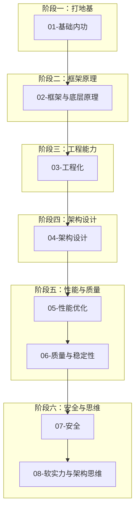

# 前端架构师学习资料

> 从基本原理出发，系统掌握前端架构师核心知识体系

## 如何使用本资料

本资料采用**教科书式深度讲解**，每章统一结构：

| 章节结构 | 说明 |
|---------|------|
| 学习目标 | 本章结束后你应该掌握什么 |
| 为什么需要 | 背景与动机，理解"为什么要学" |
| 核心原理 | 从底层机制推导，而非只列 API |
| 关键机制 + 代码示例 | 可运行的示例代码 |
| Mermaid 图示 | 可视化流程与架构 |
| 常见误区与最佳实践 | 避坑指南 |
| 小结 | 核心要点回顾 |
| 延伸阅读 | 进一步学习资源 |

**建议学习方式：**
1. 严格按模块顺序学习，后续章节依赖前置知识
2. 每章先通读原理，再动手运行代码示例
3. 每模块的 `00-本章导读.md` 提供知识地图与学习建议
4. 每完成一个模块，暂停回顾，确保理解再进入下一模块

---

## 学习路线图



---

## 模块索引

### [01-基础内功](./01-基础内功/00-本章导读.md)

| 章节 | 主题 |
|------|------|
| [01-浏览器工作原理](./01-基础内功/01-浏览器工作原理.md) | 渲染流程、HTTP 缓存、跨域 |
| [02-JavaScript核心原理](./01-基础内功/02-JavaScript核心原理.md) | 原型链、闭包、作用域、内存管理 |
| [03-异步与事件循环](./01-基础内功/03-异步与事件循环.md) | Event Loop、Promise、async/await |
| [04-TypeScript类型系统](./01-基础内功/04-TypeScript类型系统.md) | 类型推导、泛型、类型约束 |
| [05-CSS架构与布局原理](./01-基础内功/05-CSS架构与布局原理.md) | 布局模型、CSS 架构方案 |

### [02-框架与底层原理](./02-框架与底层原理/00-本章导读.md)

| 章节 | 主题 |
|------|------|
| [01-响应式原理](./02-框架与底层原理/01-响应式原理.md) | Vue 响应式、React 状态更新 |
| [02-虚拟DOM与Diff](./02-框架与底层原理/02-虚拟DOM与Diff.md) | VDOM 设计、Diff 算法 |
| [03-React-Fiber架构](./02-框架与底层原理/03-React-Fiber架构.md) | Fiber 架构、调度机制 |
| [04-状态管理设计](./02-框架与底层原理/04-状态管理设计.md) | Redux/Zustand/Pinia 设计取舍 |
| [05-跨端方案选型](./02-框架与底层原理/05-跨端方案选型.md) | 小程序/RN/Electron 选型 |
| [06-React19新特性](./02-框架与底层原理/06-React19新特性.md) | use/Actions/RSC/Compiler |

### [03-工程化](./03-工程化/00-本章导读.md)

| 章节 | 主题 |
|------|------|
| [01-模块化演进与原理](./03-工程化/01-模块化演进与原理.md) | CommonJS/ESM、模块加载 |
| [02-构建工具原理](./03-工程化/02-构建工具原理(Webpack-Vite).md) | Webpack/Vite 原理与优化 |
| [03-包管理与Monorepo](./03-工程化/03-包管理与Monorepo.md) | pnpm、workspace、Turborepo |
| [04-规范化与Git工作流](./03-工程化/04-规范化与Git工作流.md) | ESLint、Husky、Git Flow |
| [05-CICD与发布](./03-工程化/05-CICD与发布.md) | 自动化构建、灰度发布 |

### [04-架构设计](./04-架构设计/00-本章导读.md)

| 章节 | 主题 |
|------|------|
| [01-设计原则与模式](./04-架构设计/01-设计原则与模式.md) | SOLID、前端设计模式 |
| [02-组件库与设计系统](./04-架构设计/02-组件库与设计系统.md) | Design Token、主题化 |
| [03-微前端架构](./04-架构设计/03-微前端架构.md) | qiankun、Module Federation |

### [05-性能优化](./05-性能优化/00-本章导读.md)

| 章节 | 主题 |
|------|------|
| [01-性能指标体系](./05-性能优化/01-性能指标体系.md) | Core Web Vitals、性能度量 |
| [02-加载与运行时优化](./05-性能优化/02-加载与运行时优化.md) | 懒加载、代码分割、CDN |
| [03-渲染策略](./05-性能优化/03-渲染策略(CSR-SSR-SSG).md) | CSR/SSR/SSG/ISR 选型 |

### [06-质量与稳定性](./06-质量与稳定性/00-本章导读.md)

| 章节 | 主题 |
|------|------|
| [01-测试体系](./06-质量与稳定性/01-测试体系.md) | 单元/组件/E2E 测试 |
| [02-监控与告警](./06-质量与稳定性/02-监控与告警.md) | Sentry、性能监控、埋点 |
| [03-降级与容灾](./06-质量与稳定性/03-降级与容灾.md) | 兜底、熔断、灰度 |

### [07-安全](./07-安全/00-本章导读.md)

| 章节 | 主题 |
|------|------|
| [01-前端安全攻防](./07-安全/01-前端安全攻防.md) | XSS、CSRF、CSP、供应链安全 |

### [08-软实力与架构思维](./08-软实力与架构思维/00-本章导读.md)

| 章节 | 主题 |
|------|------|
| [01-技术选型与决策](./08-软实力与架构思维/01-技术选型与决策.md) | 选型方法论、权衡分析 |
| [02-技术方案文档](./08-软实力与架构思维/02-技术方案文档(RFC-ADR).md) | RFC/ADR 写作规范 |

---

## 预估学习周期

| 模块 | 建议时长 | 难度 |
|------|---------|------|
| 01-基础内功 | 2-3 周 | ★★★★ |
| 02-框架与底层原理 | 2 周 | ★★★★★ |
| 03-工程化 | 1-2 周 | ★★★ |
| 04-架构设计 | 1-2 周 | ★★★★ |
| 05-性能优化 | 1 周 | ★★★ |
| 06-质量与稳定性 | 1 周 | ★★★ |
| 07-安全 | 3-5 天 | ★★★ |
| 08-软实力与架构思维 | 3-5 天 | ★★ |

**总计：约 8-12 周**（每天 2-3 小时）

---

## 章节模板示例

每章遵循以下结构，以 [01-浏览器工作原理](./01-基础内功/01-浏览器工作原理.md) 为例：

```
# 章节标题

## 学习目标
## 为什么需要
## 核心原理
## 关键机制与代码示例
## 图示（Mermaid）
## 常见误区与最佳实践
## 小结
## 延伸阅读
```
